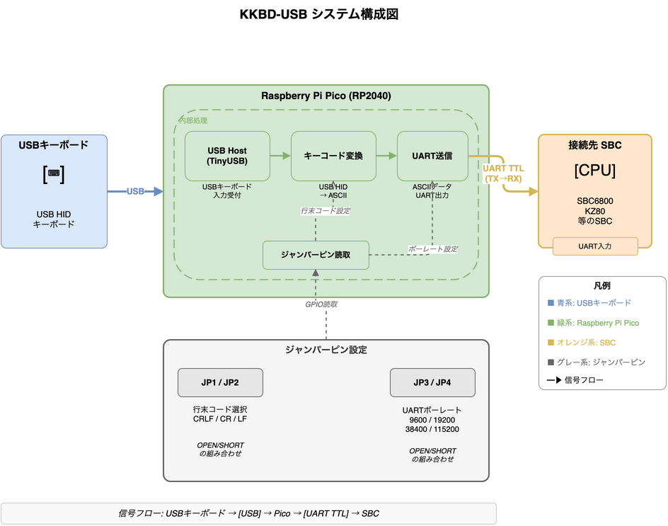

# KKBD-USB


> **注意: 現在開発進行中のプロジェクトです。ファームウェアは未実装です。**

## 概要

KKBD-USB は、SBC6800 や KZ80 マイコンなど、UART 経由で稼働するシングルボードコンピューター（SBC）をスタンドアロン化するためのキーボードインターフェースボードです。

Raspberry Pi Pico（RP2040）の USB ホスト機能を利用し、USB キーボードの入力を UART 信号に変換して SBC へ出力します。これにより、PC なしで SBC 単体をキーボード操作できる環境を実現します。

## システム構成図



## 主な機能

- USB キーボードの入力を UART 信号に変換して出力
- ボーレートをジャンパーピンで選択可能（9600 / 19200 / 38400 / 115200 bps）
- 行末コードをジャンパーピンで選択可能（CRLF / CR / LF）
- Raspberry Pi Pico（RP2040）の内蔵 USB ホスト機能（TinyUSB）を使用

## 実装ステータス

| Phase | 内容 | 状態 |
|-------|------|------|
| Phase 1 | ビルド環境構築・Lチカ | 完了（実機検証済み） |
| Phase 2 | ジャンパー読取とUART送信 | 完了（実機検証済み） |
| Phase 3 | USBホスト基盤（TinyUSB） | 未着手 |
| Phase 4 | 基本キー入力（英数字） | 未着手 |
| Phase 5 | 修飾キー対応 | 未着手 |
| Phase 6 | 行末コード・キーリピート・LED | 未着手 |
| Phase 7 | 異常系処理 | 未着手 |
| Phase 8 | 実機検証 | 未着手 |

詳細は [`docs/design/実装計画.md`](docs/design/実装計画.md) を参照してください。

## ハードウェア仕様

| 項目 | 仕様 |
|------|------|
| MCU | Raspberry Pi Pico（RP2040） |
| USB ホスト | Pico 内蔵 USB ホスト機能（TinyUSB） |
| 開発言語 | C/C++（Raspberry Pi Pico SDK） |
| UART 出力レベル | TTL レベル |
| UART フォーマット | 8N1 |

### ジャンパーピン設定

#### 行末コード選択（JP1 / JP2）

| JP1 | JP2 | 行末コード | 送出バイト列 |
|-----|-----|-----------|-------------|
| OPEN | OPEN | CR | 0x0D |
| SHORT | OPEN | LF | 0x0A |
| OPEN | SHORT | CRLF | 0x0D 0x0A |
| SHORT | SHORT | （予約） | - |

> 予約パターン（JP1=SHORT, JP2=SHORT）読み取り時は CR にフォールバックする（要件定義 FR-004 補足）。

#### ボーレート選択（JP3 / JP4）

| JP3 | JP4 | ボーレート |
|-----|-----|-----------|
| OPEN | OPEN | 9600 bps |
| SHORT | OPEN | 19200 bps |
| OPEN | SHORT | 38400 bps |
| SHORT | SHORT | 115200 bps |

## ディレクトリ構成

```
KKBD-USB/
├── README.md
├── CMakeLists.txt              # ルートCMake（Pico SDK統合）
├── pico_sdk_import.cmake       # Pico SDK インポート
├── .gitignore
├── docs/
│   ├── requirements/
│   │   ├── 要件概要.md
│   │   └── 要件定義.md
│   ├── design/
│   │   ├── 設計書.md
│   │   ├── 実装計画.md
│   │   └── テスト戦略.md
│   ├── tests/                  # 実機検証手順（Phase毎）
│   └── images/
│       ├── system_overview.drawio + .png
│       ├── architecture.drawio + .png
│       └── tool/
│           └── convert_drawio.sh
├── src/                        # ファームウェア（Pico SDK ビルド）
│   ├── CMakeLists.txt
│   ├── main.c                  # エントリポイント
│   ├── tusb_config.h           # TinyUSB ホストモード設定
│   ├── usb_host.c/h            # USBホスト処理
│   ├── keymap.c/h              # HID Usage ID → ASCII
│   ├── uart_out.c/h            # UART送信、行末コード
│   ├── config.c/h              # ジャンパー読取
│   ├── led.c/h                 # LEDインジケータ
│   └── keyrepeat.c/h           # キーリピート
└── tests/                      # ホスト側ユニットテスト（独立CMake）
    ├── CMakeLists.txt
    ├── test_framework.h
    └── test_keymap.c
```

## 開発環境

| ツール | バージョン | インストール例（macOS） |
|--------|-----------|------------------------|
| Raspberry Pi Pico SDK | v1.5.1 以上 | 後述「Pico SDK のセットアップ」参照 |
| arm-none-eabi-gcc | 10 以上 | `brew install --cask gcc-arm-embedded` |
| CMake | 3.13 以上 | `brew install cmake` |
| Ninja（推奨） | - | `brew install ninja` |
| picotool（任意） | - | `brew install picotool` |

### Pico SDK のセットアップ

> **注意**: Pico SDK は **本リポジトリの外** に clone してください。プロジェクトルート内に clone すると未追跡ファイルとして混入し、誤コミットの原因になります（`.gitignore` でも一応保護していますが、別ディレクトリに置く運用が推奨です）。

```sh
# プロジェクト外の任意の場所（例: ホームディレクトリ）に clone
cd ~
git clone -b 1.5.1 https://github.com/raspberrypi/pico-sdk.git --recurse-submodules

# 環境変数 PICO_SDK_PATH を設定（~/.zshrc や ~/.bashrc に追記すると永続化）
export PICO_SDK_PATH=$HOME/pico-sdk
```

Linux / Windows のセットアップは [Pico SDK 公式ドキュメント](https://github.com/raspberrypi/pico-sdk) を参照してください。

## ビルド方法

### 推奨: ビルドスクリプト経由

```sh
export PICO_SDK_PATH=$HOME/pico-sdk
./scripts/build.sh           # 通常ビルド
./scripts/build.sh --clean   # build/ を削除して再ビルド
```

ビルドが成功すると `build/src/kkbd_usb.uf2` が生成されます。
`scripts/build.sh` は CMake 4.x 利用時のワークアラウンド（`CMAKE_POLICY_VERSION_MINIMUM=3.5`）を自動的に設定します。

### 手動ビルド

```sh
export PICO_SDK_PATH=$HOME/pico-sdk
# CMake 4.0+ を使う場合は以下も必要（Pico SDK 1.5.1 互換性対応）
export CMAKE_POLICY_VERSION_MINIMUM=3.5
cmake -S . -B build -G Ninja
cmake --build build
```

> **Note (CMake 4.x 利用時)**: Pico SDK 1.5.1 同梱の TinyUSB サブビルド（`pioasm` / `elf2uf2`）が古い `cmake_minimum_required` を持つため、CMake 4.0 以上ではビルド時にエラーになります。`CMAKE_POLICY_VERSION_MINIMUM=3.5` を **シェルで export** することで ExternalProject_Add の子 CMake 呼び出しに env var が伝播し回避できます（CMakeLists.txt 内の `set(ENV{})` ではビルド時の sub-cmake 起動に伝播しないため不可）。Pico SDK 2.x へのアップグレードで本対応は不要になります。

### Pico への書き込み

1. Pico の **BOOTSEL ボタン** を押しながら USB を接続すると `RPI-RP2` ボリュームとしてマウントされます。
2. `build/src/kkbd_usb.uf2` を `RPI-RP2` にドラッグ＆ドロップ（または `cp`）
   - macOS 例: `cp build/src/kkbd_usb.uf2 /Volumes/RPI-RP2/`
   - Linux 例: `cp build/src/kkbd_usb.uf2 /media/$USER/RPI-RP2/`
3. Pico が自動再起動し、Phase 1 ファームウェアの場合 LED が約 500ms 間隔でトグル（点灯500ms→消灯500ms→点灯…）して点滅します。

### ホスト側ユニットテスト実行

ファームウェアビルドとは独立に、ホスト側で keymap 等のユニットテストを実行できます：

```sh
cmake -S tests -B build-tests
cmake --build build-tests
ctest --test-dir build-tests --output-on-failure
```

詳細は [`docs/design/テスト戦略.md`](docs/design/テスト戦略.md) を参照してください。

## 実機検証

各 Phase の実機検証手順は [`docs/tests/`](docs/tests/) を参照してください。

- Phase 1: [`docs/tests/phase1_実機検証手順.md`](docs/tests/phase1_実機検証手順.md)
- Phase 2: [`docs/tests/phase2_実機検証手順.md`](docs/tests/phase2_実機検証手順.md)

## draw.io 変換ツールの使い方

`docs/images/tool/convert_drawio.sh` を使用すると、draw.io ファイル（`.drawio`）を PNG 画像に変換できます。

```bash
cd docs/images/tool
./convert_drawio.sh ../system_overview.drawio
```

変換後の画像は `docs/images/` に出力されます。

## ライセンス

TBD

## 参考リンク

- [USB 簡単ホスト（TinyUSB を使った RP2040 USB ホスト実装例）](https://q61.org/blog/2021/06/09/easyusbhost/)
- [Raspberry Pi Pico SDK](https://github.com/raspberrypi/pico-sdk)
- [TinyUSB](https://github.com/hathach/tinyusb)
