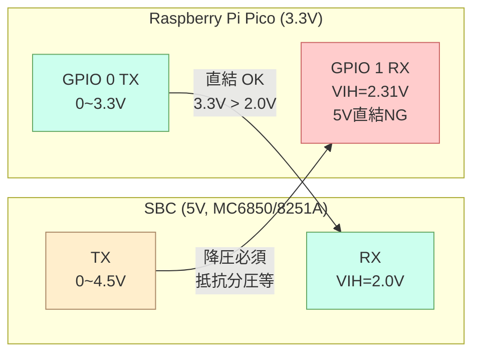
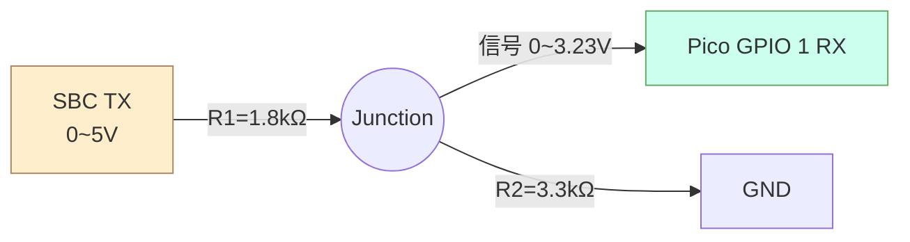
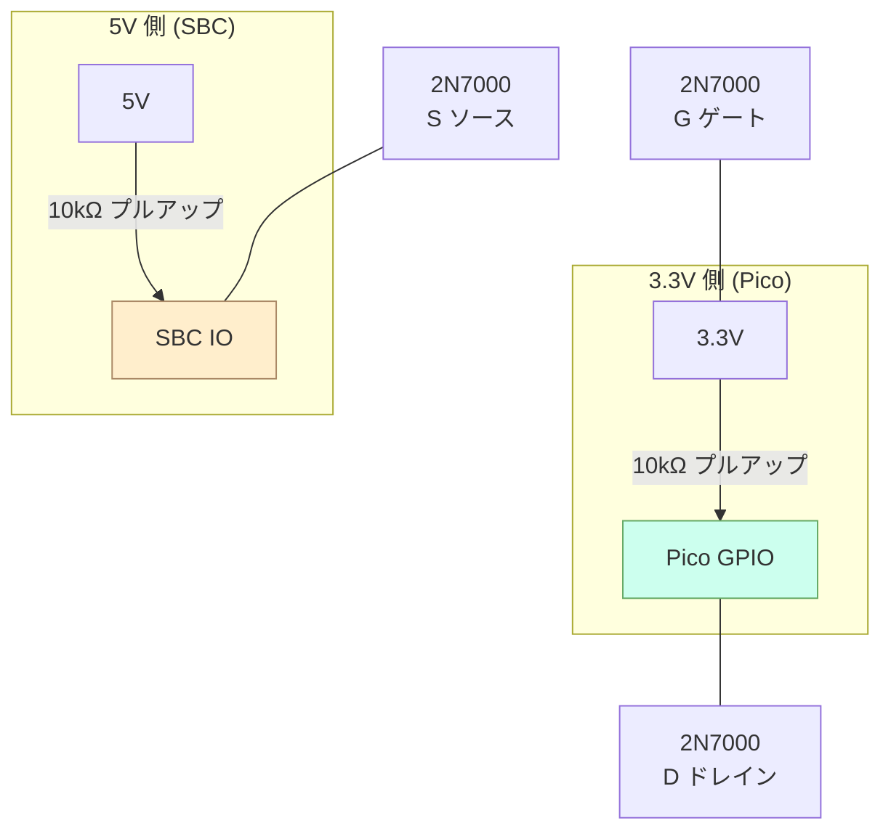
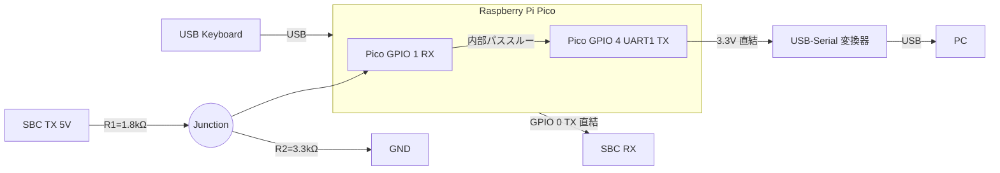

# KKBD-USB 将来計画: 5V SBC 接続のための電圧レベル変換ガイド

**文書番号**: KKBD-USB-FUT-004
**作成日**: 2026-05-06
**バージョン**: 1.0
**ステータス**: 検討中（未確定）
**追跡 Issue**: [#29](https://github.com/kuninet/KKBD-USB/issues/29)

## 1. はじめに

KKBD-USB の想定接続先 SBC は **SBC6800（MC6850 ACIA）** と **KZ80（8251A USART）**。両者とも 5V 動作の NMOS UART IC を搭載しているため、Raspberry Pi Pico (RP2040) の **3.3V GPIO** とのレベル整合を考える必要がある。

本書では、各 IC のデータシート仕様を踏まえて Pico ↔ SBC 間の電圧レベル変換方針を確定する。応答モニタ将来計画（[Plan A](将来計画_応答モニタ_PlanA.md), Issue [#27](https://github.com/kuninet/KKBD-USB/issues/27)）で SBC TX → Pico RX 方向の受信を加える際にも本書をそのまま適用できる。

実装はまだ行わない。本書は方針確定の判断材料。

## 2. SBC 側 UART IC の電気的仕様

### 2.1 MC6850 ACIA (Motorola)

- プロセス: NMOS
- 電源電圧: Vcc = 5V ±5%
- 入力（RxData / CS / R/W 等）: TTL 互換
- 出力（TxData / IRQ 等）: TTL 互換
- 主要パラメータ:

| 項目 | 記号 | 最小 | 最大 | 単位 | 備考 |
|---|---|---|---|---|---|
| 入力 High 閾値 | VIH | 2.0 | Vcc | V | TTL 互換 |
| 入力 Low 閾値 | VIL | -0.3 | 0.8 | V | TTL 互換 |
| 出力 High 電圧 | VOH | 2.4 | — | V | @ Iout = -100µA |
| 出力 Low 電圧 | VOL | — | 0.4 | V | @ Iout = 1.6mA |

### 2.2 8251A USART (Intel)

- プロセス: NMOS
- 電源電圧: Vcc = 5V ±5%
- 入力（RxD / D0-7 / 制御信号）: TTL 互換
- 出力（TxD / D0-7 / RxRDY 等）: TTL 互換
- 主要パラメータ:

| 項目 | 記号 | 最小 | 最大 | 単位 | 備考 |
|---|---|---|---|---|---|
| 入力 High 閾値 | VIH | 2.0 | Vcc+0.5 | V | TTL 互換 |
| 入力 Low 閾値 | VIL | -0.5 | 0.8 | V | TTL 互換 |
| 出力 High 電圧 | VOH | 2.4 | — | V | @ Iout = -400µA |
| 出力 Low 電圧 | VOL | — | 0.45 | V | @ Iout = 2.5mA |

### 2.3 一覧表

| IC | 入力 VIH min | 入力 VIL max | 出力 VOH min | 出力 VOL max | 出力スイング (実機) |
|---|---|---|---|---|---|
| MC6850 | 2.0V | 0.8V | 2.4V | 0.4V | 概ね 0V〜4.5V 程度 |
| 8251A | 2.0V | 0.8V | 2.4V | 0.45V | 概ね 0V〜4.5V 程度 |

> **重要**: 両者とも入力は TTL レベル（VIH=2.0V）。Pico の 3.3V 出力は余裕をもって High と認識される。一方、出力は TTL 規格上の最低 2.4V を超えて実機では 4〜5V 近くまで振れるため、**Pico に直結すると IOVDD+0.5V を超えて破損リスク**がある。

## 3. Raspberry Pi Pico (RP2040) GPIO 仕様

### 3.1 電圧範囲

- IOVDD = 3.3V（Pico ボード固定）
- **5V トレラントではない**（RP2040 データシート §5.1, "Recommended operating conditions" / "Absolute maximum ratings"）
- Absolute Max: 各 GPIO の電圧は IOVDD + 0.5V = 3.8V を超えてはいけない

### 3.2 入出力閾値

| 項目 | 記号 | 値 |
|---|---|---|
| 入力 High 閾値 | VIH | 0.7 × IOVDD = 2.31V |
| 入力 Low 閾値 | VIL | 0.3 × IOVDD = 0.99V |
| 出力 High 電圧 | VOH | IOVDD - 0.4V = 2.9V（@ 駆動電流規定値） |
| 出力 Low 電圧 | VOL | 0.4V |

## 4. 方向別の結論

### 4.1 Pico TX → SBC RX: 直結 OK

- Pico VOH ≈ 2.9V > SBC VIH 2.0V（マージン 0.9V）
- High/Low の電流も TTL 入力（数 µA）で問題なし
- **追加部品不要**

### 4.2 SBC TX → Pico RX: 降圧必須

- SBC TX は 0〜4.5V スイング（実機）
- Pico RX への直結は IOVDD+0.5V=3.8V を超えて **破損リスク**
- **抵抗分圧** または **MOSFET レベル変換** が必要

## 5. 推奨回路（抵抗分圧）

### 5.1 回路図

### 5.2 推奨抵抗値の選定根拠

| 項目 | 計算 | 値 |
|---|---|---|
| 出力電圧（High 時） | 5V × R2 / (R1+R2) = 5 × 3.3 / 5.1 | **3.23V** |
| 出力電圧（Low 時） | 0V × R2 / (R1+R2) | 0V |
| Pico 入力 VIH に対するマージン | 3.23V - 2.31V | 0.92V |
| 消費電流（High 時） | 5V / (R1+R2) = 5 / 5100 | **0.98mA** |
| 並列抵抗 | R1‖R2 = 1.8k × 3.3k / 5.1k | 1.16kΩ |
| Pico 入力静電容量（推定） | データシート + 配線 | 〜15pF |
| 時定数 | 1.16kΩ × 15pF | **17.4ns** |
| 115200bps の 1bit 時間 | 1 / 115200 | 8.68µs |
| 余裕度 | 8.68µs / 17.4ns | **約 500 倍** |

→ 115200bps でも信号波形は完全に追従。9600bps なら 5000 倍の余裕。

### 5.3 代替抵抗値

| R1 | R2 | 出力電圧 | 消費電流 | 備考 |
|---|---|---|---|---|
| 1.0kΩ | 1.8kΩ | 3.21V | 1.79mA | ノイズ耐性 ↑、消費電流 ↑ |
| **1.8kΩ** | **3.3kΩ** | **3.23V** | **0.98mA** | **推奨**（バランス良好） |
| 2.2kΩ | 3.9kΩ | 3.20V | 0.82mA | 部品箱に E12 系列のみあるとき |
| 4.7kΩ | 10kΩ | 3.40V | 0.34mA | 出力やや高め、長距離配線注意 |

E24 系列を持っていれば **1.8kΩ + 3.3kΩ** が最適。

## 6. 代替手法

### 6.1 比較表

| 手法 | 部品 | 双方向 | スルーホール | コスト | 備考 |
|---|---|---|---|---|---|
| **抵抗分圧 + 直結** | 抵抗 2 本 | × | ◎ | ¥20 | UART は方向決まってる |
| **2N7000 + プルアップ抵抗** | TO-92 N-MOSFET 1 個 + 抵抗 2 本 | ○ | ◎ | ¥50 | I2C 用にも使える定番回路 |
| **BSS138 モジュール基板** | Adafruit 757 / Sparkfun BOB-12009 | ○ | △（基板化済み） | ¥500 | 表面実装だがピンヘッダ付き |
| **74LVC125 / 74LVC245** | SMD ロジック IC | △ | × | ¥200 | 半田付け技術が必要、大袈裟 |
| **MAX232** | RS-232C レベル変換 IC | — | ○ | ¥300 | **用途違い**（±12V 用） |

### 6.2 2N7000 双方向レベル変換回路

I2C で広く使われる「BSS138 双方向レベル変換」を、TO-92 パッケージのスルーホール部品 **2N7000** で実装する古典回路。

動作原理:
- Low 側がオープン: 両端ともプルアップで High（3.3V / 5V）
- Low 側が GND に引かれる: ゲート-ソース間 ON → High 側もソースが GND に引かれる
- High 側が GND に引かれる: ボディダイオード経由で Low 側ドレインも引かれる → ゲート-ソース ON で確定
- どちらの方向にも自然に動作

メリット:
- 部品 1 個（2N7000）で双方向
- I2C / UART / SPI クロック以外に転用可能
- TO-92 でスルーホール

デメリット:
- 抵抗分圧より配線が多い（4 本 + GND）
- プルアップ抵抗で常時微小電流

### 6.3 BSS138 モジュール基板

Adafruit や Sparkfun が販売する 4ch レベル変換モジュール（BOB-12009 / Adafruit 757）。BSS138 が表面実装だが、基板化されているのでピンヘッダで使える。

メリット: 4ch 一括、配線簡単、信頼性高い
デメリット: ¥500 程度かかる、4ch は本用途には過剰

### 6.4 74LVC125 等のロジック IC

3.3V 動作で 5V トレラント入力を持つバスバッファ IC。本格的なレベル変換が必要な場合に使うが、本用途には**過剰**。

## 7. 部品表（推奨構成）

| 部品 | 数量 | 概算価格 | 備考 |
|---|---|---|---|
| 抵抗 1.8kΩ 1/4W 1% | 1 | ¥10 | SBC TX → Pico RX 用 R1 |
| 抵抗 3.3kΩ 1/4W 1% | 1 | ¥10 | SBC TX → Pico RX 用 R2 |
| ジャンパワイヤ | 数本 | — | 配線用 |

合計 **¥20 程度**。応答モニタ Plan A 採用時は別途 USB-Serial 変換器が必要。

## 8. 配線・検証手順

### 8.1 配線

1. Pico GPIO 0 (Pin 1) を SBC RX 端子に直結
2. SBC TX 端子 ─ R1 (1.8kΩ) ─ 接続点 ─ Pico GPIO 1 (Pin 2)
3. 接続点 ─ R2 (3.3kΩ) ─ GND
4. Pico GND と SBC GND を共通接続

### 8.2 検証項目

| 項目 | 方法 | 期待値 |
|---|---|---|
| Pico TX 電圧（Idle High） | テスター or オシロで GPIO 0 を測定 | 3.3V |
| SBC RX 認識（Idle High） | SBC 側 UART レジスタを読み取るか、ループバック試験 | High 認識 |
| 分圧後電圧（SBC Idle High） | テスターで Pico GPIO 1 を測定 | 約 3.23V |
| 分圧後電圧（SBC TX 出力 0） | 同上 | 0V |
| 通信疎通 | SBC ↔ Pico 間で送受信 | データ欠落なし |
| 波形確認（オシロ持ちなら） | Pico RX 端をプロービング | 立ち上がり/立ち下がり 100ns 以内 |

## 9. リスクと注意事項

| リスク | 対策 |
|---|---|
| GND 共通忘れ → 信号レベル不定 | 必ず Pico GND と SBC GND を共通接続。電源系統が違っても GND は必須 |
| Pico RX 直結による破損 | **絶対に SBC TX を Pico RX に直結しない**。試験時も必ず分圧経由 |
| R2 のプルダウン位置間違い | R2 は GND 側。R1 と R2 を逆にすると分圧比が反転する |
| ボーレート 1Mbps 超 | 推奨抵抗値の時定数 17.4ns は 1Mbps 程度まで。それ以上は 1kΩ + 1.8kΩ にする |
| ノイズの多い環境 | R1∥R2 を下げる（インピーダンス↓）か、シールド配線・短距離化 |
| 5V SBC でも CMOS（VIH=3.5V）入力の場合 | Pico TX 直結が境界値 → 動作確認必須、必要なら 3.3V→5V 昇圧（2N7000 or BSS138） |

## 10. 応答モニタ将来計画 (Plan A) との関係

[Plan A: UART1 パススルー](将来計画_応答モニタ_PlanA.md) では SBC TX → Pico RX (GPIO 1) の受信が前提。本書の **5.1 推奨回路（抵抗分圧）** をそのまま Plan A の配線に組み込めば、5V SBC でも応答モニタが安全に動作する。

Plan A 単独実装の場合も、SBC が 5V なら本書の抵抗分圧を適用すること。

## 11. 関連文書

- 既存マニュアル §2.1 (SBC UART レベル対応表): [docs/manual/01_ハードウェア構成.md](../manual/01_ハードウェア構成.md)
- 応答モニタ将来計画 概要: [将来計画_応答モニタ_概要.md](将来計画_応答モニタ_概要.md)
- 応答モニタ Plan A: [将来計画_応答モニタ_PlanA.md](将来計画_応答モニタ_PlanA.md)
- GitHub Issue（本書追跡）: [#29](https://github.com/kuninet/KKBD-USB/issues/29)
- GitHub Issue（応答モニタ）: [#27](https://github.com/kuninet/KKBD-USB/issues/27)

## 12. 改訂履歴

| 日付 | バージョン | 内容 |
|---|---|---|
| 2026-05-06 | 1.0 | 初版（MC6850 / 8251A 仕様確定、抵抗分圧 1.8kΩ+3.3kΩ 推奨） |
