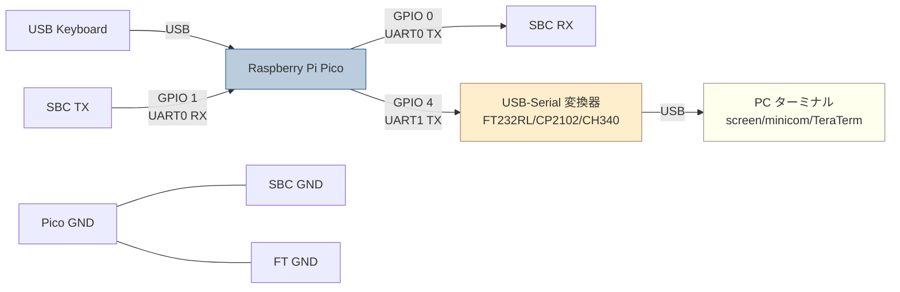
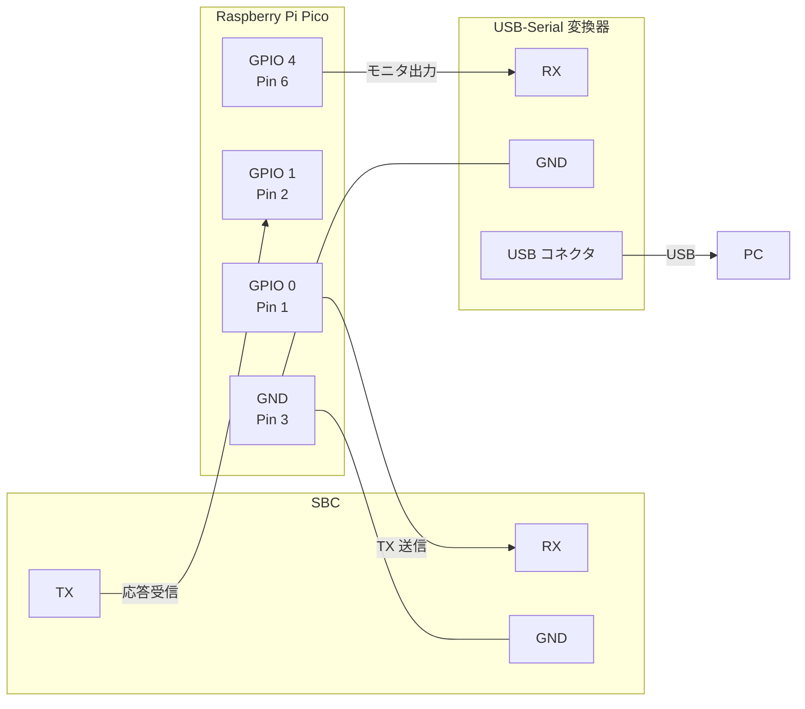
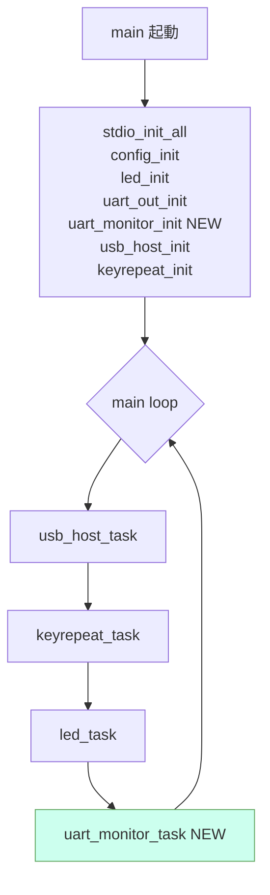

# KKBD-USB 将来計画: Plan A — UART1 パススルー方式

**文書番号**: KKBD-USB-FUT-002
**作成日**: 2026-05-06
**バージョン**: 1.0
**ステータス**: 検討中（未着手）
**追跡 Issue**: [#27](https://github.com/kuninet/KKBD-USB/issues/27)

## 1. 概要

UART0 RX (GPIO 1) を初期化して SBC からの応答を受信し、そのまま UART1 TX (GPIO 4) に素通す。PC には FT232RL / CP2102 / CH340 等の USB-Serial 変換器で UART1 を受けてターミナルソフト（screen / minicom / TeraTerm / PuTTY）で表示する。

本体ファームに常時組み込む（マクロ無効化なし）。受信処理はポーリングで十分軽く、本体の USB ホスト処理に影響しない。

## 2. ハードウェア構成

### 2.1 全体構成



### 2.2 Pico ピンアサイン（追加分）

| 機能 | GPIO | Pico 物理ピン | 方向 | 備考 |
|---|---|---|---|---|
| UART0 TX (既存) | GPIO 0 | Pin 1 | 出力 | SBC RX へ（変更なし） |
| **UART0 RX (新規)** | **GPIO 1** | **Pin 2** | **入力** | **SBC TX から受信** |
| **UART1 TX (新規)** | **GPIO 4** | **Pin 6** | **出力** | **USB-Serial 変換器 RX へ** |

UART1 RX (GPIO 5) は使用しない。

### 2.3 配線図



### 2.4 部品リスト（追加分）

| 部品 | 数量 | 概算価格 | 備考 |
|---|---|---|---|
| USB-Serial 変換器（FT232RL / CP2102 / CH340 等） | 1 | ¥500〜1,500 | 3.3V/5V 切替可のものが望ましい |
| ジャンパワイヤ または 直結配線 | 2 本 | — | UART1 TX、GND |

### 2.5 配線注意

- Pico GND と USB-Serial 変換器 GND は **必ず共通接続**。
- USB-Serial 変換器のロジックレベルは **3.3V** に設定（5V トレラントの Pico でも 3.3V 推奨）。
- 既存の SBC ↔ Pico 配線（GPIO 0 → SBC RX、GPIO 1 ← SBC TX、GND）はそのまま。`docs/manual/01_ハードウェア構成.md` の既存配線図に GPIO 4 を追記する。

## 3. ソフトウェア構成

### 3.1 新規モジュール: `src/uart_monitor.{c,h}`

```c
/* uart_monitor.h */
#ifndef UART_MONITOR_H
#define UART_MONITOR_H
#include <stdint.h>
void uart_monitor_init(uint32_t baudrate);
void uart_monitor_task(void);
#endif
```

```c
/* uart_monitor.c (実装イメージ) */
#include "uart_monitor.h"
#include "hardware/uart.h"
#include "hardware/gpio.h"

#define MON_UART_RX_PIN   1   /* UART0 RX */
#define MON_UART1_TX_PIN  4   /* UART1 TX */

void uart_monitor_init(uint32_t baudrate) {
    /* UART0 RX 側ピンを UART 機能に */
    gpio_set_function(MON_UART_RX_PIN, GPIO_FUNC_UART);
    /* UART1 TX を初期化 */
    uart_init(uart1, baudrate);
    gpio_set_function(MON_UART1_TX_PIN, GPIO_FUNC_UART);
    uart_set_format(uart1, 8, 1, UART_PARITY_NONE);
    uart_set_fifo_enabled(uart1, true);
    uart_set_hw_flow(uart1, false, false);
}

void uart_monitor_task(void) {
    while (uart_is_readable(uart0)) {
        uint8_t b = uart_getc(uart0);
        if (uart_is_writable(uart1)) {
            uart_putc_raw(uart1, (char)b);
        }
        /* TX1 が満杯ならドロップ（モニタ用途なので許容） */
    }
}
```

### 3.2 既存ファイルの変更点

- `src/main.c`: `uart_out_init()` の直後に `uart_monitor_init(config_get_baudrate())` を追加。メインループに `uart_monitor_task()` を 1 行追加。
- `src/CMakeLists.txt`: ソース一覧に `uart_monitor.c` を追加。リンクライブラリは既存（`pico_stdlib` / `hardware_uart` / `hardware_gpio`）で足りる。
- `src/uart_out.c` の `uart_out_init()` は **触らない**（TX 側設定はそのまま、RX 側 GPIO は `uart_monitor_init()` 側で設定）。

### 3.3 制御フロー



### 3.4 ボーレート同期

- UART0（送信）と UART1（モニタ出力）を同じボーレートで動かす。`config_get_baudrate()` の戻り値をそのまま両方に流す。
- ジャンパでボーレートを変えると、PC 側ターミナルもそれに合わせて再設定が必要（既存の運用と同じ思想）。

### 3.5 行末コードの扱い

- モニタ側は **無加工で素通し**。SBC が出した CR/LF/エスケープシーケンスをそのまま PC に届ける（`uart_putc_raw` を使用）。
- これは既存の `uart_out_send_line_ending()`（`src/uart_out.c:40-58`）の思想（変換しない）と一貫する。

## 4. 受け入れ条件

| ID | 条件 |
|---|---|
| A-AC-01 | `kkbd_usb.uf2` がエラーなくビルドできる。 |
| A-AC-02 | USB キーボード→SBC への送信機能が従来どおり動作する（リグレッションなし）。 |
| A-AC-03 | SBC で `echo hello` を実行 → PC ターミナルに `hello\r\n` 等が表示される。 |
| A-AC-04 | ジャンパ JP3/JP4 を変更してボーレートを変えると、PC 側で受信できるボーレートも追従する（PC 側設定をそれに合わせて変える前提）。 |
| A-AC-05 | 連続入力（10 秒間に 1KB 程度）でも欠落しない。 |
| A-AC-06 | バイナリサイズ増加が +5KB 以内。 |

## 5. リスク・課題

| リスク | 影響度 | 対策 |
|---|---|---|
| UART0 RX に SBC 側がノイズを流すと誤検出 | 中 | パススルー時はそのまま通す。本体送信動作には影響しない。 |
| UART1 TX と UART1 RX (GPIO 5) のピンを将来別用途に使いたくなる | 低 | GPIO 5 は使わず予約。 |
| GPIO 4 の他用途競合 | 低 | 現在 `src/config.h` の JP1〜JP4 (GPIO 10-13) と LED (GPIO 25) のみ使用。GPIO 4 は空き。 |

## 6. 工数見積もり

- 設計・実装: 0.5 日
- 配線・実機検証: 0.5 日
- ドキュメント更新（`docs/manual/01_ハードウェア構成.md`、`docs/manual/03_ビルドと書き込み.md`）: 0.5 日
- **合計: 1.5 日**

## 7. 関連項目

- 概要: [将来計画_応答モニタ_概要.md](将来計画_応答モニタ_概要.md)
- 対比案: [将来計画_応答モニタ_PlanB.md](将来計画_応答モニタ_PlanB.md)
- GitHub Issue: [#27](https://github.com/kuninet/KKBD-USB/issues/27)

## 改訂履歴

| 日付 | バージョン | 内容 |
|---|---|---|
| 2026-05-06 | 1.0 | 初版 |
