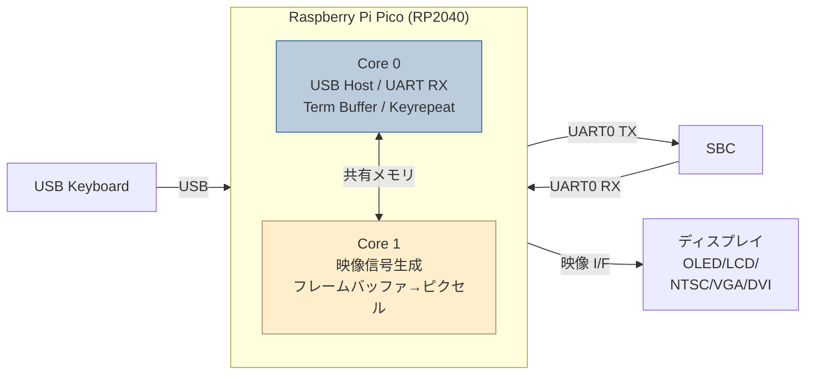
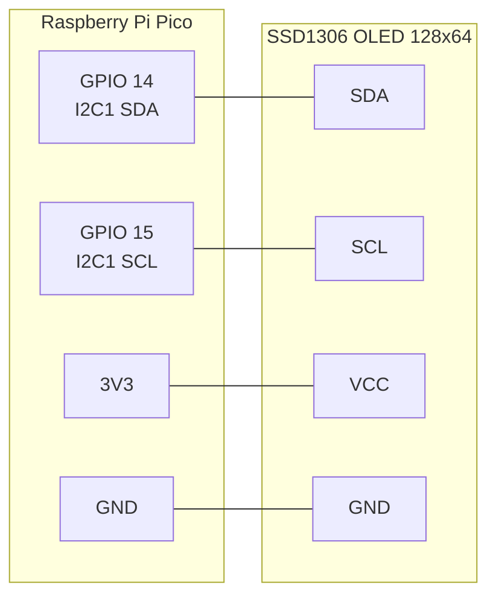
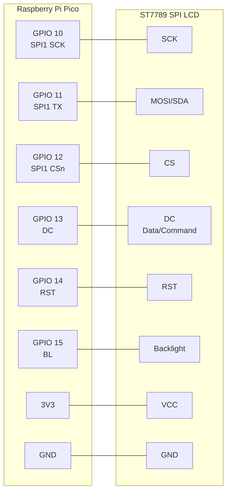
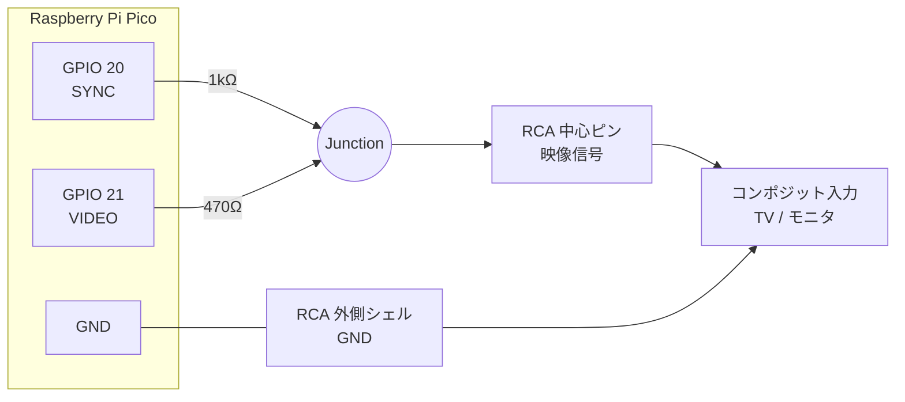
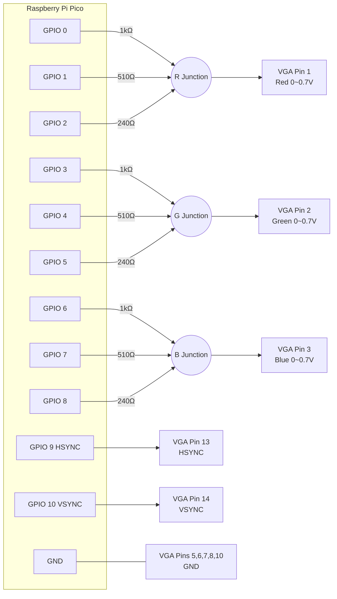
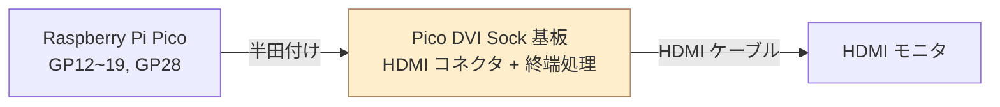
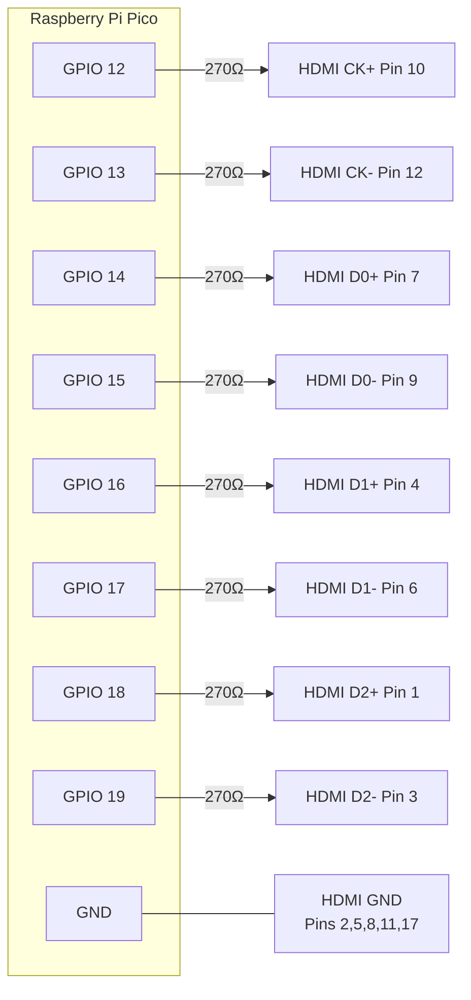

# KKBD-USB 将来計画: Plan B — スタンドアロンシリアル端末化

**文書番号**: KKBD-USB-FUT-003
**作成日**: 2026-05-06
**バージョン**: 1.0
**ステータス**: 検討中（未着手・要試作）
**追跡 Issue**: [#27](https://github.com/kuninet/KKBD-USB/issues/27)

## 1. 概要

KKBD-USB に映像出力 I/F を追加し、UART RX で受信した文字を Pico 自身が画面に直接描画する。PC 不要の「USB キーボード + 画面 = 完結したシリアル端末」を構成する野心的な拡張。映像方式として **B-1〜B-5 の 5 通り**を比較する。

## 2. 共通設計

### 2.1 全体アーキテクチャ



### 2.2 Core 分担

- **Core 0**: USB ホスト処理（TinyUSB）、UART RX 受信、ターミナルバッファ更新、キーリピート、LED、ジャンパ読み取り。
- **Core 1**: 映像信号生成（タイミングシビアな処理）、フレームバッファ→ピクセル変換。

`pico_multicore` ライブラリで Core1 を起動し、リングバッファ（または共有メモリ）でターミナル状態を Core0 から Core1 に渡す。

### 2.3 ターミナル機能

- **キャラクタバッファ**: 画面サイズ × 2 バイト（文字 + 属性）。例: 80×30 = 4.8KB。
- **VT100 サブセット解釈**:
  - 制御文字: BS (0x08), TAB (0x09), LF (0x0A), CR (0x0D), BEL (0x07)
  - 最低限のエスケープ: `ESC [ 2 J`（画面クリア）、`ESC [ H`（カーソル原点）、`ESC [ A/B/C/D`（カーソル移動）
  - カラー (`ESC [ 3X m`) は方式によりサポート可否が変わる（OLED/NTSC はモノクロ）。
- **スクロール**: 行末で 1 行スクロールアップ。バッファシフトで実装。

### 2.4 フォント

- 8×8 または 8×16 固定ビットマップ。
- 採用候補:
  - **IBM CGA 8×8**（パブリックドメイン、ASCII 全文字、約 2KB）
  - **Cozette**（MIT, 6×13、よりモダン）
  - **Spleen**（BSD-2, 8×16）
- フラッシュ ROM に const 配列で配置（RAM 圧迫を避ける）。

### 2.5 新規モジュール構成（共通部分）

```
src/
├── term/
│   ├── term_buffer.{c,h}    # キャラクタバッファ + VT100 解釈
│   ├── uart_rx.{c,h}        # UART0 RX 受信 → term_buffer
│   ├── font_8x8.h           # フォントデータ
│   └── video_<方式>.{c,h}   # 方式別ドライバ（B-1〜B-5）
└── ...
```

### 2.6 メモリ予算（Pico SRAM 264KB）

| 用途 | 想定サイズ |
|---|---|
| TinyUSB 内部バッファ | 〜20KB |
| キャラクタバッファ + 属性 | 5〜10KB |
| フレームバッファ（方式依存） | 0〜80KB |
| フォント | 2〜4KB（フラッシュ常駐推奨） |
| スタック (Core0/Core1) | 8KB×2 |
| **合計** | 35〜130KB |

→ Pico1 (RP2040) で B-5 (DVI) は厳しめ、それ以外は余裕あり。

---

## 3. B-1: I2C OLED (SSD1306 128×64)

### 3.1 配線図



### 3.2 部品

| 部品 | 数量 | 概算価格 | 備考 |
|---|---|---|---|
| SSD1306 OLED (128×64, I2C) | 1 | ¥300〜500 | 0.96 インチが一般的 |
| ジャンパワイヤ | 4 本 | — | |

### 3.3 仕様

- 解像度: 128×64 モノクロ
- 文字数: 21×8（6×8 フォント）または 16×4（8×16 フォント）
- I2C 速度: 400kHz（fast mode）
- フレーム転送: 128×64/8 = 1024 bytes ≈ 25ms/フレーム
- ライブラリ: `pico-ssd1306`（GitHub: daschr/pico-ssd1306）

### 3.4 PIO/メモリ

- PIO 不要（I2C ハードウェアブロックを使用）
- フレームバッファ: 1KB
- コード規模: ~300〜500 行

### 3.5 適性

- ◎ 配線最小、入手容易、即試作可能。
- △ 表示量が少ない（8 行程度）。「直近ログ確認」用途に向く。

---

## 4. B-2: SPI LCD (ST7789 240×240 / 320×240)

### 4.1 配線図



### 4.2 部品

| 部品 | 数量 | 概算価格 | 備考 |
|---|---|---|---|
| ST7789 SPI LCD（1.3〜2.0 インチ） | 1 | ¥1,000〜2,000 | Pimoroni / Waveshare / AliExpress |
| ジャンパワイヤ | 8 本 | — | |

### 4.3 仕様

- 解像度: 240×240 または 320×240、16bit カラー
- 文字数: 30×30 または 40×30（8×8 フォント）
- SPI 速度: 30〜62.5 MHz
- フレームバッファ: 240×240×2 = 115KB（フル）または スクリーンバッファ 40×30×2 = 2.4KB（テキストモード）
- ライブラリ: `pico-examples` の `pico_examples/spi/lcd_1inch3` 系、または `pico-st7789`

### 4.4 PIO/メモリ

- PIO 不要（SPI ハードウェアブロックを使用、または PIO で高速化も可）
- メモリ: テキストモード前提なら 5KB 程度
- コード規模: ~700〜1000 行

### 4.5 適性

- ◎ 解像度・色とも端末用途に十分、実装も比較的素直。
- ◎ 入手容易。
- ★ Plan B の中で最もバランスが良い選択肢。

---

## 5. B-3: NTSC コンポジット

### 5.1 配線図（抵抗ラダー DAC）



抵抗ラダーで 2bit DAC を構成。NTSC 信号レベル 1V p-p (75Ω 終端) を再現。

| SYNC | VIDEO | 出力電圧 | 意味 |
|---|---|---|---|
| 0 | 0 | 0V | 同期パルス |
| 1 | 0 | 約 0.3V | 黒/ブランキング |
| 1 | 1 | 約 0.7〜1.0V | 白 |

### 5.2 部品

| 部品 | 数量 | 概算価格 | 備考 |
|---|---|---|---|
| RCA ジャック | 1 | ¥100〜300 | 黄色（映像）色のもの |
| 抵抗 1kΩ | 1 | ¥10 | 1/4W で十分 |
| 抵抗 470Ω | 1 | ¥10 | 1/4W で十分 |
| RCA ケーブル + コンポジット入力 TV/モニタ | 1 | — | 中古、入手性低下中 |

### 5.3 仕様

- 信号: NTSC モノクロ（カラーは 4.4MHz サブキャリア生成が必要で困難）
- 解像度: 320×200 or 256×192 程度
- 文字数: 40×25（8×8 フォント）
- タイミング: 1H = 63.5μs（HSYNC 周波数 15.734 kHz）、垂直 60Hz

### 5.4 PIO/メモリ

- PIO 1 SM 使用（同期 + 映像出力）
- フレームバッファ: 256×192/8 = 6KB（モノクロ 1bpp）
- コード規模: ~1500〜2000 行（PIO プログラム + Core1 タイミング処理 + 文字描画）

### 5.5 参考実装

- Hunter Adams (Cornell) "Raspberry Pi Pico Composite Video": <https://vanhunteradams.com/Pico/TV/TV.html>
- breakintoprogram/pico-mposite: <https://github.com/breakintoprogram/pico-mposite>

### 5.6 適性

- △ レトロ路線。コンポジット入力モニタの入手が課題。
- △ カラーは現実的でない。
- ○ 部品費は最小級。

---

## 6. B-4: VGA

### 6.1 配線図（3bit/色 = 512 色版）



### 6.2 抵抗値計算

VGA はモニタ内 75Ω で終端されており、信号源 0〜0.7V を期待する。Pico GPIO は 3.3V。

- **1bit/色 (8 色)**: 各色 1 ピン → 270Ω
  - 出力電圧 = 3.3V × 75 / (270+75) ≈ 0.72V（満点白）
- **2bit/色 (64 色)**: 各色 2 ピン → MSB 270Ω, LSB 510Ω
- **3bit/色 (512 色)**: 1kΩ + 510Ω + 240Ω（重み 1:2:4）

HSYNC/VSYNC は VESA 仕様で 5V TTL を期待するが、3.3V GPIO 直結で動作するモニタが大半。

### 6.3 部品

| 部品 | 数量 | 概算価格 | 備考 |
|---|---|---|---|
| VGA メス D-SUB15 コネクタ | 1 | ¥100〜300 | パネル取付 or PCB 取付 |
| 金属皮膜抵抗 (1%) 1kΩ | 3 | ¥10 | 3bit/色構成の場合 |
| 金属皮膜抵抗 (1%) 510Ω | 3 | ¥10 | 同上 |
| 金属皮膜抵抗 (1%) 240Ω | 3 | ¥10 | 同上 |
| (代替) 270Ω | 3 | ¥10 | 1bit/色構成の場合 |
| VGA ケーブル + VGA 入力モニタ | 1 | — | 中古モニタ容易 |

### 6.4 仕様

- 解像度: 640×480 60Hz（ピクセルクロック 25.175MHz、HSYNC 31.469kHz）
- 文字数: 80×30（8×16 フォント）または 80×60（8×8 フォント）
- 色数: 1bit/色なら 8 色、3bit/色なら 512 色

### 6.5 PIO/メモリ

- PIO 1〜2 SM 使用（ピクセル出力 + 同期）
- フレームバッファ:
  - テキストモード（80×30 文字）: 4.8KB
  - 320×240×8bit カラー: 76KB
  - 640×480×1bit モノクロ: 38KB
- コード規模: ~2000〜3000 行

### 6.6 参考実装

- `pico-extras` の `pico_scanvideo`（公式サンプル）: <https://github.com/raspberrypi/pico-extras>
- Hunter Adams VGA: <https://vanhunteradams.com/Pico/VGA/VGA.html>

### 6.7 適性

- ◎ 標準的な PC モニタに繋がる「本物の端末」感。
- ◎ コネクタ・抵抗だけで実装可能、モニタも中古で安価。
- △ 配線数が多く（HSYNC/VSYNC 含めて 11 本）、PCB 化したい。
- △ 実装規模は Plan B 内最大級。

---

## 7. B-5: DVI/HDMI (PicoDVI)

### 7.1 配線図（推奨: Pico DVI Sock 基板使用）



Pico DVI Sock は Pico の裏面に半田付けする小型基板。HDMI コネクタ + 抵抗 + 終端処理が一体化されている。

### 7.2 配線図（自作版・参考、推奨しない）



> 注意: TMDS は本来差動シリアル信号で、専用ドライバ IC が必要。抵抗だけで動かすのは「だましだまし」レベルで信号品質が低い。差動対線は撚り線推奨、長さを揃える。実用には Sock 基板を推奨。

### 7.3 部品

| 部品 | 数量 | 概算価格 | 備考 |
|---|---|---|---|
| Pico DVI Sock 基板 | 1 | ~¥1,500（$12） | 推奨ルート、Pimoroni / SB Components 取扱 |
| HDMI ケーブル + HDMI モニタ | 1 | — | 入手最容易 |

### 7.4 仕様

- 解像度: 320×240×16bit カラー（標準モード）
- 必須: Pico オーバークロック 252MHz（標準 125MHz の 2 倍）
- ライブラリ: Wren6991 / PicoDVI <https://github.com/Wren6991/PicoDVI>

### 7.5 PIO/メモリ

- PIO 3 SM 使用（TMDS エンコード × 3 チャンネル）
- フレームバッファ: 320×240×2 = 150KB（フルカラー）または 4bpp で 38KB
- コード規模: ライブラリ流用で ~1500 行（自前実装は非推奨）

### 7.6 適性

- ◎ HDMI モニタ（最モダン）に直結できる。
- △ メモリ・CPU 余裕が薄め（オーバークロック必須）。
- △ USB Host との同居は **要試作検証**（Pico DVI のサンプルは USB Host を併用していない）。
- ◎ Sock 基板を使えば配線は半田付けだけ。

---

## 8. 比較表（B-1〜B-5）

| 項目 | B-1 OLED | B-2 SPI LCD | B-3 NTSC | B-4 VGA | B-5 DVI |
|---|---|---|---|---|---|
| 解像度 | 128×64 | 240×240〜320×240 | 320×200 | 640×480 | 320×240 |
| 文字数 | 21×8 | 40×30 | 40×25 | 80×30 | 40×30 |
| カラー | × | ◎ 16bit | × モノクロ | ○ 8〜512色 | ◎ 16bit |
| PIO 消費 | 0 | 0 | 1 SM | 1〜2 SM | 3 SM |
| フレームバッファ | 1KB | 5〜115KB | 6KB | 5〜76KB | 38〜150KB |
| 追加部品費 | ¥500 | ¥2,000 | ¥500 | ¥500 | ¥2,000 |
| 配線数 | 4 | 8 | 3 | 11 | Sock 半田 |
| 実装規模 | 小 | 中 | 大 | 大 | 中（ライブラリ流用） |
| USB Host 同居 | ◎ | ◎ | ○ | ○ | △ 要検証 |
| 推奨度 | ★★★ | ★★★★★ | ★★ | ★★★★ | ★★ |

## 9. 工数見積もり（参考、B-2 採用時）

- フォント整備・term_buffer 実装: 1 日
- ST7789 ドライバ統合・描画: 1 日
- VT100 サブセット解釈: 1 日
- USB ホストとの並行動作確認・調整: 1 日
- ハードウェア試作・配線・筐体検討: 1 日
- ドキュメント更新: 0.5 日
- **合計: 5.5 日**

B-4 (VGA) はこれに +3〜5 日、B-5 (DVI) は +2〜3 日（ライブラリ流用前提）。

## 10. 関連項目

- 概要: [将来計画_応答モニタ_概要.md](将来計画_応答モニタ_概要.md)
- 対比案: [将来計画_応答モニタ_PlanA.md](将来計画_応答モニタ_PlanA.md)
- GitHub Issue: [#27](https://github.com/kuninet/KKBD-USB/issues/27)

## 改訂履歴

| 日付 | バージョン | 内容 |
|---|---|---|
| 2026-05-06 | 1.0 | 初版（5 方式併記） |
