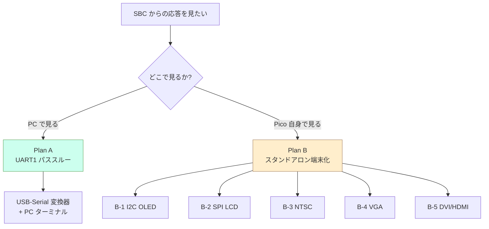
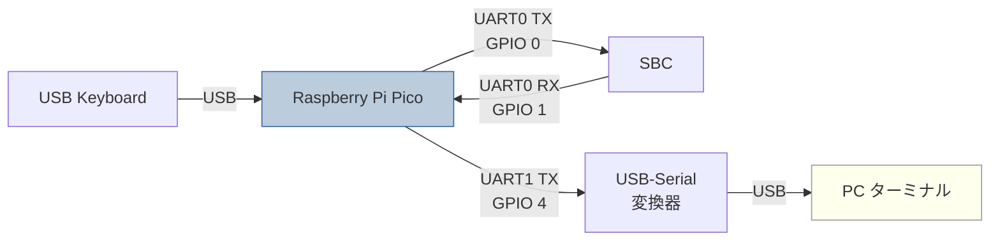
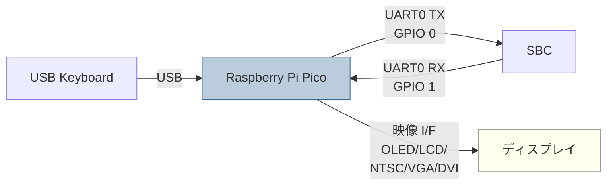

# KKBD-USB 将来計画: SBC 応答モニタ機能（概要）

**文書番号**: KKBD-USB-FUT-001
**作成日**: 2026-05-06
**バージョン**: 1.0
**ステータス**: 検討中（未確定）
**追跡 Issue**: [#27](https://github.com/kuninet/KKBD-USB/issues/27)

## 1. 背景

KKBD-USB は USB キーボード→UART 変換アダプタとして Phase 1〜6 を完了し、実機検証済み。送信経路（USB キーボード入力 → Pico → SBC）は安定動作しているが、**SBC 側からの応答（プロンプト、`echo` 結果、ログなど）を確認する経路がない**。開発時に「キーがちゃんと届いたか」「SBC が何を返してきているか」を見る手段が欲しい。

本書は、応答モニタ機能の追加に向けた 2 つの方向性を比較し、後日の方針確定に資する判断材料をまとめる。

## 2. 2 つの方向性

### 比較サマリ

| | Plan A: UART1 パススルー | Plan B: スタンドアロン端末化 |
|---|---|---|
| **方法** | UART0 RX 受信 → UART1 TX に素通し → PC で USB-Serial 変換器経由で見る | Pico に映像 I/F を生やし、UART RX を画面に直接表示 |
| **PC 必要性** | 必要 | 不要 |
| **追加ハード** | USB-Serial 変換器 1 個 | ディスプレイ + 配線（方式により異なる） |
| **実装規模** | 数十行 | 数百〜千行 |
| **本体機能との両立** | 容易（ポーリングで十分） | Core1 に映像生成を逃がす設計が必要 |
| **詳細** | [Plan A 詳細](将来計画_応答モニタ_PlanA.md) | [Plan B 詳細](将来計画_応答モニタ_PlanB.md) |

## 3. 判断軸

### Plan A を選ぶべきケース

- 開発時のみのデバッグ用途で、PC のある環境でしか使わない。
- 最短工数で済ませたい。
- 既存ファームの動作にリスクを増やしたくない。

### Plan B を選ぶべきケース

- KKBD-USB を「PC 不要のシリアル端末アダプタ」として完成させたい。
- レトロ機材（NTSC/VGA）や小型ディスプレイ（OLED/LCD）と組み合わせる構想がある。
- Pico の余剰リソース（PIO、Core1、SRAM）を活用したい。

### 折衷案（推奨）

- Plan A をまず実装し、Plan B は別 Phase（Phase 9 以降）として扱う。
- Plan B の中でも、最も低コストな B-1（I2C OLED）または B-2（SPI LCD）を先に試作し、
  そこで得た知見で B-3〜B-5 のうちどこまで進めるか決める段階リリース戦略。

## 4. データフロー比較

### Plan A のデータフロー

### Plan B のデータフロー

## 5. 共通の制約・前提

- **TinyUSB はホストモード固定**（`src/tusb_config.h: CFG_TUH_HID=4`）。RP2040 では USB ホスト/デバイスの同時利用が現実的でないため、PC 接続を USB CDC で行う案は不採用。
- **Pico の PIO リソース**は 2 ブロック × 4 SM の計 8 SM。USB ホストは標準 USB コントローラを使うため PIO を消費しない（=映像出力に PIO を使ってよい）。
- **ボーレート/行末コード**は既存ジャンパ設定（`config_get_baudrate()` / `config_get_line_ending()`、`src/config.h`）を流用する前提。

## 6. やらないこと

- USB CDC 化 / TinyUSB のデバイスモード化（上記理由）。
- PC → SBC への双方向ターミナル化（観測のみで足りる）。
- フィルタ・タイムスタンプ付加（素通し優先、必要なら PC 側で行う）。

## 7. 関連文書

- 親計画: [docs/design/実装計画.md](実装計画.md)
- 詳細設計（既存）: [docs/design/設計書.md](設計書.md)
- Plan A 詳細: [将来計画_応答モニタ_PlanA.md](将来計画_応答モニタ_PlanA.md)
- Plan B 詳細: [将来計画_応答モニタ_PlanB.md](将来計画_応答モニタ_PlanB.md)
- GitHub Issue: [#27](https://github.com/kuninet/KKBD-USB/issues/27)

## 改訂履歴

| 日付 | バージョン | 内容 |
|---|---|---|
| 2026-05-06 | 1.0 | 初版（検討中ステータスで記録） |
