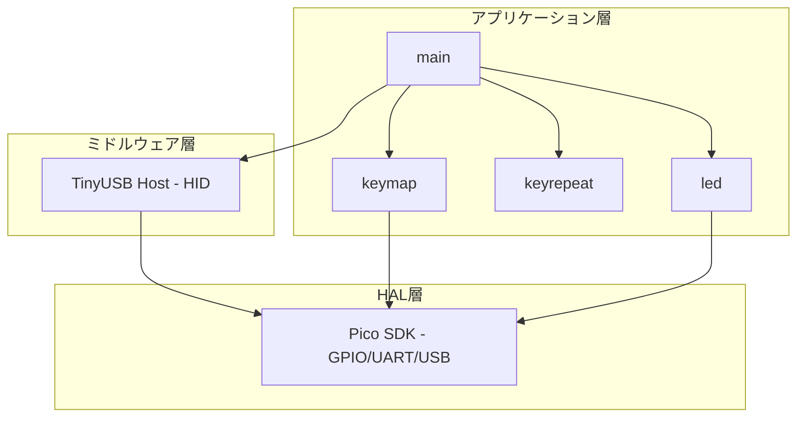
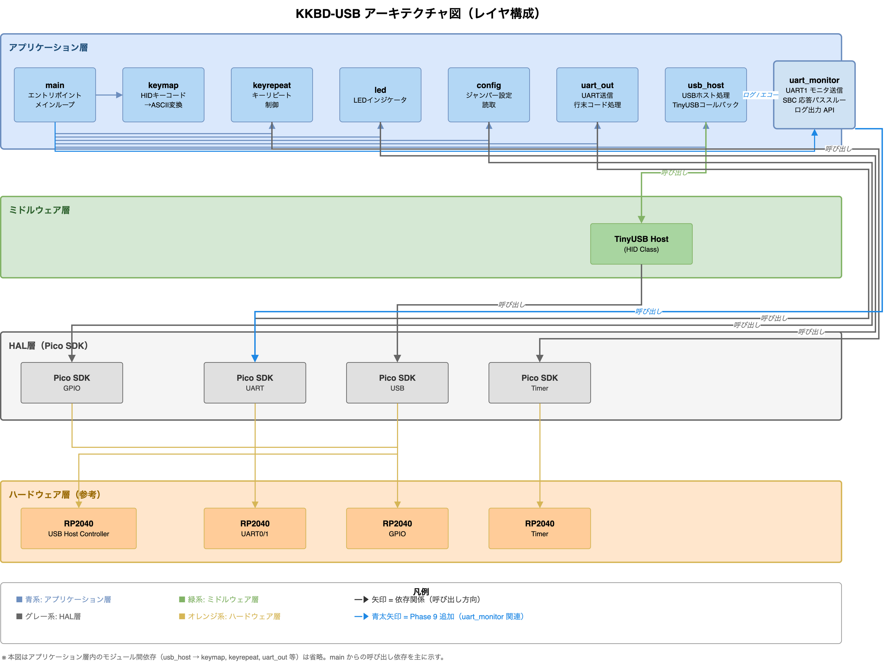
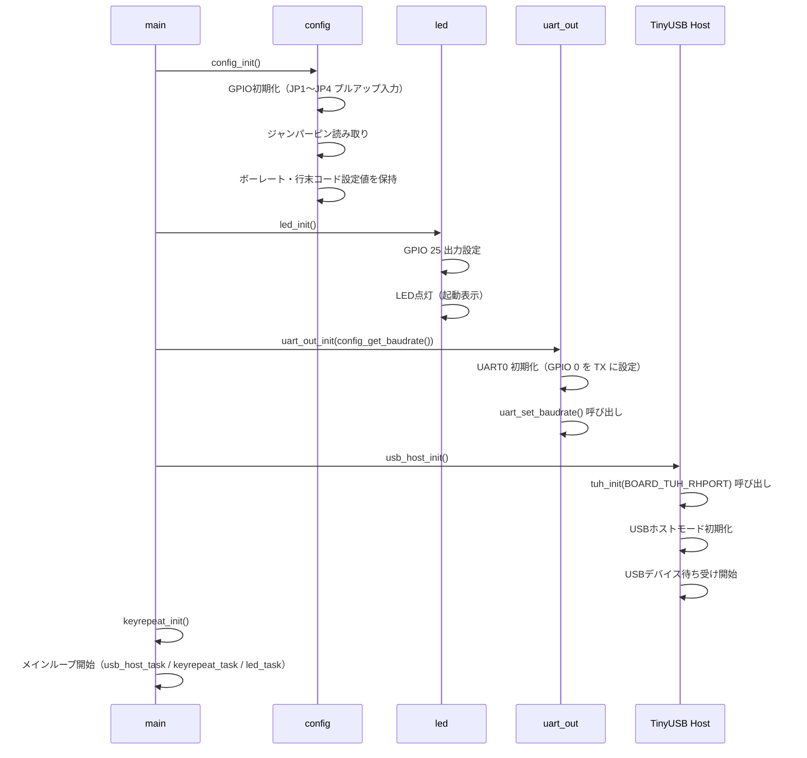
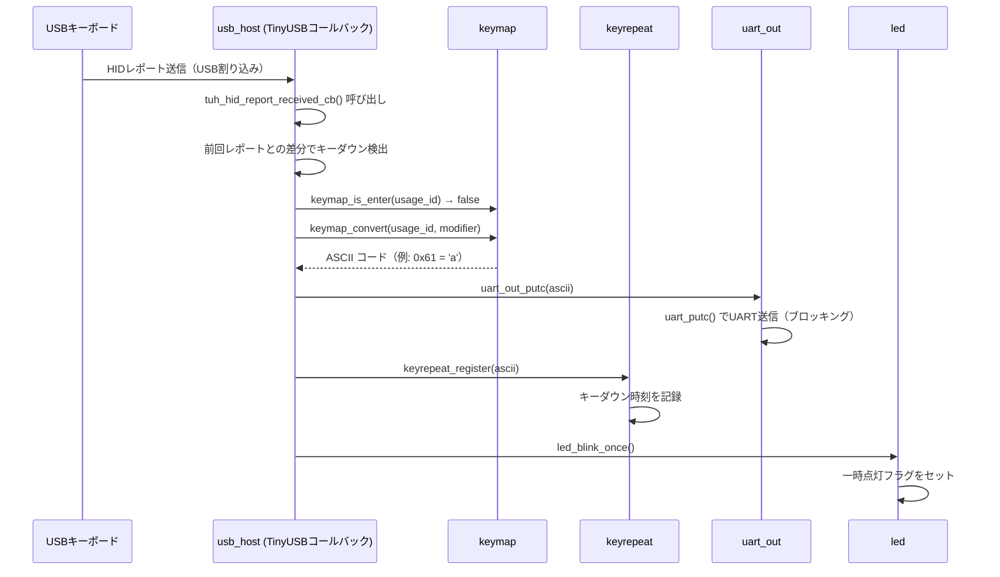
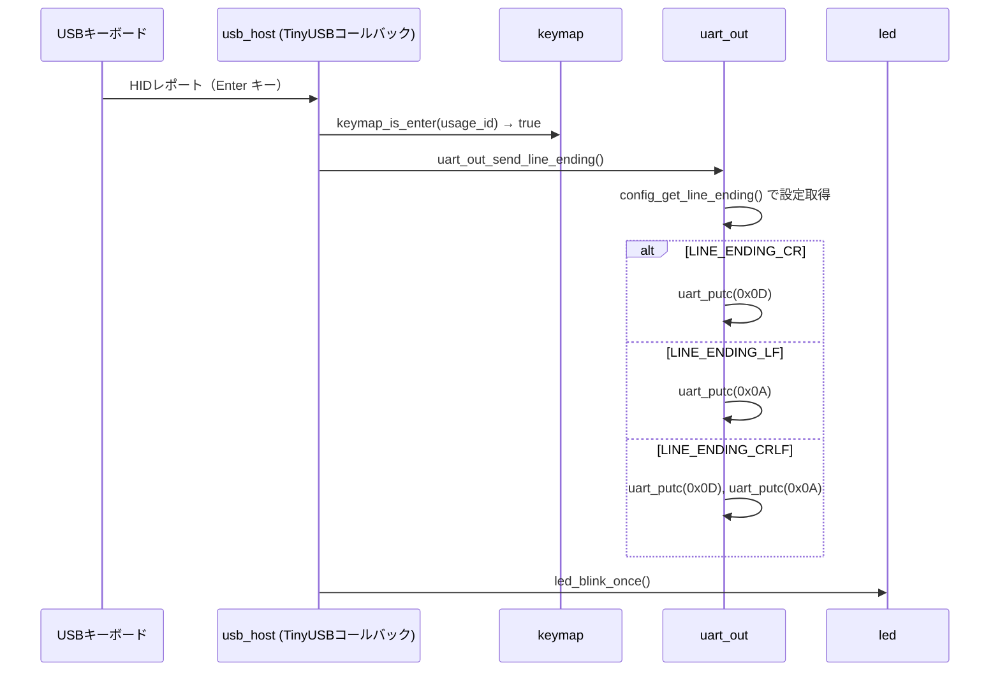
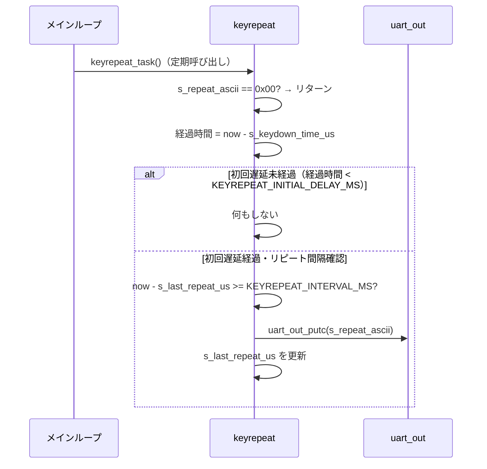
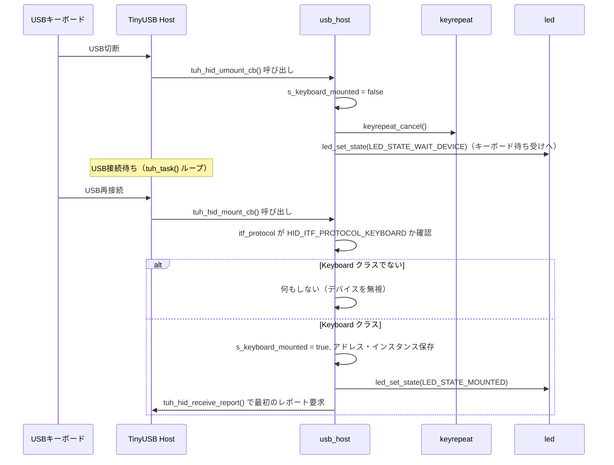
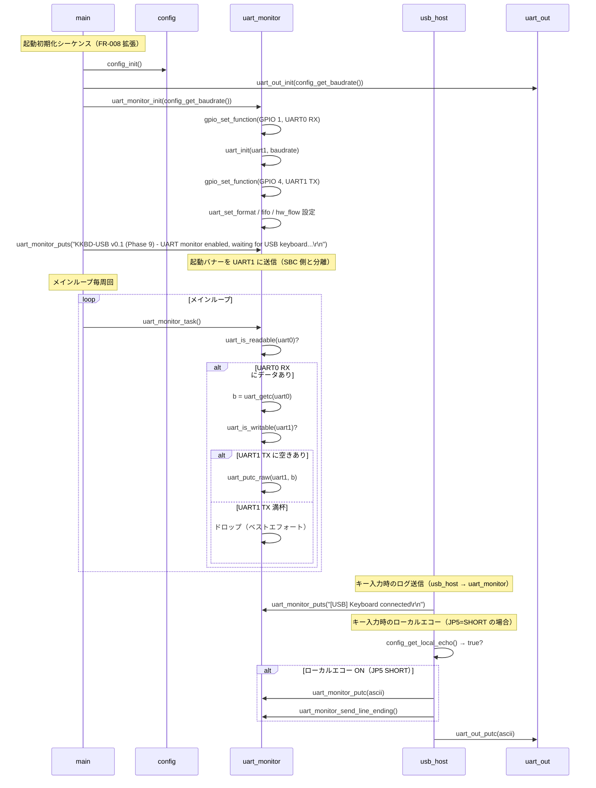
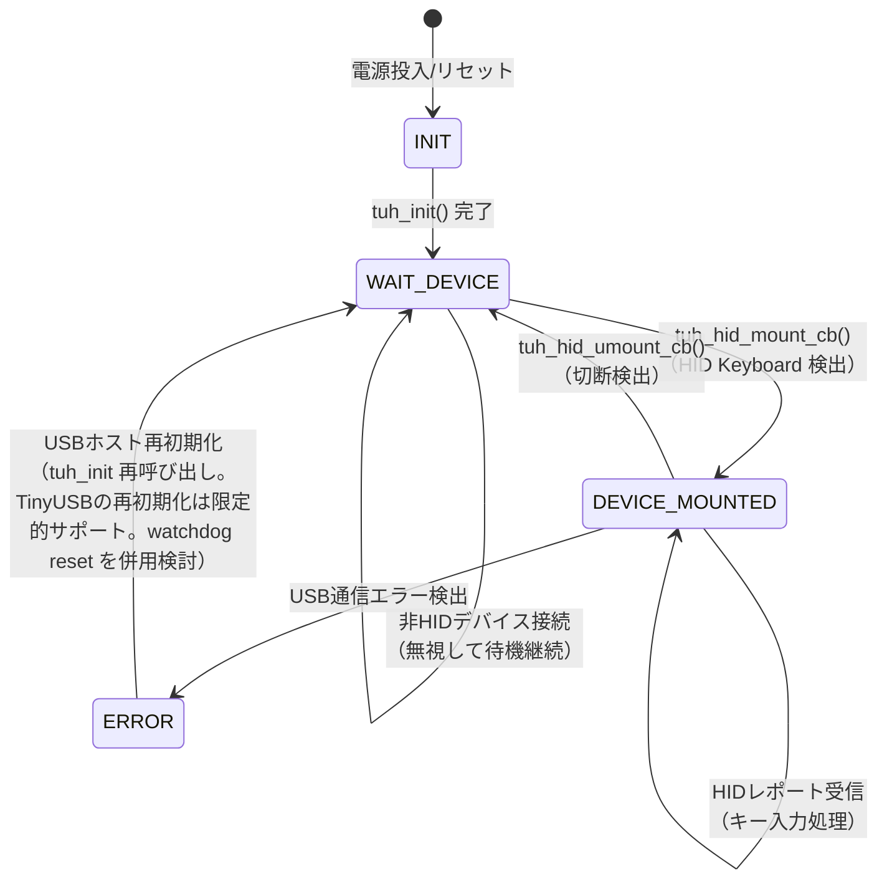
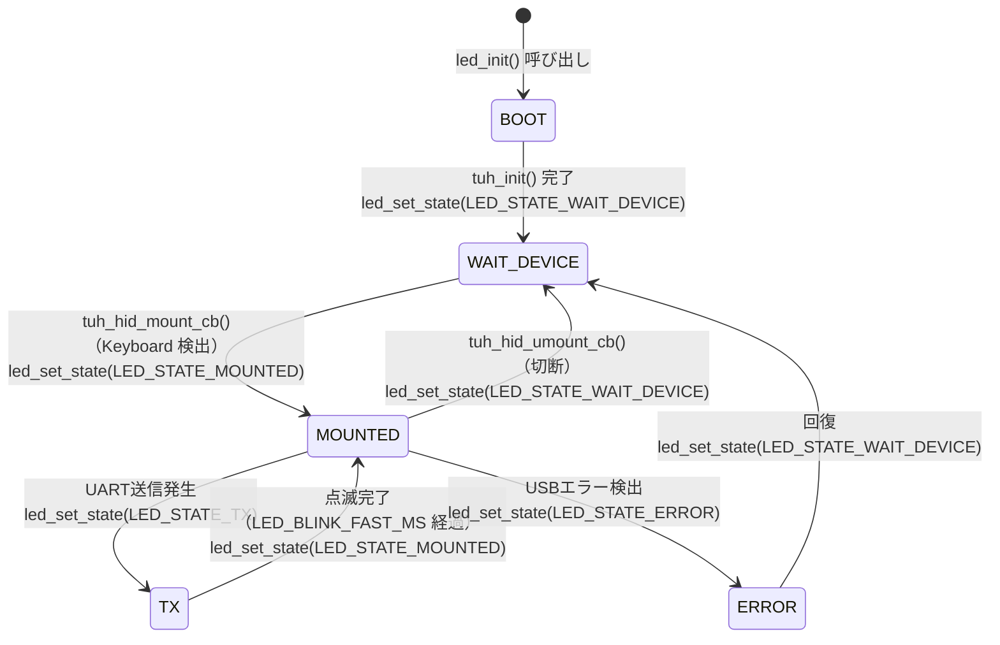

# KKBD-USB 詳細設計書

**文書番号**: KKBD-USB-DES-001
**作成日**: 2026-05-04
**バージョン**: 1.1
**ステータス**: ドラフト（Phase 9 追記）

---

## 目次

1. [はじめに](#1-はじめに)
2. [アーキテクチャ概要](#2-アーキテクチャ概要)
3. [モジュール構成](#3-モジュール構成)
4. [ピンアサイン（確定版）](#4-ピンアサイン確定版)
5. [キーマップ仕様](#5-キーマップ仕様)
6. [データフロー](#6-データフロー)
7. [状態遷移](#7-状態遷移)
8. [エラー処理設計](#8-エラー処理設計)
9. [タイミング設計](#9-タイミング設計)
10. [要件トレーサビリティ](#10-要件トレーサビリティ)
11. [ビルド設定](#11-ビルド設定)
12. [Phase 9 受け入れ条件](#12-phase-9-受け入れ条件)

---

## 1. はじめに

### 1.1 目的

本文書は、KKBD-USB 詳細設計書（KKBD-USB-DES-001）である。要件定義書（KKBD-USB-REQ-001）に定義された機能要件（FR-001〜FR-010）および非機能要件（NFR-001〜NFR-005）を実現するための、ソフトウェアモジュール構成・データフロー・ピンアサイン・キーマップ等の設計情報を規定する。

実装担当者は本文書に従い、Raspberry Pi Pico（RP2040）上で動作するC/C++ ファームウェアを実装すること。

### 1.2 関連文書

| 文書番号 | 文書名 | 場所 |
|---------|--------|------|
| KKBD-USB-REQ-001 | KKBD-USB 要件定義書 | `docs/requirements/要件定義.md` |
| - | KKBD-USB プロジェクト概要 | `docs/requirements/要件概要.md` |
| - | TinyUSB ドキュメント | https://docs.tinyusb.org/ |
| - | Raspberry Pi Pico SDK ドキュメント | https://raspberrypi.github.io/pico-sdk-doxygen/ |
| - | USB HID Usage Tables 1.12 | https://usb.org/sites/default/files/hut1_12.pdf |

### 1.3 用語

要件定義書（KKBD-USB-REQ-001）第7章の用語集を参照すること。本文書では重複を避け、設計固有の用語のみを追記する。

| 用語 | 説明 |
|------|------|
| HID Usage ID | USB HID Usage Tables 0x07（Keyboard/Keypad Page）で定義されたキーコード識別番号。本設計で使用するキーマップの基底となる。 |
| Modifier Byte | HIDレポート先頭の1バイト。Left/Right Ctrl, Shift, Alt, GUI の各ビットを持つ。 |
| キーリピートタイマー | キーダウン継続を計測するソフトウェアタイマー。`time_us_64()` を使用してマイクロ秒単位で計測する。 |
| コールバック | TinyUSB がUSBイベント（mount, unmount, HIDレポート受信）発生時に呼び出す関数。アプリケーション側が実装する必要がある。 |

---

## 2. アーキテクチャ概要

### 2.1 レイヤ構成

KKBD-USB ファームウェアは以下の3レイヤで構成される。



別途 draw.io 形式のアーキテクチャ図も作成する。



### 2.2 レイヤ責務

| レイヤ | 責務 |
|--------|------|
| アプリケーション層 | ビジネスロジック全般。キーマップ変換・キーリピート・LED制御・初期化・メインループ。 |
| ミドルウェア層 | TinyUSB HIDホストドライバ。USB列挙・HIDレポート受信・コールバック発火を担う。 |
| HAL層 | Pico SDK が提供するハードウェア抽象化。GPIO/UART/USB ハードウェアへのアクセスを提供する。 |

### 2.3 ソースツリー構成（予定）

```
KKBD-USB/
├── CMakeLists.txt
├── src/
│   ├── CMakeLists.txt
│   ├── main.c
│   ├── usb_host.c
│   ├── usb_host.h
│   ├── keymap.c
│   ├── keymap.h
│   ├── uart_out.c
│   ├── uart_out.h
│   ├── uart_monitor.c   ← Phase 9 で追加
│   ├── uart_monitor.h   ← Phase 9 で追加
│   ├── config.c
│   ├── config.h
│   ├── led.c
│   ├── led.h
│   ├── keyrepeat.c
│   ├── keyrepeat.h
│   └── tusb_config.h
└── docs/
    └── design/
        └── 設計書.md
```

---

## 3. モジュール構成

### 3.1 モジュール一覧

| モジュール | ファイル | 対応要件 | 概要 |
|-----------|---------|---------|------|
| main | `main.c` | FR-008 | エントリポイント・初期化シーケンス・メインループ |
| usb_host | `usb_host.c/h` | FR-001, FR-002, FR-009 | TinyUSB HID ホスト処理・コールバック実装 |
| keymap | `keymap.c/h` | FR-003 | HID Usage ID → ASCII変換テーブルと変換ロジック |
| uart_out | `uart_out.c/h` | FR-004, FR-006 | UART送信・行末コード処理 |
| config | `config.c/h` | FR-005, FR-008 | ジャンパーピン読み取り・設定値保持 |
| led | `led.c/h` | FR-010 | Pico内蔵LED制御・状態表示 |
| keyrepeat | `keyrepeat.c/h` | FR-007 | キーリピート状態管理・タイマー処理 |
| uart_monitor | `uart_monitor.c/h` | Phase 9（新規） | UART1 モニタ送信・UART0 RX パススルー・ログ出力 API・ローカルエコー |

---

### 3.2 `main.c`

#### 3.2.1 責務

- システムエントリポイント（`main()` 関数）
- 各モジュールの初期化を規定順序で呼び出す（FR-008）
- メインループでTinyUSBタスクを周期的に呼び出す
- キーリピートのタイミング処理をメインループ内で実行する

#### 3.2.2 公開関数

```c
int main(void);
```

#### 3.2.3 初期化順序（FR-008）

1. `stdio_init_all()` — デバッグ用標準入出力初期化
2. `config_init()` — GPIO初期化・ジャンパーピン読み取り（Phase 9: JP5 も含む）
3. `led_init()` — LED GPIO初期化・点灯（起動表示）
4. `uart_out_init(config_get_baudrate())` — UART0 TX 初期化
5. `uart_monitor_init(config_get_baudrate())` — UART1 TX + UART0 RX 初期化（Phase 9 追加）
6. `usb_host_init()` — TinyUSB ホスト初期化（`tuh_init(BOARD_TUH_RHPORT)` のラッパ）
7. `keyrepeat_init()` — キーリピート状態初期化
8. `uart_monitor_puts(起動バナー)` — UART1 モニタ側に起動バナー送信（Phase 9 追加）
9. メインループ開始

#### 3.2.4 メインループ処理

```c
while (true) {
    usb_host_task();            // TinyUSB タスク処理（tuh_task() のラッパ）
    keyrepeat_task();           // キーリピートタイマー確認・送信
    led_task();                 // LED点滅タイマー処理
    uart_monitor_task();        // UART0 RX → UART1 TX パススルー（Phase 9 追加）
}
```

#### 3.2.5 内部状態

なし（モジュール間はモジュール内グローバル変数で状態管理）

#### 3.2.6 依存モジュール

- `config`、`led`、`uart_out`、`uart_monitor`（Phase 9 追加）、`usb_host`、`keyrepeat`

---

### 3.3 `usb_host.c/h`

#### 3.3.1 責務

- TinyUSB ホストスタックの初期化と定期タスク処理（FR-001, FR-002, FR-009）
- TinyUSB が要求するコールバック関数の実装（内部実装）
- USBデバイスのマウント・アンマウントイベント処理
- HID キーボードレポートの受信と解析
- 前回レポートとの差分からキーダウン・キーアップを検出
- キーマップモジュールを呼び出してASCIIに変換し、uart_out および keyrepeat へ送信
- TinyUSB の Boot Protocol レポート形式を前提とする。`CFG_TUH_HID 4`（boot keyboard対応）を使用する。デバイスがReport Protocolのみ対応の場合は将来拡張で対応。

#### 3.3.2 公開関数

```c
/**
 * @brief TinyUSB ホストスタックを初期化する（tuh_init() のラッパ）
 */
void usb_host_init(void);

/**
 * @brief メインループから定期的に呼び出す（tuh_task() のラッパ）
 */
void usb_host_task(void);

/**
 * @brief キーボードのマウント状態を返す
 * @return true: キーボード接続済み
 */
bool usb_host_is_keyboard_mounted(void);

/* TinyUSB HID コールバック（内部実装 - usb_host.c が提供する） */
/* tuh_hid_mount_cb(), tuh_hid_umount_cb(), tuh_hid_report_received_cb() */
```

#### 3.3.3 内部状態

```c
static bool    s_keyboard_mounted;           // キーボードマウント状態
static uint8_t s_prev_report[8];             // 前回 HID レポート（Modifier + Keycode[6] + Reserved）
static uint8_t s_dev_addr;                   // マウント中のデバイスアドレス
static uint8_t s_instance;                   // マウント中の HID インスタンス
```

#### 3.3.4 HID レポート解析ロジック

標準 USB HID キーボードレポート形式（Boot Protocol）:

| Byte | 内容 |
|------|------|
| 0 | Modifier Byte（bit0:LCtrl, bit1:LShift, bit2:LAlt, bit3:LGUI, bit4:RCtrl, bit5:RShift, bit6:RAlt, bit7:RGUI） |
| 1 | Reserved（常に0x00） |
| 2〜7 | 押下中キーのHID Usage ID（最大6キー同時） |

前回レポートにはなく現在のレポートにあるキーコードを「キーダウン」として処理する。

#### 3.3.5 依存モジュール

- `keymap`、`uart_out`、`uart_monitor`（Phase 9: ログ振替 + ローカルエコー）、`keyrepeat`、`led`、`config`（Phase 9: `config_get_local_echo()` 参照）

---

### 3.4 `keymap.c/h`

#### 3.4.1 責務

- USB HID Usage ID と修飾キー状態（Shift, Ctrl）の組み合わせをASCIIコードに変換する（FR-003）
- 通常テーブル・Shiftテーブル・Ctrlテーブルの3種類の変換テーブルを保持する
- 変換不能なキーコードは0x00（無視）を返す

#### 3.4.2 公開関数

```c
/**
 * @brief HID Usage ID と修飾キー状態からASCIIコードを返す
 * @param usage_id  HID Usage ID (0x04〜0x73)
 * @param modifier  Modifier Byte
 * @return ASCIIコード。変換不能時は 0x00。
 *         Enterキー（0x28）の場合も 0x00 を返し、呼び出し側で行末処理を行うこと。
 */
uint8_t keymap_convert(uint8_t usage_id, uint8_t modifier);

/**
 * @brief Enterキーかどうかを判定する
 * @param usage_id  HID Usage ID
 * @return true: Enterキー（メイン・テンキー共）
 */
bool keymap_is_enter(uint8_t usage_id);
```

#### 3.4.3 Modifier Byte のビット定義（参照用）

```c
#define MOD_LCTRL   (1u << 0)
#define MOD_LSHIFT  (1u << 1)
#define MOD_LALT    (1u << 2)
#define MOD_LGUI    (1u << 3)
#define MOD_RCTRL   (1u << 4)
#define MOD_RSHIFT  (1u << 5)
#define MOD_RALT    (1u << 6)
#define MOD_RGUI    (1u << 7)

#define MOD_SHIFT   (MOD_LSHIFT | MOD_RSHIFT)
#define MOD_CTRL    (MOD_LCTRL  | MOD_RCTRL)
```

#### 3.4.4 内部状態

なし（テーブルは静的配列）

#### 3.4.5 依存モジュール

なし

---

### 3.5 `uart_out.c/h`

#### 3.5.1 責務

- Pico SDK の `uart_putc()` / `uart_write_blocking()` を使用してUART送信を行う（FR-006）
- Enterキー入力時に設定に従いCR / LF / CRLF を送信する（FR-004）
- UART初期化（ボーレート・データビット・パリティ・ストップビット設定）

#### 3.5.2 公開関数

```c
/**
 * @brief UART初期化
 * @param baudrate  ボーレート（9600, 19200, 38400, 115200）
 */
void uart_out_init(uint32_t baudrate);

/**
 * @brief 1バイト送信
 * @param c  送信バイト
 */
void uart_out_putc(uint8_t c);

/**
 * @brief 行末コードを送信する（Enterキー入力時に呼ぶ）
 *        送信内容は config_get_line_ending() の設定による
 */
void uart_out_send_line_ending(void);
```

#### 3.5.3 UART設定定数

```c
#define UART_ID         uart0
#define UART_TX_PIN     0       // GPIO 0 を TX として使用
#define UART_DATA_BITS  8
#define UART_STOP_BITS  1
#define UART_PARITY     UART_PARITY_NONE
```

#### 3.5.4 内部状態

なし

#### 3.5.5 依存モジュール

- `config`（行末コード設定取得）

---

### 3.6 `config.c/h`

#### 3.6.1 責務

- 起動時にジャンパーピン（JP1〜JP4）のGPIO状態を読み取る（FR-005, FR-008）
- 読み取った値をデコードして行末コード設定とボーレート設定を保持する
- 他モジュールへ設定値を提供するアクセサ関数を提供する

#### 3.6.2 公開関数

```c
/**
 * @brief GPIO初期化（プルアップ設定）およびジャンパーピン読み取り
 *        起動時に一回だけ呼ぶ。Phase 9 で JP5（GPIO 14）の初期化を追加。
 */
void config_init(void);

/**
 * @brief 設定されたボーレートを返す
 * @return 9600, 19200, 38400, 115200 のいずれか
 */
uint32_t config_get_baudrate(void);

/**
 * @brief 行末コード種別を返す
 * @return LINE_ENDING_CR / LINE_ENDING_LF / LINE_ENDING_CRLF
 */
line_ending_t config_get_line_ending(void);

/**
 * @brief ローカルエコー設定を返す（Phase 9 追加）
 * @return true: JP5 SHORT（ローカルエコー ON）/ false: JP5 OPEN（OFF）
 */
bool config_get_local_echo(void);
```

#### 3.6.3 行末コード列挙型

```c
typedef enum {
    LINE_ENDING_CR   = 0,  // JP1=OPEN, JP2=OPEN → CR (0x0D)
    LINE_ENDING_LF   = 1,  // JP1=SHORT, JP2=OPEN → LF (0x0A)
    LINE_ENDING_CRLF = 2,  // JP1=OPEN, JP2=SHORT → CRLF (0x0D 0x0A)
    /* JP1=SHORT, JP2=SHORT は予約。LINE_ENDING_CR として動作 */
} line_ending_t;
```

#### 3.6.4 内部状態

```c
static uint32_t      s_baudrate;      // 設定ボーレート
static line_ending_t s_line_ending;   // 行末コード種別
```

#### 3.6.5 GPIO ピン定数

```c
#define JP1_GPIO    10   // 行末コード bit0
#define JP2_GPIO    11   // 行末コード bit1
#define JP3_GPIO    12   // ボーレート bit0
#define JP4_GPIO    13   // ボーレート bit1
#define JP5_GPIO    14   // ローカルエコー（Phase 9 追加）
```

#### 3.6.6 依存モジュール

なし

---

### 3.7 `led.c/h`

#### 3.7.1 責務

- Pico内蔵LED（GPIO 25）を制御してシステム状態を視覚的に表示する（FR-010）
- 点灯・消灯・点滅（通常/高速）の各状態を管理する
- `led_task()` を定期的に呼び出すことで点滅タイミングを制御する

#### 3.7.2 公開関数

```c
/**
 * @brief LED GPIO初期化・初期状態（起動中点灯）設定
 */
void led_init(void);

/**
 * @brief LED状態を設定する
 * @param state  led_state_t 値
 */
void led_set_state(led_state_t state);

/**
 * @brief LED点滅タイミング処理（メインループから定期的に呼ぶ）
 */
void led_task(void);
```

#### 3.7.3 LED状態列挙型

```c
typedef enum {
    LED_STATE_BOOT,         // 初期化中（常時点灯）
    LED_STATE_WAIT_DEVICE,  // USBキーボード待ち受け（低速点滅）
    LED_STATE_MOUNTED,      // キーボード認識済み（常時点灯）
    LED_STATE_TX,           // UART送信時（短時間点滅）
    LED_STATE_ERROR,        // エラー時（高速点滅）
} led_state_t;
```

#### 3.7.4 内部状態

```c
static led_state_t s_state;           // 現在のLED状態
static uint64_t    s_last_toggle_us;  // 最後にLEDを切り替えた時刻（マイクロ秒）
static bool        s_led_on;          // 現在のLED点灯状態
```

#### 3.7.5 依存モジュール

なし

---

### 3.8 `keyrepeat.c/h`

#### 3.8.1 責務

- キーを押し続けた場合のリピート動作を実現する（FR-007）
- 初回遅延（`KEYREPEAT_INITIAL_DELAY_MS`）後にリピート間隔（`KEYREPEAT_INTERVAL_MS`）で同じASCIIコードを繰り返し送信する
- キーアップイベントでリピートをキャンセルする

#### 3.8.2 公開関数

```c
/**
 * @brief キーリピート状態を初期化する
 */
void keyrepeat_init(void);

/**
 * @brief キーダウン時に呼び出す。リピート対象キーを登録する。
 * @param ascii  リピート送信するASCIIコード
 */
void keyrepeat_register(uint8_t ascii);

/**
 * @brief キーアップ時（全キーリリース）に呼び出す。リピートをキャンセルする。
 */
void keyrepeat_cancel(void);

/**
 * @brief メインループから定期的に呼び出す。タイマー判定とUART送信を行う。
 */
void keyrepeat_task(void);
```

#### 3.8.3 内部状態

```c
static uint8_t  s_repeat_ascii;       // リピート中のASCIIコード（0x00 = 無効）
static uint64_t s_keydown_time_us;    // キーダウン検出時刻（マイクロ秒）
static uint64_t s_last_repeat_us;     // 最後にリピート送信した時刻
static bool     s_initial_fired;      // 初回遅延後のリピート開始フラグ
```

#### 3.8.4 依存モジュール

- `uart_out`

---

### 3.9 `uart_monitor.c/h`（Phase 9 で追加）

#### 3.9.1 責務

- UART1 を TX 専用で初期化する（モニタ出力チャネル）
- UART0 RX（GPIO 1）から SBC 応答を受信し、UART1 TX（GPIO 4）にパススルーする
- 内部ログ（起動バナー、`[USB]` 系メッセージ等）の出力 API（`uart_monitor_puts` / `uart_monitor_putc`）を提供する
- ローカルエコー実装（`usb_host.c` から `config_get_local_echo()` を確認して呼び出される）

#### 3.9.2 公開 API

```c
/**
 * @brief UART モニタ初期化
 *        UART1 を TX 専用で初期化し、UART0 RX 側 GPIO 機能を割当。
 * @param baudrate ボーレート（UART0 と同じ値を渡すこと）
 */
void uart_monitor_init(uint32_t baudrate);

/**
 * @brief メインループから定期呼出。UART0 RX を読み UART1 TX へパススルー。
 */
void uart_monitor_task(void);

/**
 * @brief モニタ側に NUL 終端文字列を送信（ログ・起動バナー用）
 * @param s  送信する NUL 終端文字列
 */
void uart_monitor_puts(const char *s);

/**
 * @brief モニタ側に 1 バイト送信（ログ・ローカルエコー用）
 * @param byte  送信バイト
 */
void uart_monitor_putc(uint8_t byte);
```

#### 3.9.3 ピン定数（`uart_monitor.h` 内）

```c
#define UART_MON_ID         uart1
#define UART_MON_TX_PIN     4    /* UART1 TX = GPIO 4 = Pico Pin 6（USB-Serial 変換器 RX へ） */
#define UART0_RX_PIN        1    /* UART0 RX = GPIO 1 = Pico Pin 2（SBC TX から受信） */
#define UART_MON_DATA_BITS  8
#define UART_MON_STOP_BITS  1
#define UART_MON_PARITY     UART_PARITY_NONE
```

#### 3.9.4 内部状態

なし（ステートレス設計。UART ハードウェア FIFO に委ねる）

#### 3.9.5 設計判断

- UART1 TX FIFO が満杯の場合はベストエフォート（ドロップ可）。USB ホスト処理の遅延を避けるため、ブロッキングしない方針。
- UART1 ボーレートは UART0 と連動（呼び出し側が同じ `config_get_baudrate()` の戻り値を渡す）。
- `uart_monitor_puts` / `uart_monitor_putc` は既存の `uart_out_puts` / `printf` 系ログ出力を置き換えるためのラッパ API。

#### 3.9.6 依存モジュール

- Pico SDK `hardware/uart.h`、`hardware/gpio.h`

---

## 4. ピンアサイン（確定版）

| 機能 | GPIO | Pico Pin | 方向 | 設定 | 備考 |
|------|------|----------|------|------|------|
| UART0 TX | GPIO 0 | Pin 1 | 出力 | UART機能 | SBCのRXへ接続。TTLレベル3.3V出力 |
| UART0 RX | GPIO 1 | Pin 2 | 入力 | UART機能 | SBC TX から応答受信（Phase 9） |
| UART1 TX | GPIO 4 | Pin 6 | 出力 | UART機能 | USB-Serial 変換器 RX へ（モニタ出力、Phase 9） |
| JP1（行末コード bit0） | GPIO 10 | Pin 14 | 入力 | プルアップ | OPEN=High=1 / SHORT=Low=0 |
| JP2（行末コード bit1） | GPIO 11 | Pin 15 | 入力 | プルアップ | OPEN=High=1 / SHORT=Low=0 |
| JP3（ボーレート bit0） | GPIO 12 | Pin 16 | 入力 | プルアップ | OPEN=High=1 / SHORT=Low=0 |
| JP4（ボーレート bit1） | GPIO 13 | Pin 17 | 入力 | プルアップ | OPEN=High=1 / SHORT=Low=0 |
| JP5（ローカルエコー） | GPIO 14 | Pin 19 | 入力 | プルアップ | OPEN=OFF / SHORT=ON（Phase 9） |
| LED | GPIO 25 | - | 出力 | デジタル出力 | Pico内蔵LED（PICO_DEFAULT_LED_PIN） |
| USB | 内蔵USB | - | - | USBホスト | Micro-BコネクタをUSBホストとして使用 |

> 注意: Phase 9 より UART0 RX（GPIO 1）を SBC 応答受信に使用。また、UART1 TX（GPIO 4）を PC 側モニタ用に使用。UART1 RX（GPIO 5）は未使用（予約）。

> 注意: JP5（GPIO 14）は Phase 9 で追加したローカルエコー切替ジャンパー。SHORT 時にキー入力文字を UART1（モニタ側）にもミラー出力する。

> 注意: USBホストモードで動作させるためには、Pico の USB_DP/USB_DM ピンを外部回路（VBUS切り替え等）と組み合わせる必要がある。詳細は回路設計書を参照すること。

> 注意: `config.h` の JP5_GPIO 定数は Phase 9 で追加される（`#define JP5_GPIO 14`）。`config_get_local_echo()` 関数で JP5 SHORT 時に `true` を返す。

---

## 5. キーマップ仕様

### 5.1 変換テーブルの基本方針

- USB HID Usage Tables 1.12 の Keyboard/Keypad Page（Usage Page 0x07）に基づく
- 変換テーブルは3種類：通常テーブル・Shiftテーブル・Ctrlテーブル
- HID Usage ID の範囲は 0x04（Keyboard a and A）〜 0x73（Keypad . and Delete）を対象とする
- テーブルに存在しない Usage ID または変換値が 0x00 のキーは無視する
- Enter キー（Usage ID: 0x28）およびテンキー Enter（0x58）は `keymap_is_enter()` で別途判定し、`uart_out_send_line_ending()` を呼び出す

### 5.2 通常テーブル（修飾キーなし）

| HID Usage ID | キー名 | ASCII | HEX |
|-------------|--------|-------|-----|
| 0x04 | a | a | 0x61 |
| 0x05 | b | b | 0x62 |
| 0x06 | c | c | 0x63 |
| 0x07 | d | d | 0x64 |
| 0x08 | e | e | 0x65 |
| 0x09 | f | f | 0x66 |
| 0x0A | g | g | 0x67 |
| 0x0B | h | h | 0x68 |
| 0x0C | i | i | 0x69 |
| 0x0D | j | j | 0x6A |
| 0x0E | k | k | 0x6B |
| 0x0F | l | l | 0x6C |
| 0x10 | m | m | 0x6D |
| 0x11 | n | n | 0x6E |
| 0x12 | o | o | 0x6F |
| 0x13 | p | p | 0x70 |
| 0x14 | q | q | 0x71 |
| 0x15 | r | r | 0x72 |
| 0x16 | s | s | 0x73 |
| 0x17 | t | t | 0x74 |
| 0x18 | u | u | 0x75 |
| 0x19 | v | v | 0x76 |
| 0x1A | w | w | 0x77 |
| 0x1B | x | x | 0x78 |
| 0x1C | y | y | 0x79 |
| 0x1D | z | z | 0x7A |
| 0x1E | 1 | 1 | 0x31 |
| 0x1F | 2 | 2 | 0x32 |
| 0x20 | 3 | 3 | 0x33 |
| 0x21 | 4 | 4 | 0x34 |
| 0x22 | 5 | 5 | 0x35 |
| 0x23 | 6 | 6 | 0x36 |
| 0x24 | 7 | 7 | 0x37 |
| 0x25 | 8 | 8 | 0x38 |
| 0x26 | 9 | 9 | 0x39 |
| 0x27 | 0 | 0 | 0x30 |
| 0x28 | Enter | （行末コード処理） | - |
| 0x29 | Escape | ESC | 0x1B |
| 0x2A | Backspace | BS | 0x08 |
| 0x2B | Tab | HT | 0x09 |
| 0x2C | Space | SP | 0x20 |
| 0x2D | - (Minus) | - | 0x2D |
| 0x2E | = (Equal) | = | 0x3D |
| 0x2F | [ | [ | 0x5B |
| 0x30 | ] | ] | 0x5D |
| 0x31 | \\ | \\ | 0x5C |
| 0x33 | ; | ; | 0x3B |
| 0x34 | ' | ' | 0x27 |
| 0x35 | ` | \` | 0x60 |
| 0x36 | , | , | 0x2C |
| 0x37 | . | . | 0x2E |
| 0x38 | / | / | 0x2F |
| 0x58 | Keypad Enter | （行末コード処理） | - |
| 0x59 | Keypad 1 | 1 | 0x31 |
| 0x5A | Keypad 2 | 2 | 0x32 |
| 0x5B | Keypad 3 | 3 | 0x33 |
| 0x5C | Keypad 4 | 4 | 0x34 |
| 0x5D | Keypad 5 | 5 | 0x35 |
| 0x5E | Keypad 6 | 6 | 0x36 |
| 0x5F | Keypad 7 | 7 | 0x37 |
| 0x60 | Keypad 8 | 8 | 0x38 |
| 0x61 | Keypad 9 | 9 | 0x39 |
| 0x62 | Keypad 0 | 0 | 0x30 |
| 0x63 | Keypad . | . | 0x2E |

### 5.3 Shift テーブル（Shift 押下時）

| HID Usage ID | キー名 | Shift 時 ASCII | HEX |
|-------------|--------|---------------|-----|
| 0x04〜0x1D | a〜z | A〜Z | 0x41〜0x5A |
| 0x1E | 1 | ! | 0x21 |
| 0x1F | 2 | @ | 0x40 |
| 0x20 | 3 | # | 0x23 |
| 0x21 | 4 | $ | 0x24 |
| 0x22 | 5 | % | 0x25 |
| 0x23 | 6 | ^ | 0x5E |
| 0x24 | 7 | & | 0x26 |
| 0x25 | 8 | * | 0x2A |
| 0x26 | 9 | ( | 0x28 |
| 0x27 | 0 | ) | 0x29 |
| 0x2D | - | _ | 0x5F |
| 0x2E | = | + | 0x2B |
| 0x2F | [ | { | 0x7B |
| 0x30 | ] | } | 0x7D |
| 0x31 | \\ | \| | 0x7C |
| 0x33 | ; | : | 0x3A |
| 0x34 | ' | " | 0x22 |
| 0x35 | ` | ~ | 0x7E |
| 0x36 | , | < | 0x3C |
| 0x37 | . | > | 0x3E |
| 0x38 | / | ? | 0x3F |

### 5.4 Ctrl テーブル（Ctrl 押下時）

| HID Usage ID | キー名 | Ctrl 時 ASCII | 制御文字名 | HEX |
|-------------|--------|--------------|-----------|-----|
| 0x04 | a | ^A | SOH | 0x01 |
| 0x05 | b | ^B | STX | 0x02 |
| 0x06 | c | ^C | ETX | 0x03 |
| 0x07 | d | ^D | EOT | 0x04 |
| 0x08 | e | ^E | ENQ | 0x05 |
| 0x09 | f | ^F | ACK | 0x06 |
| 0x0A | g | ^G | BEL | 0x07 |
| 0x0B | h | ^H | BS | 0x08 |
| 0x0C | i | ^I | HT | 0x09 |
| 0x0D | j | ^J | LF | 0x0A |
| 0x0E | k | ^K | VT | 0x0B |
| 0x0F | l | ^L | FF | 0x0C |
| 0x10 | m | ^M | CR | 0x0D |
| 0x11 | n | ^N | SO | 0x0E |
| 0x12 | o | ^O | SI | 0x0F |
| 0x13 | p | ^P | DLE | 0x10 |
| 0x14 | q | ^Q | DC1 | 0x11 |
| 0x15 | r | ^R | DC2 | 0x12 |
| 0x16 | s | ^S | DC3 | 0x13 |
| 0x17 | t | ^T | DC4 | 0x14 |
| 0x18 | u | ^U | NAK | 0x15 |
| 0x19 | v | ^V | SYN | 0x16 |
| 0x1A | w | ^W | ETB | 0x17 |
| 0x1B | x | ^X | CAN | 0x18 |
| 0x1C | y | ^Y | EM | 0x19 |
| 0x1D | z | ^Z | SUB | 0x1A |
| 0x2D | - | ^_ | US | 0x1F |
| 0x2F | [ | ^[ | ESC | 0x1B |
| 0x30 | ] | ^] | GS | 0x1D |
| 0x31 | \\ | ^\\ | FS | 0x1C |

### 5.5 変換ロジック（疑似コード）

```c
uint8_t keymap_convert(uint8_t usage_id, uint8_t modifier) {
    if (keymap_is_enter(usage_id)) return 0x00;  // Enter は呼び出し側で処理

    bool shift = (modifier & MOD_SHIFT) != 0;
    bool ctrl  = (modifier & MOD_CTRL)  != 0;

    if (ctrl) {
        return keymap_ctrl_table[usage_id];   // 0x00 なら無視
    } else if (shift) {
        return keymap_shift_table[usage_id];  // 0x00 なら無視
    } else {
        return keymap_normal_table[usage_id]; // 0x00 なら無視
    }
}
```

---

## 6. データフロー

### 6.1 起動シーケンス



### 6.2 キー入力 → UART 送信（通常キー）



### 6.3 キー入力 → UART 送信（Enter キー）



### 6.4 キーリピート処理



### 6.5 USB切断 / 再接続



### 6.6 Phase 9: uart_monitor 初期化・動作フロー



---

## 7. 状態遷移

### 7.1 USB ホスト状態遷移



### 7.2 LED 状態遷移



---

## 8. エラー処理設計

### 8.1 USBキーボード未接続時（FR-009-1）

- **検出方法**: `s_keyboard_mounted == false` の状態が継続
- **動作**: メインループで `tuh_task()` を呼び続け、USB接続イベントを待ち受ける
- **UART**: 送信しない（`usb_host_is_keyboard_mounted()` のチェックにより送信処理に入らない）
- **LED**: `LED_STATE_WAIT_DEVICE`（待ち受け状態表示）

### 8.2 USBキーボード切断時（FR-009-2）

- **検出方法**: `tuh_hid_umount_cb()` コールバックが TinyUSB から呼ばれる
- **動作**:
  1. `s_keyboard_mounted = false` にセット
  2. `keyrepeat_cancel()` を呼びリピートをキャンセル
  3. `led_set_state(LED_STATE_WAIT_DEVICE)` でキーボード待機表示に戻る
- **回復**: 再接続時に `tuh_hid_mount_cb()` が呼ばれ自動復帰

### 8.3 非対応USBデバイス接続時（FR-009-3）

- **検出方法**: `tuh_hid_mount_cb()` 内で `itf_protocol` を確認
- **動作**: `itf_protocol != HID_ITF_PROTOCOL_KEYBOARD` の場合、コールバックから即リターン。デバイスを無視しキーボード接続待機を継続する

```c
void tuh_hid_mount_cb(uint8_t dev_addr, uint8_t instance,
                      uint8_t const *desc_report, uint16_t desc_len) {
    if (tuh_hid_interface_protocol(dev_addr, instance) != HID_ITF_PROTOCOL_KEYBOARD) {
        return;  // キーボード以外は無視
    }
    // ... 正常処理 ...
}
```

### 8.4 USB通信エラー時（FR-009-4）

- **検出方法**: TinyUSB の内部エラーコールバック、またはHIDレポート受信が一定時間停止
- **動作**:
  1. `s_keyboard_mounted = false` にセット
  2. `led_set_state(LED_STATE_ERROR)` でエラー表示
  3. USBホスト再初期化（`tuh_init()` 再呼び出し）。TinyUSBの再初期化は限定的サポートのため watchdog reset の併用を検討すること。
  4. 再初期化完了後に `LED_STATE_WAIT_DEVICE` へ復帰

### 8.5 過電流保護（FR-009-5）

- **検出方法**: ハードウェア保護回路（ポリスイッチ等）による遮断、またはソフトウェアの異常検出
- **ソフトウェア対応**:
  1. 異常状態（`tuh_hid_umount_cb()` が繰り返し呼ばれる等）を検出した場合、USBホストタスクを停止
  2. `led_set_state(LED_STATE_ERROR)` でエラー表示
  3. 電源再投入による復帰を前提とする
- **ハードウェア対応**: 回路設計時にポリスイッチまたは電流制限ICを検討する

---

## 9. タイミング設計

### 9.1 定数定義

以下の定数は `config.h` または `keyrepeat.h` / `led.h` に定義する。

```c
/* キーリピート設定 */
#define KEYREPEAT_INITIAL_DELAY_MS   500u   // キーリピート初回遅延 [ms]
#define KEYREPEAT_INTERVAL_MS         50u   // キーリピート間隔 [ms]

/* LED点滅設定 */
#define LED_BLINK_FAST_MS            100u   // 高速点滅周期（エラー時） [ms]
#define LED_BLINK_SLOW_MS            500u   // 低速点滅周期 [ms]
#define LED_BLINK_ONCE_MS            100u   // データ送信時の一時点灯時間 [ms]

/* USBポーリング設定 */
#define USB_POLL_INTERVAL_MS          10u   // メインループのUSBポーリング周期目標値 [ms]
```

### 9.2 タイミング根拠

| 定数 | 値 | 根拠 |
|------|-----|------|
| `KEYREPEAT_INITIAL_DELAY_MS` | 500ms | 一般的なOS（Windows/macOS）のキーリピート初回遅延と同等 |
| `KEYREPEAT_INTERVAL_MS` | 50ms | 約20文字/秒のリピート速度。一般的なキーリピートと同等 |
| `LED_BLINK_FAST_MS` | 100ms | エラー状態を視覚的に明確に区別できる高速点滅 |
| `LED_BLINK_SLOW_MS` | 500ms | 通常動作状態の視認性を確保 |
| `USB_POLL_INTERVAL_MS` | 10ms | NFR-003 の要件「10ms以内」に対応するポーリング周期 |

---

## 10. 要件トレーサビリティ

### 10.1 機能要件（FR）

| 要件ID | 概要 | 担当モジュール | 実装関数/機能 |
|--------|------|--------------|-------------|
| FR-001 | USBキーボード接続検出 | `usb_host` | `usb_host_init()`, `tuh_hid_mount_cb()`（内部） |
| FR-002 | キー入力受付 | `usb_host` | `usb_host_task()`, `tuh_hid_report_received_cb()`（内部） |
| FR-003 | ASCIIコード変換 | `keymap` | `keymap_convert()` |
| FR-004 | 行末コード選択送信 | `uart_out` | `uart_out_send_line_ending()` |
| FR-005 | UARTボーレート設定 | `config`, `uart_out` | `config_init()`, `uart_out_init()` |
| FR-006 | UART送信 | `uart_out` | `uart_out_putc()` |
| FR-007 | キーリピート | `keyrepeat` | `keyrepeat_init()`, `keyrepeat_register()`, `keyrepeat_cancel()`, `keyrepeat_task()` |
| FR-008 | 起動時初期化 | `main`, `config` | `main()` 内の初期化シーケンス |
| FR-009 | エラー処理・異常系動作 | `usb_host`, `led` | `tuh_hid_umount_cb()`, エラー処理ロジック |
| FR-010 | LEDインジケータ | `led` | `led_set_state()`, `led_blink_once()`, `led_task()` |

### 10.2 非機能要件（NFR）

| 要件ID | 概要 | 実現方法 |
|--------|------|---------|
| NFR-001 | 電源要件（5V, 1A以上） | 回路設計で対応（Pico VSYS への5V供給）。ソフトウェア範囲外。 |
| NFR-002 | 対応キーボード（USB HID 1.11準拠） | TinyUSB HIDホストドライバ使用により、標準準拠キーボードを自動対応 |
| NFR-003 | レスポンス性能（10ms以内） | メインループで `usb_host_task()` を定期呼び出し。ポーリング間隔目標 `USB_POLL_INTERVAL_MS = 10ms`、ブロッキング送信使用 |
| NFR-004 | 信頼性（24時間連続動作） | エラー時の自動回復処理（FR-009）、キー抜き差し対応（FR-001/FR-009）。ウォッチドッグタイマー導入を推奨（将来実装） |
| NFR-005 | 実装サイズ・コスト | Raspberry Pi Pico（低コスト）を主要部品とし、外部部品を最小化。コンパクトな基板レイアウトを目標とする。 |

---

## 11. ビルド設定

### 11.1 CMakeLists.txt 設定

ルートの `CMakeLists.txt`（プロジェクト定義）と `src/CMakeLists.txt`（ビルドターゲット定義）の2ファイルで構成する。

**CMakeLists.txt（ルート）**:

```cmake
cmake_minimum_required(VERSION 3.13)

include(pico_sdk_import.cmake)

project(kkbd_usb C CXX ASM)
set(CMAKE_C_STANDARD 11)
set(CMAKE_CXX_STANDARD 17)

pico_sdk_init()

add_subdirectory(src)
```

**src/CMakeLists.txt**:

```cmake
add_executable(kkbd_usb
    main.c
    usb_host.c
    keymap.c
    uart_out.c
    config.c
    led.c
    keyrepeat.c
)

# tusb_config.h のインクルードパス（src/ 内に配置）
target_include_directories(kkbd_usb PRIVATE
    ${CMAKE_CURRENT_LIST_DIR}
)

# Pico SDK ライブラリのリンク（tinyusb_board は不要: Pico SDK が内部で扱う）
target_link_libraries(kkbd_usb PRIVATE
    pico_stdlib
    hardware_uart
    hardware_gpio
    tinyusb_host
)

# UF2/BIN/HEX を生成
pico_add_extra_outputs(kkbd_usb)
```

### 11.2 TinyUSB 設定ファイル（`tusb_config.h`）

```c
#ifndef _TUSB_CONFIG_H_
#define _TUSB_CONFIG_H_

#ifdef __cplusplus
extern "C" {
#endif

/* MCU・OS設定（Pico SDK が提供する tusb_option.h を自動でインクルードするため不要な場合もあるが、
   明示的に指定することで一貫性を保つ） */
#define CFG_TUSB_MCU              OPT_MCU_RP2040
#define CFG_TUSB_OS               OPT_OS_PICO
#define CFG_TUSB_DEBUG            0

/* メモリ配置（Pico SDK のデフォルトを使用） */
#define CFG_TUSB_MEM_SECTION
#define CFG_TUSB_MEM_ALIGN        __attribute__((aligned(4)))

/* USBホストのルートハブポート番号（Pico は通常 0） */
#define BOARD_TUH_RHPORT          0

/* Host mode */
#define CFG_TUH_ENABLED           1
#define CFG_TUH_RPI_PIO_USB       0
#define CFG_TUH_HUB               0

/* HID ホストクラス: 4 インスタンス（boot keyboard 対応）
   CFG_TUH_HID_EPIN_NOTIF は架空マクロのため使用しないこと */
#define CFG_TUH_HID               4

#define CFG_TUH_DEVICE_MAX        1
#define CFG_TUH_ENUMERATION_BUFSIZE 256

/* Device mode disabled */
#define CFG_TUD_ENABLED           0

#ifdef __cplusplus
}
#endif

#endif /* _TUSB_CONFIG_H_ */
```

### 11.3 ビルド手順（参考）

```bash
# ビルドディレクトリ作成
mkdir build && cd build

# CMake 設定（PICO_SDK_PATH 環境変数またはオプションで指定）
cmake .. -DPICO_SDK_PATH=/path/to/pico-sdk

# ビルド
make -j4

# 生成物: kkbd_usb.uf2 を Pico の BOOTSEL モードで書き込む
```

---

## 12. Phase 9 受け入れ条件

Phase 9（UART モニタパススルー + ログ振替 + ローカルエコー）の受け入れ条件を以下に示す。GitHub Issue #31 と対応。

| 条件 ID | 条件 |
|---------|------|
| C-AC-01 | `kkbd_usb.uf2` がエラーなくビルドできる。 |
| C-AC-02 | USB キーボード → SBC への送信機能が従来どおり動作する（リグレッションなし）。 |
| C-AC-03 | PC ターミナル（UART1 側）に起動バナー `"KKBD-USB v0.1 (Phase 9) - UART monitor enabled, waiting for USB keyboard..."` が表示される。 |
| C-AC-04 | SBC からの応答（例: `hello\r\n`）が PC ターミナルに表示される（UART0 RX → UART1 TX パススルー動作）。 |
| C-AC-05 | JP3/JP4 によるボーレード変更時、UART1 モニタ出力のボーレートも追従する（PC 側設定を合わせた上で確認）。 |
| C-AC-06 | JP5 SHORT（ローカルエコー ON）時、キー入力した文字と行末コードが UART1 にもミラー出力される。JP5 OPEN 時はミラーされない。 |
| C-AC-07 | 連続入力（10 秒間に 1KB 程度）でも UART1 モニタ出力に顕著な欠落が発生しない。 |

> 詳細な実機検証手順は `docs/tests/phase9_実機検証手順.md` を参照すること。

---

*本文書は KKBD-USB プロジェクトの詳細設計書（バージョン 1.1）です。実装の進捗に応じて内容を更新・精緻化します。*
