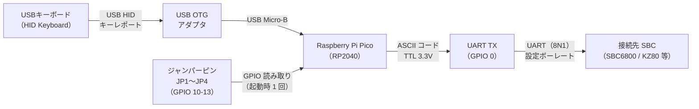

# KKBD-USB ユーザーマニュアル — 01 ハードウェア構成

| 項目 | 内容 |
|------|------|
| 文書番号 | KKBD-USB-MAN-01-001 |
| 作成日 | 2026-05-05 |
| バージョン | 1.0 |
| ステータス | 正式版 |

---

## 目次

1. [はじめに](#1-はじめに)
2. [必要部品一覧](#2-必要部品一覧)
3. [システム構成図](#3-システム構成図)
4. [信号フロー](#4-信号フロー)
5. [Pico 物理ピンレイアウト](#5-pico-物理ピンレイアウト)
6. [関連文書](#6-関連文書)

---

## 1. はじめに

> **重要: 本ボードは USB キーボード → UART 単方向送信専用のキーボードインターフェース代替ボードです。**
>
> - **送信のみ**: USB キーボードのキー入力を ASCII 化して UART で送信します。
> - **受信・表示機能なし**: SBC からの UART 応答を読み取って画面に表示する機能はありません（シリアルターミナルではありません）。
> - **想定構成**: SBC 側で VRAM 付きビデオボード等の独立した表示系統を用意することを前提とします。本ボードは「キーボード単独入力」を提供するものであり、SBC との双方向通信を行うターミナルではありません。

### 1.1 このマニュアルの位置付け

本文書（KKBD-USB-MAN-01-001）は、KKBD-USB ユーザーマニュアルの第 1 章です。KKBD-USB を自作・組み立てする方を対象に、システムを構成するハードウェア部品と各部品間の接続関係を解説します。

本章を読むことで、以下の内容を把握できます。

- KKBD-USB に必要な部品の全体像
- システム全体の構成と信号の流れ
- Raspberry Pi Pico のピン配置と各ピンの用途

実際の組み立て手順については [02 組み立て手順](02_組み立て手順.md) を参照してください。

### 1.2 対象読者

- SBC6800、KZ80 等のシングルボードコンピューター（SBC）をスタンドアロン操作したい方
- Raspberry Pi Pico を使った電子工作の経験がある方（ブレッドボード配線、ジャンパーケーブルの扱いができる方）
- ファームウェアのビルドと書き込みができる、または書き込み済み UF2 ファイルを入手した方

### 1.3 KKBD-USB とは

KKBD-USB は、USB キーボードからの入力を UART 信号に変換して SBC へ出力するキーボードインターフェースです。Raspberry Pi Pico（RP2040）の内蔵 USB ホスト機能（TinyUSB）を使用しており、外部 USB ホストモジュールは不要です。

> **動作ステータス**: Phase 1〜6 完了・実機検証済み。USB キーボード接続 → ASCII 変換 → UART 送信のメイン機能は通常用途で使用可能です。

---

## 2. 必要部品一覧

KKBD-USB を組み立てるために必要な部品を以下に示します。

| No. | 部品名 | 仕様・備考 | 数量 | 用途 |
|-----|--------|-----------|------|------|
| 1 | **Raspberry Pi Pico**（無印） | RP2040 搭載。無印（Wi-Fi なし）を推奨。RP2040 搭載の互換ボードも使用可能 | 1 | メイン MCU |
| 2 | **USB Micro-B ケーブル**（書き込み用） | データ通信対応のもの（充電専用ケーブルは不可）。Pico への UF2 書き込みおよび電源供給に使用 | 1 | ファームウェア書き込み・電源 |
| 3 | **USB OTG アダプタまたは OTG ケーブル** | VBUS 給電パススルー対応のもの。Micro-B（Pico 側）→ Type-A メス（キーボード接続）に変換。Pico を USB ホストとして動作させるために必要 | 1 | USB ホスト接続 |
| 4 | **USB キーボード** | USB HID Keyboard クラス準拠のもの。一般的な日本語・英語キーボードの大多数が対応 | 1 | キー入力デバイス |
| 5 | **USB-シリアル変換アダプタ**（3.3V TTL） | 初期動作確認用。最終的には SBC の UART 受信端子に直接接続するため不要。3.3V TTL 対応のもの（5V TTL 専用は使用不可） | 1 | 初期確認・デバッグ |
| 6 | **ジャンパーケーブルまたはタクトスイッチまたはピンヘッダ** | JP1〜JP4 用。4 本以上。ジャンパーケーブルでブレッドボードに短絡させる方法が最も簡単 | 4 本以上 | ジャンパー設定 |
| 7 | **ブレッドボードまたは基板**（推奨） | 配線整理用。なくても動作するが、配線が安定し確認が容易になる | 1 | 配線整理 |
| 8 | **接続先 SBC** | SBC6800、KZ80 等。UART 受信端子付きのもの。SBC の UART が TTL 3.3V 入力対応であること（RS-232C レベルの場合は別途レベル変換 IC が必要） | 1 | キーボード入力の受信先 |

### 2.1 部品選定の注意事項

**USB OTG アダプタについて**

Pico の Micro-B コネクタを USB ホストとして動作させるには、VBUS への 5V 給電が必要です。一般的な OTG アダプタ（スマートフォン用など）は VBUS パススルーに対応していない場合があるため、仕様を確認してください。

**SBC の UART レベルについて**

Pico の GPIO は 3.3V ロジックです。SBC 側の UART 入力が以下の場合は追加対応が必要です。

| SBC の UART レベル | 対応 |
|-------------------|------|
| TTL 3.3V | 直結可 |
| TTL 5V | 入力閾値確認が必要（多くの場合 2.0V 以上で High 認識するため動作する可能性あり） |
| RS-232C（±12V） | レベル変換 IC（MAX232 等）が別途必要 |

**電源容量について**

Pico 本体（約 100mA）と USB キーボード（最大 500mA）を合わせると最大約 600mA の電流が必要です。電源アダプタは **1A 以上** の供給能力があるものを使用してください。

---

## 3. システム構成図


システム全体の構成を上図に示します。左から「USB キーボード」→「Raspberry Pi Pico」→「接続先 SBC」の順に信号が流れます。Pico 内部でキーコード変換と UART 送信処理が行われ、ジャンパーピン設定（JP1〜JP4）により動作パラメーターが決まります。

---

## 4. 信号フロー

システム内を流れる信号の経路を以下の図に示します。



### 4.1 信号フローの詳細

| ステップ | 信号 | 説明 |
|---------|------|------|
| 1 | USB HID キーレポート | キーボードが押下されたキーの情報（修飾キー + キーコード）を USB HID フォーマットで Pico へ送信 |
| 2 | HID キーコード → ASCII 変換 | Pico 内部で USB HID Usage ID を ASCII コードに変換。Shift/Ctrl 修飾に対応 |
| 3 | 行末コード処理 | Enter キー入力時、JP1/JP2 の設定に従い CR / LF / CRLF を選択して送信 |
| 4 | UART 送信 | ASCII コードを TTL 3.3V の UART 信号として GPIO 0（TX）から出力 |
| 5 | SBC 受信 | SBC の UART 受信端子が ASCII コードを受信し、キーボード入力として処理 |

---

## 5. Pico 物理ピンレイアウト

### 5.1 Raspberry Pi Pico ピン配置（使用ピン抜粋）

以下は Raspberry Pi Pico の物理ピン配置の概略図です（使用するピンのみ示します）。

```
Pico 上面図（Micro-B コネクタを上として）

       ┌────────────────────┐
       │  [Micro-B]  [LED]  │
  (1)──┤ GP0 TX     VBUS ├──(40)  ← USB 給電（入力）※Micro-B と内部接続
  (2)──┤ GP1        VSYS ├──(39)  ← 外部 5V 入力（推奨・ショットキーダイオード経由）
  (3)──┤ GND    ←   GND  ├──(38)
  (4)──┤ GP2         3V3 ├──(37)
  (5)──┤ GP3        3V3EN├──(36)
  (6)──┤ GP4         ADC ├──(35)
  (7)──┤ GP5        GP28 ├──(34)
  (8)──┤ GND    ←   GND  ├──(33)
       │   ...          ... │
 (13)──┤ GND    ←   GP10 ├──(14) ← JP1（行末コード bit0）
       │                    │
 (14)──┤ GP10  JP1  GP11 ├──(15) ← JP2（行末コード bit1）
 (15)──┤ GP11  JP2  GP12 ├──(16) ← JP3（ボーレート bit0）
 (16)──┤ GP12  JP3  GP13 ├──(17) ← JP4（ボーレート bit1）
 (17)──┤ GP13  JP4   GND ├──(18) ← GND（ジャンパー基準）
       │   ...          ... │
 (23)──┤ GND         GND ├──(28)
       │   [内蔵LED:GP25]   │
       └────────────────────┘
```

> **補足**: 上記はピン配置の概略図です。正確なピン配置は [Raspberry Pi Pico データシート](https://datasheets.raspberrypi.com/pico/pico-datasheet.pdf) を参照してください。

### 5.2 ピンアサイン一覧（確定版）

本プロジェクトで使用する Raspberry Pi Pico の GPIO 一覧です。配線時の参照用として使用してください。

| 機能 | GPIO 番号 | Pico 物理ピン番号 | 方向 | 内部設定 | 備考 |
|------|----------|-------------------|------|---------|------|
| UART0 TX | GPIO 0 | 1 | 出力 | UART 機能 | SBC の RX へ接続（TTL 3.3V 出力） |
| GND | — | 3, 8, 13, 18, 23, 28, 38 | — | — | UART・ジャンパー共通グラウンド |
| JP1（行末コード bit0） | GPIO 10 | 14 | 入力 | 内蔵プルアップ | OPEN=未接続 / SHORT=GND ピンへ接続 |
| JP2（行末コード bit1） | GPIO 11 | 15 | 入力 | 内蔵プルアップ | 同上 |
| JP3（ボーレート bit0） | GPIO 12 | 16 | 入力 | 内蔵プルアップ | 同上 |
| JP4（ボーレート bit1） | GPIO 13 | 17 | 入力 | 内蔵プルアップ | 同上 |
| LED（ステータス表示） | GPIO 25 | 内蔵 | 出力 | — | Pico オンボード LED |
| USB | 内蔵 | Micro-B コネクタ | — | USB ホスト | USB OTG アダプタ経由でキーボード接続 |

> **配線方法**: 各 JP は **OPEN（未接続）** または **SHORT（GND ピンへ接続）** の 2 状態。内蔵プルアップにより OPEN 時は High（1）、SHORT 時は Low（0）として読み取られます。

### 5.3 ジャンパーピン設定

ジャンパーピンの設定は**電源投入時に一度だけ読み取られます**。設定変更後は必ず電源を再投入してください。

#### 行末コード選択（JP1 = GPIO 10 / JP2 = GPIO 11）

| JP1 | JP2 | 行末コード | 送出バイト列 | 用途例 |
|-----|-----|-----------|-------------|--------|
| OPEN | OPEN | CR | 0x0D | 多くのレトロ SBC のデフォルト **← 推奨初期設定** |
| SHORT | OPEN | LF | 0x0A | Unix 系ターミナル |
| OPEN | SHORT | CRLF | 0x0D 0x0A | Windows 系ターミナル |
| SHORT | SHORT | （予約） | — | CR にフォールバック |

#### ボーレート選択（JP3 = GPIO 12 / JP4 = GPIO 13）

| JP3 | JP4 | ボーレート | 用途例 |
|-----|-----|-----------|--------|
| OPEN | OPEN | 9600 bps | 多くのレトロ SBC のデフォルト **← 推奨初期設定** |
| SHORT | OPEN | 19200 bps | — |
| OPEN | SHORT | 38400 bps | — |
| SHORT | SHORT | 115200 bps | 高速通信 |

> **推奨初期設定**: JP1〜JP4 全て **OPEN（未接続）** で 9600 bps + CR となります。接続先 SBC のボーレートに合わせて JP3/JP4 を設定してください。

### 5.4 LED インジケーター

Pico オンボード LED（GPIO 25）がシステム状態を表示します。

| 状態 | LED 挙動 | 意味 |
|------|---------|------|
| BOOT | 常時点灯 | 起動中・初期化中 |
| WAIT_DEVICE | 低速点滅（500ms 周期） | USB キーボード待機中 |
| MOUNTED | 常時点灯 | USB キーボード接続済み |
| TX | 短時間点滅（30ms） | UART 送信時の瞬間表示 |
| ERROR | 高速点滅（100ms 周期） | エラー検出時 |

---

## 6. 関連文書

| 文書 | 内容 |
|------|------|
| [02 組み立て手順](02_組み立て手順.md) | 実際の配線手順・ジャンパー設定・動作確認 |
| [03 ビルドと書き込み](03_ビルドと書き込み.md) | ファームウェアのビルド・Pico への書き込み手順 |
| [05 OTG と電源](05_OTGと電源.md) | USB OTG アダプタの選定・電源設計の詳細 |
| [詳細設計書](../design/設計書.md) | ピンアサイン確定版・ソフトウェア設計 |
| [要件定義書](../requirements/要件定義.md) | ハードウェア要件・機能要件の詳細 |

---

*本文書は KKBD-USB プロジェクト ユーザーマニュアル 第 1 章（バージョン 1.0）です。*
