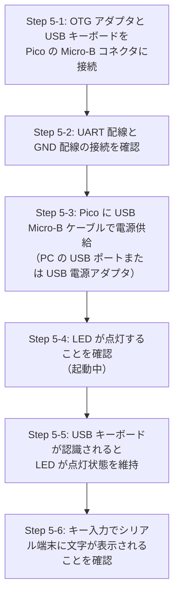
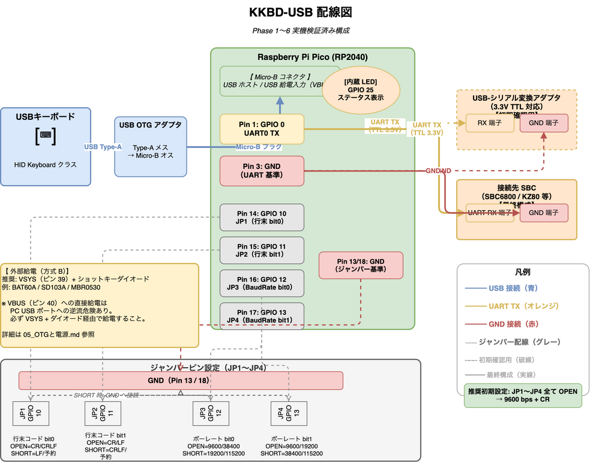

# KKBD-USB ユーザーマニュアル — 02 組み立て手順

| 項目 | 内容 |
|------|------|
| 文書番号 | KKBD-USB-MAN-02-001 |
| 作成日 | 2026-05-05 |
| バージョン | 1.0 |
| ステータス | 正式版 |

---

## 目次

1. [はじめに](#1-はじめに)
2. [準備物確認](#2-準備物確認)
3. [配線手順（Step 1〜5）](#3-配線手順step-15)
4. [配線図](#4-配線図)
5. [ジャンパー設定の組み合わせ早見表](#5-ジャンパー設定の組み合わせ早見表)
6. [トラブルシューティング（簡易）](#6-トラブルシューティング簡易)
7. [関連文書](#7-関連文書)

---

## 1. はじめに

本文書（KKBD-USB-MAN-02-001）は、KKBD-USB ユーザーマニュアルの第 2 章です。KKBD-USB を実際に手元で組み立てる手順を Step ごとに解説します。

本章では以下の内容を扱います。

- ジャンパーピン（JP1〜JP4）の配線方法
- UART 出力ピンの配線方法（USB-シリアル変換アダプタ経由、または SBC 直結）
- USB OTG アダプタを介したキーボード接続
- 動作確認用シリアル端末の接続
- 電源投入の正しい順序

> **前提条件**: ファームウェア（`kkbd_usb.uf2`）が Raspberry Pi Pico に書き込み済みであることを前提とします。ビルドと書き込みの手順は [03 ビルドと書き込み](03_ビルドと書き込み.md) を参照してください。

---

## 2. 準備物確認

組み立てを始める前に、以下の部品がすべて揃っていることを確認してください。詳細な仕様は [01 ハードウェア構成](01_ハードウェア構成.md) の「必要部品一覧」を参照してください。

| チェック | 部品名 | 確認ポイント |
|---------|--------|-------------|
| ☐ | Raspberry Pi Pico（RP2040） | ファームウェア書き込み済みか確認 |
| ☐ | USB Micro-B ケーブル（データ通信対応） | 充電専用ケーブルでないことを確認 |
| ☐ | USB OTG アダプタまたは OTG ケーブル | VBUS 給電パススルー対応であることを確認 |
| ☐ | USB キーボード（HID Keyboard クラス） | 一般的な USB キーボードであれば OK |
| ☐ | USB-シリアル変換アダプタ（3.3V TTL） | 動作確認用（初期セットアップのみ） |
| ☐ | ジャンパーケーブルまたはタクトスイッチ | JP1〜JP4 用、4 本以上 |
| ☐ | ブレッドボード（推奨） | 配線整理用 |
| ☐ | 接続先 SBC | UART 受信端子付き、TTL 3.3V 入力対応 |

---

## 3. 配線手順（Step 1〜5）

### Step 1: ジャンパー配線（JP1〜JP4）

ジャンパーピンにより、行末コードとボーレートを設定します。

**接続要領**

各ジャンパーは「対応する GPIO ピン」と「GND ピン」を接続（SHORT）するか、何もしない（OPEN）かの 2 状態です。

| ジャンパー | Pico 物理ピン | 設定内容 | GND 最寄りピン |
|-----------|-------------|---------|---------------|
| JP1 | 物理ピン 14（GPIO 10） | 行末コード bit0 | 物理ピン 13（GND） |
| JP2 | 物理ピン 15（GPIO 11） | 行末コード bit1 | 物理ピン 13 または 18（GND） |
| JP3 | 物理ピン 16（GPIO 12） | ボーレート bit0 | 物理ピン 13 または 18（GND） |
| JP4 | 物理ピン 17（GPIO 13） | ボーレート bit1 | 物理ピン 18（GND） |

**手順**

1. Pico をブレッドボードに挿します（ピンヘッダが必要な場合ははんだ付けしてください）。
2. ジャンパーケーブルを使い、SHORT にしたい JP の GPIO ピンと GND ピンを接続します。
3. OPEN にしたい JP はケーブルを接続しません（内蔵プルアップにより High に固定されます）。

> **推奨初期設定**: JP1〜JP4 すべて OPEN（ケーブルなし）→ 9600 bps + CR

> **注意**: ジャンパー設定は電源投入時に一度だけ読み取られます。設定を変更した場合は電源を再投入してください。

---

### Step 2: UART 配線

Pico の UART0 TX（GPIO 0、物理ピン 1）から SBC または USB-シリアル変換アダプタに UART 信号を出力します。

#### 初期確認用（USB-シリアル変換アダプタ経由）

動作確認の段階では PC 上のシリアル端末ソフトウェアを使って UART 出力を確認します。

| 接続元（Pico） | 接続先（USB-シリアル変換アダプタ） | 備考 |
|---------------|----------------------------------|------|
| GPIO 0（物理ピン 1）TX | アダプタの RX 端子 | クロス接続（TX→RX） |
| GND（物理ピン 3 または 38 等） | アダプタの GND 端子 | 共通グラウンド |

> **注意**: Pico の出力は TTL 3.3V です。USB-シリアル変換アダプタが 3.3V TTL 対応であることを確認してください（5V 専用アダプタは使用不可）。

#### 最終構成（SBC 直結）

動作確認後は USB-シリアル変換アダプタを外し、SBC の UART 受信端子に直接接続します。

| 接続元（Pico） | 接続先（SBC） | 備考 |
|---------------|-------------|------|
| GPIO 0（物理ピン 1）TX | SBC の UART RX 端子 | クロス接続（TX→RX） |
| GND（物理ピン 3 または 38 等） | SBC の GND 端子 | 共通グラウンド必須 |

> **重要**: KKBD-USB の UART は**送信専用**です（SBC から KKBD-USB への受信は非対応）。SBC の TX 端子に接続する必要はありません。

---

### Step 3: USB OTG 配線（キーボード接続）

Pico の Micro-B コネクタを USB ホストとして使用し、USB キーボードを接続します。

**接続方法**

```
USB キーボード
    │（USB Type-A プラグ）
    ↓
USB OTG アダプタ（Type-A メス → Micro-B オス）
    │（Micro-B プラグ）
    ↓
Raspberry Pi Pico（Micro-B コネクタ）
```

1. USB OTG アダプタを Pico の Micro-B コネクタに接続します。
2. USB キーボードを OTG アダプタの Type-A メス端子に接続します。

> **注意**: OTG アダプタは VBUS 給電パススルーに対応したものを使用してください。キーボードへの電源供給は VBUS 経由で行われます。

---

### Step 4: 動作確認用シリアル端末接続

UART 出力を PC 上のシリアル端末ソフトウェアで確認します。

シリアル端末は **9600 bps・8N1・フロー制御なし** で開いてください。具体的なソフトウェアと OS 別手順は [04_使い方](04_使い方.md) §4 を参照してください。

**確認方法**

1. PC に USB-シリアル変換アダプタを接続し、シリアルポートを開きます。
2. KKBD-USB に電源を投入します（Step 5 参照）。
3. USB キーボードが Pico に接続されると LED が点灯します。
4. キーを押すと、シリアル端末に対応する文字が表示されることを確認します。

---

### Step 5: 電源投入の順序

電源投入は以下の順序で行ってください。



> **重要**: 電源を投入する前にすべての配線を完了してください。電源投入時にジャンパー設定が読み取られます。

> **注意**: OTG 経由でキーボードを接続している状態で Pico に電源を供給すると、Pico が USB ホストとして動作し、キーボードに電源が供給されます。Pico の Micro-B コネクタは 1 系統しかないため、OTG（USB ホスト）として使う場合は同じコネクタから PC のデバイスとして繋ぐことはできません。電源は給電パススルー OTG・VSYS への外部給電（ショットキーダイオード経由）・電源供給付き OTG ケーブルのいずれかで供給してください（詳細は [05_OTGと電源.md](05_OTGと電源.md) 参照）。

---

## 4. 配線図

KKBD-USB の配線全体を以下に示します。



> 上記の PNG 画像は `docs/images/wiring_diagram.drawio` を変換したものです。draw.io ファイルの編集・変換については `docs/images/tool/convert_drawio.sh` を参照してください。

### 4.1 配線概要図（テキスト）

```
┌─────────────────────────────────────────────────────────────┐
│                     KKBD-USB 配線概要                        │
│                                                              │
│  [USB キーボード]                                             │
│       │ USB Type-A                                           │
│       ↓                                                      │
│  [USB OTG アダプタ]                                           │
│       │ Micro-B                                              │
│       ↓                                                      │
│  ┌─────────────────────────────────────────────────┐        │
│  │         Raspberry Pi Pico (RP2040)               │        │
│  │                                                  │        │
│  │  Pin 1  (GPIO 0 / UART TX)  ──────────────────→ │ ──→ SBC RX
│  │  Pin 3  (GND)               ──────────────────→ │ ──→ SBC GND
│  │                                                  │        │
│  │  Pin 14 (GPIO 10 / JP1) ──┐                     │        │
│  │  Pin 15 (GPIO 11 / JP2) ──┤── (SHORT=GND接続)   │        │
│  │  Pin 16 (GPIO 12 / JP3) ──┤── (OPEN=接続なし)   │        │
│  │  Pin 17 (GPIO 13 / JP4) ──┘                     │        │
│  │  Pin 13 or 18 (GND)     ←─── ジャンパー基準     │        │
│  │                                                  │        │
│  │  [内蔵 LED: GPIO 25] ← 状態表示                 │        │
│  └─────────────────────────────────────────────────┘        │
└─────────────────────────────────────────────────────────────┘
```

---

## 5. ジャンパー設定の組み合わせ早見表

### 5.1 行末コード選択（JP1 / JP2）

JP1 は Pico 物理ピン 14（GPIO 10）、JP2 は物理ピン 15（GPIO 11）です。

| JP1 | JP2 | 行末コード | 送出バイト列 | 推奨用途 |
|-----|-----|-----------|-------------|---------|
| **OPEN** | **OPEN** | **CR** | **0x0D** | **多くのレトロ SBC ← 推奨初期設定** |
| SHORT | OPEN | LF | 0x0A | Unix/Linux 系 |
| OPEN | SHORT | CRLF | 0x0D 0x0A | Windows 系ターミナル |
| SHORT | SHORT | （予約）→ CR | 0x0D | 使用しないこと |

> **推奨**: 接続先 SBC が 何を期待するか不明な場合は **JP1/JP2 ともに OPEN（CR）** から始めてください。

### 5.2 ボーレート選択（JP3 / JP4）

JP3 は Pico 物理ピン 16（GPIO 12）、JP4 は物理ピン 17（GPIO 13）です。

| JP3 | JP4 | ボーレート | 推奨用途 |
|-----|-----|-----------|---------|
| **OPEN** | **OPEN** | **9600 bps** | **多くのレトロ SBC のデフォルト ← 推奨初期設定** |
| SHORT | OPEN | 19200 bps | 中速通信 |
| OPEN | SHORT | 38400 bps | 高速通信 |
| SHORT | SHORT | 115200 bps | 高速通信（SBC が対応している場合） |

> **重要**: SBC 側の UART ボーレート設定と KKBD-USB のジャンパー設定を**必ず一致させてください**。不一致の場合、文字化けや無応答が発生します。

### 5.3 推奨初期設定まとめ

**JP1〜JP4 すべて OPEN = ジャンパーケーブルなし = 9600 bps + CR**

---

## 6. トラブルシューティング（簡易）

組み立て後に問題が発生した場合の初期確認事項を以下に示します。詳細は [07 トラブルシューティング](07_トラブルシューティング.md) を参照してください。

### 症状別チェックリスト

#### LED が点灯しない

| チェック項目 | 確認方法 |
|-------------|---------|
| Pico に電源が供給されているか | USB Micro-B ケーブルが PC またはアダプタにしっかり接続されているか確認 |
| データ通信対応ケーブルか | 充電専用ケーブルは使用不可。別のケーブルで試す |
| ファームウェアが書き込まれているか | BOOTSEL ボタンを押しながら USB 接続し、RPI-RP2 ドライブが表示されたら書き込み済みではない。[03 ビルドと書き込み](03_ビルドと書き込み.md) を参照 |

#### LED は点灯するが USB キーボードが認識されない（LED がゆっくり点滅のまま）

| チェック項目 | 確認方法 |
|-------------|---------|
| OTG アダプタが正しく接続されているか | Pico の Micro-B コネクタにしっかり差し込まれているか確認 |
| OTG アダプタが VBUS 給電対応か | アダプタの仕様を確認。充電専用 OTG は不可 |
| キーボードが HID Keyboard クラスに対応しているか | 別のキーボードで試す |
| キーボードに電源が入っているか | キーボードの LED 等で電源状態を確認 |

#### キーを押しても文字が表示されない（シリアル端末）

| チェック項目 | 確認方法 |
|-------------|---------|
| UART 配線が正しいか | Pico GPIO 0（TX）→ アダプタ RX、Pico GND → アダプタ GND を確認 |
| シリアル端末のボーレートが正しいか | JP3/JP4 設定のボーレートとシリアル端末の設定が一致しているか確認 |
| TX と RX を逆に接続していないか | TX→RX のクロス接続を確認 |
| USB-シリアル変換アダプタが 3.3V 対応か | 5V 専用アダプタは使用不可。アダプタの仕様を確認 |

#### 文字化けする

| チェック項目 | 確認方法 |
|-------------|---------|
| ボーレートが一致しているか | SBC またはシリアル端末のボーレートと KKBD-USB の JP3/JP4 設定を確認 |
| フレームフォーマットが一致しているか | KKBD-USB は 8N1 固定。SBC 側も 8N1 に設定されているか確認 |

#### Enter キーを押しても SBC が改行しない

| チェック項目 | 確認方法 |
|-------------|---------|
| 行末コード設定が SBC の期待に合っているか | JP1/JP2 設定を変更して試す（CR → LF → CRLF）。設定変更後は電源再投入が必要 |

---

## 7. 関連文書

| 文書 | 内容 |
|------|------|
| [01 ハードウェア構成](01_ハードウェア構成.md) | 必要部品一覧・ピンアサイン・システム構成 |
| [03 ビルドと書き込み](03_ビルドと書き込み.md) | ファームウェアのビルドと Pico への書き込み手順 |
| [05 OTG と電源](05_OTGと電源.md) | USB OTG アダプタの選定・電源設計の詳細 |
| [07 トラブルシューティング](07_トラブルシューティング.md) | 詳細なトラブルシューティングガイド |

---

*本文書は KKBD-USB プロジェクト ユーザーマニュアル 第 2 章（バージョン 1.0）です。*
