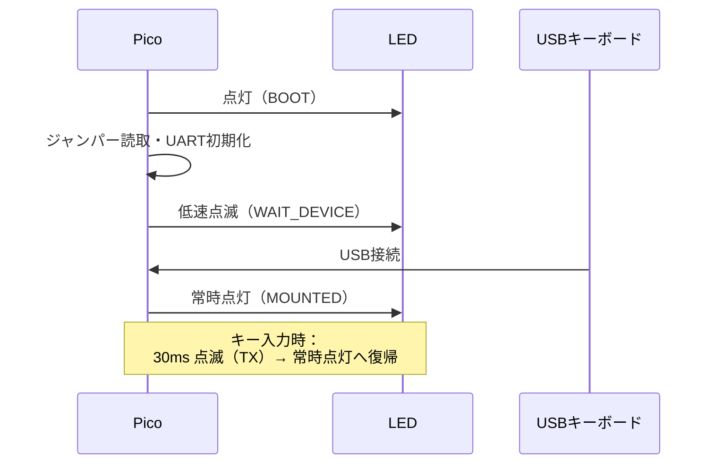

# KKBD-USB ユーザーマニュアル — 使い方

| 項目 | 内容 |
|------|------|
| 文書番号 | KKBD-USB-MAN-04-001 |
| 作成日 | 2026-05-05 |
| バージョン | 1.0 |
| ステータス | 正式版 |
| 対象バージョン | Phase 1〜6 完了時点（実機検証済み） |
| 関連文書 | [README.md](../../README.md) / [03_ビルドと書き込み.md](03_ビルドと書き込み.md) |

---

## §1 はじめに

本マニュアルは、KKBD-USB ファームウェアを書き込んだ Raspberry Pi Pico を実際に使用するための手順を説明します。

> **重要: 本ボードは送信専用です。SBC からの応答を表示する機能はありません。**
>
> KKBD-USB は USB キーボードのキー入力を UART で SBC へ送信する「単方向キーボード I/F」です。SBC からの UART 応答を受信して画面に表示する機能（シリアルターミナル機能）はありません。SBC 側の表示は VRAM 付きビデオボード等の別系統を前提とします。

**典型的なユースケース:**

- SBC6800 や KZ80 などの Z80 / 6800 系シングルボードコンピューターを、PC なしでキーボード単体から操作したい（SBC 側の文字表示は VRAM ボード等の別系統で行う前提）
- 既存の USB キーボードをそのまま使い、SBC の UART モニタにキー入力を送りたい
- ボーレートや行末コードを SBC 側の仕様に合わせて設定したい

**前提条件:**

- Pico に KKBD-USB ファームウェアが書き込み済みであること（[03_ビルドと書き込み.md](03_ビルドと書き込み.md) を参照）
- USB OTG アダプタ（Micro-B オス → USB-A メス）が用意されていること
- USB-シリアル変換アダプタ（3.3V TTL 対応）または SBC の UART ポートへの接続手段があること

---

## §2 起動と接続

### Step 1: ジャンパー設定の確認

電源を入れる前に、ジャンパーピン（JP1〜JP4）の設定を確認します。

**初回起動の推奨設定: JP1〜JP4 すべて OPEN（未接続）**

| 設定 | 値 |
|------|----|
| ボーレート | 9600 bps |
| 行末コード | CR（0x0D） |

ジャンパー設定の詳細は §6（ボーレートの変更）および §7（行末コードの変更）を参照してください。

### Step 2: USB OTG アダプタにキーボードを接続

USB OTG アダプタ（Micro-B オス → USB-A メス）を経由して、USB キーボードを接続します。

```
USB キーボード ──[USB-A]──> [USB OTG アダプタ] ──[Micro-B]──> Pico の USB ポート
```

> **注意**: Pico の USB ポートは 1 系統のみです。USB OTG アダプタを使用することで、USB ホストモードで動作します。USB ハブ経由での複数キーボード接続は現バージョンでは非対応です。

### Step 3: Pico に電源を投入

**専用の電源ケーブル**（USB Micro-B）を Pico の USB ポートへ接続します。

> USB キーボードを OTG アダプタ経由で接続している場合、Pico の USB ポートは OTG アダプタが占有されます。この場合、Pico への電源供給は Pico の **VSYS ピン（物理ピン 39）** にショットキーダイオード経由で 5V を供給するか、OTG アダプタが電源供給をサポートするもの（Y ケーブル等）を使用してください。なお、VBUS（物理ピン 40）は Micro-B コネクタと内部接続されているため、外部 5V を直接 VBUS に入れると PC USB ポートへ逆流する危険があります。

簡易的な使用方法としては、以下のいずれかを選択します。

| 電源供給方法 | 説明 |
|------------|------|
| USB OTG + 電源供給付きハブ | USB OTG アダプタとセルフパワー USB ハブを組み合わせる |
| VSYS ピンへの 5V 供給（推奨） | Pico ピン 39（VSYS）にショットキーダイオード経由で 5V を供給する（別途電源・ダイオードが必要）。詳細は [05_OTGと電源.md](05_OTGと電源.md) 参照 |
| USB OTG Y ケーブル | キーボード接続と電源供給を同時に行う Y ケーブルを使用する |

### Step 4: SBC との UART 接続確認

Pico の UART0 TX（GPIO 0 / 物理ピン 1）を SBC の UART RX へ接続します。GND は共通に接続してください。

```
Pico GPIO 0 (UART TX) ──────> SBC UART RX
Pico GND              ──────> SBC GND
```

> UART 出力レベルは **TTL（3.3V）** です。SBC 側のロジックレベルが 5V の場合は、レベル変換が必要です。

---

## §3 LED ステータスの読み方

Pico オンボードの緑色 LED（GPIO 25）がファームウェアの状態を示します。

| 状態名 | LED パターン | 意味 |
|--------|------------|------|
| BOOT | 常時点灯 | 電源投入直後の初期化中。数百ミリ秒で次の状態へ遷移 |
| WAIT_DEVICE | 低速点滅（500ms 周期） | USB キーボード未接続。キーボードの接続を待っている |
| MOUNTED | 常時点灯 | USB キーボード接続済み・動作中 |
| TX | 短時間点滅（30ms 点灯） | キー入力を UART に送信中 |
| ERROR | 高速点滅（100ms 周期） | エラー発生。USB 初期化失敗等 |

**正常な起動シーケンス:**



---

## §4 シリアル端末での確認

Pico の UART 出力は USB-シリアル変換アダプタ経由で PC から確認できます。動作確認や SBC と接続する前のテストに有用です。

> **注意: ここで確認できるのは「KKBD-USB が送信した文字」のみです。**
>
> シリアル端末（TeraTerm 等）に表示されるのは、あくまでも KKBD-USB から送り出された ASCII コードです。SBC が UART に返信した内容を表示するものではありません。本ボードは送信専用のため、SBC からの応答は KKBD-USB 経由では見えません。この接続形態は「KKBD-USB 単体の動作確認」用であり、SBC との対話を見るためのものではありません。

### 4.1 接続

```
Pico GPIO 0 (UART TX) ──> USB-シリアル変換アダプタ RX
Pico GND              ──> USB-シリアル変換アダプタ GND
```

アダプタを PC に接続後、認識されたシリアルデバイスを確認します。

| OS | デバイス確認コマンド | デバイス名の例 |
|----|-------------------|--------------|
| macOS | `ls /dev/tty.usb*` | `/dev/tty.usbserial-XXXX` |
| Linux | `ls /dev/ttyUSB*` | `/dev/ttyUSB0` |
| Windows | デバイスマネージャーを開く | `COM3` 等 |

### 4.2 シリアル端末の起動

デフォルト設定（全ジャンパー OPEN）のボーレートは **9600 bps** です。

**macOS（screen コマンド）:**

```sh
screen /dev/tty.usbserial-XXXX 9600
```

**Linux（minicom）:**

```sh
minicom -D /dev/ttyUSB0 -b 9600
```

**Windows（TeraTerm）:**

1. TeraTerm を起動
2. 「シリアル」を選択し、ポートを指定（例: COM3）
3. 設定 → シリアルポート → ボーレートを 9600 に設定

**Windows（PuTTY）:**

1. 接続種類で「Serial」を選択
2. シリアルライン: `COM3`（環境による）
3. スピード: `9600`
4. 「Open」をクリック

### 4.3 シリアル端末の終了方法

| ツール | 終了操作 |
|--------|---------|
| macOS screen | `Ctrl+A` → `K` → `Y` |
| Linux minicom | `Ctrl+A` → `X` → `Yes` |
| TeraTerm | メニュー「ファイル」→「TeraTerm の終了」 |
| PuTTY | ウィンドウを閉じる |

---

## §5 制御文字の確認方法

通常のシリアル端末ではキーボードから入力した文字が表示されますが、制御文字（Ctrl+A = 0x01、CR = 0x0D 等）は画面上に表示されないことがあります。KKBD-USB の動作を 16 進数レベルで確認したい場合は以下の方法を使用します。

### 方法 A: Python miniterm（16 進表示モード）

```sh
python3 -m serial.tools.miniterm /dev/tty.usbserial-XXXX 9600 -f hexlify
```

キー入力のたびに `0d`（CR）等の 16 進値が表示されます。`python3-serial` パッケージが必要です（`pip3 install pyserial`）。

### 方法 B: screen でログを取得して hexdump

```sh
# ログ付きで screen を起動（screenlog.0 に記録される）
screen -L /dev/tty.usbserial-XXXX 9600

# 別ターミナルで hexdump を確認
hexdump -C screenlog.0
```

---

## §6 ボーレートの変更

### 6.1 JP3 / JP4 の組み合わせ表

| JP3（GPIO 12） | JP4（GPIO 13） | ボーレート |
|----------------|----------------|-----------|
| OPEN | OPEN | **9600 bps** |
| SHORT（GND 接続） | OPEN | 19200 bps |
| OPEN | SHORT（GND 接続） | 38400 bps |
| SHORT（GND 接続） | SHORT（GND 接続） | 115200 bps |

> **SHORT** = GPIO ピンを GND ピンに接続するということです。Pico の内蔵プルアップが有効なため、OPEN 時は High（1）、SHORT 時は Low（0）として読み取られます。

### 6.2 変更手順

> **注意**: ホットスワップ（電源を入れたままのジャンパー変更）には対応していません。必ず電源を切ってからジャンパーを変更してください。

1. Pico の電源を切る（USB ケーブルを抜く）
2. JP3 / JP4 を目的のボーレートに合わせて設定する
3. **SBC 側のボーレート設定も同じ値に変更する**
4. Pico に電源を投入する（USB ケーブルを接続する）

### 6.3 SBC 側の設定例

| SBC | ボーレート設定方法 |
|-----|----------------|
| SBC6800 | モニタプログラムのボーレート設定コマンドによる |
| KZ80 | モニタプログラムのコンフィグまたは起動時設定 |
| 汎用 UART | ターミナルエミュレータのシリアル設定で変更 |

---

## §7 行末コードの変更

### 7.1 JP1 / JP2 の組み合わせ表

| JP1（GPIO 10） | JP2（GPIO 11） | 行末コード | 送出バイト列 |
|----------------|----------------|-----------|-------------|
| OPEN | OPEN | **CR** | `0x0D` |
| SHORT（GND 接続） | OPEN | LF | `0x0A` |
| OPEN | SHORT（GND 接続） | CRLF | `0x0D 0x0A` |
| SHORT（GND 接続） | SHORT（GND 接続） | （予約 → CR にフォールバック） | `0x0D` |

> 予約パターン（JP1=SHORT, JP2=SHORT）は CR として動作します（FR-004 補足）。

### 7.2 変更手順

ボーレートの変更と同様に、必ず電源を切ってから変更してください（§6.2 参照）。

### 7.3 用途別推奨設定

| 用途 | 推奨設定 | 理由 |
|------|---------|------|
| SBC6800 / KZ80 等の Motorola / Z80 系モニタ | **CR**（JP1/JP2 全 OPEN） | モトローラ系・旧来の 8 ビットシステムは CR のみを行末として扱うことが多い |
| Unix 系 OS（Linux / macOS ターミナル） | **LF**（JP1=SHORT, JP2=OPEN） | Unix 系は LF が標準行末コード |
| Windows 系アプリケーション / TeraTerm | **CRLF**（JP1=OPEN, JP2=SHORT） | Windows は CRLF を標準行末コードとして扱う |

---

## §8 制限事項

現バージョン（Phase 1〜6 完了時点）の既知の制限事項を以下に示します。

| 項目 | 内容 |
|------|------|
| キーボードレイアウト | JIS キーボードを接続した場合、記号キーの位置は **US 配列ベース**で処理されます。JIS 配列の記号位置には未対応です（別 Issue で対応検討中）。 |
| 日本語入力キー | 半角/全角・変換・無変換・カナキーは未対応です（ASCII 入力専用）。 |
| 修飾キー | Alt（Option）キーおよび GUI（Windows / Command）キーは無視されます。Shift・Ctrl は正常に動作します。Caps Lock は KKBD-USB 側で状態追跡しません（キーボード側の Caps Lock LED 状態は反映されません）。 |
| NumLock | NumLock 状態の追跡は行いません。テンキー（Keypad）キーは常に数字として処理されます。 |
| 同時押し | USB HID Boot Protocol の仕様により、最大 6 キーの同時押しをサポートします。それを超えると一部のキーが無視されます。 |
| 複数キーボード | USB ハブ経由での複数キーボード接続は未検証・非対応です（Phase 7 以降で対応予定）。 |
| 異常系処理 | tuh_init 失敗時のセーフモード、受信失敗時のリトライ、Phantom キー詳細対応は未実装です（Phase 7 で対応予定）。 |
| USB キーボード互換性 | 一般的な HID Boot Protocol 対応 USB キーボードで動作確認済みです。一部の特殊なキーボードでは動作しない場合があります（Phase 8 の実機検証で確認予定）。 |

---

## §9 関連文書

| 文書 | 内容 |
|------|------|
| [README.md](../../README.md) | プロジェクト概要・ハードウェア仕様・ピンアサイン・ジャンパー設定一覧 |
| [03_ビルドと書き込み.md](03_ビルドと書き込み.md) | ビルド環境構築・ファームウェアビルド・Pico への書き込み手順 |
| [docs/requirements/要件定義.md](../requirements/要件定義.md) | 機能要件（FR）・非機能要件（NFR）の詳細 |
| [docs/design/設計書.md](../design/設計書.md) | LED 仕様・ピンアサイン・タイミング設計の詳細 |
| [docs/tests/phase2_実機検証手順.md](../tests/phase2_実機検証手順.md) | UART 送信・ジャンパー設定の詳細検証手順 |
| [docs/tests/phase6_実機検証手順.md](../tests/phase6_実機検証手順.md) | 行末コード・キーリピート・LED の詳細検証手順 |
