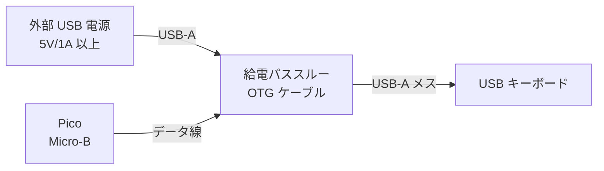
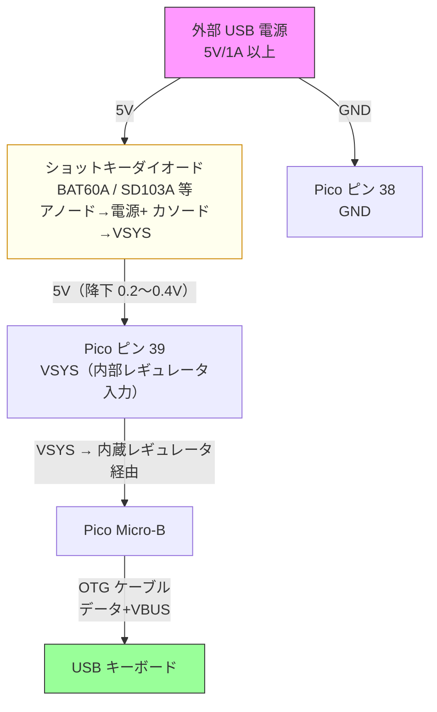
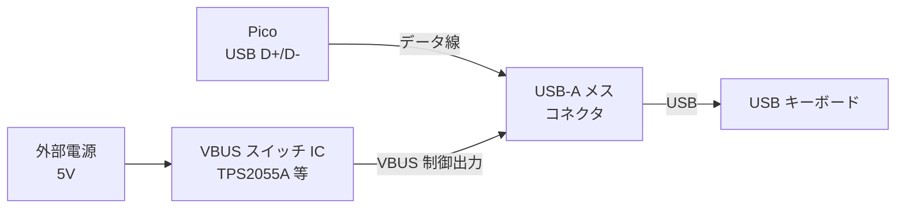

# KKBD-USB ユーザーマニュアル — 05 OTG と電源

| 項目 | 内容 |
|------|------|
| 文書番号 | KKBD-USB-MAN-05-001 |
| 作成日 | 2026-05-05 |
| バージョン | 1.0 |
| ステータス | 正式版 |

---

## 目次

1. [はじめに](#1-はじめに)
2. [USB OTG ケーブルの基本](#2-usb-otg-ケーブルの基本)
3. [給電方式 3 種類](#3-給電方式-3-種類)
4. [推奨構成（用途別）](#4-推奨構成用途別)
5. [配線図](#5-配線図)
6. [トラブルシューティング（給電関連）](#6-トラブルシューティング給電関連)
7. [参考リンク](#7-参考リンク)
8. [関連文書](#8-関連文書)

---

## 1. はじめに

KKBD-USB のハードウェア構成で最も詰まりやすいポイントが **USB OTG ケーブルの選択と給電**です。

USB キーボードを接続するためには Raspberry Pi Pico を「USB ホスト」として動作させる必要がありますが、Pico 標準の Micro-B コネクタは本来「USB デバイス（スレーブ）」として設計されています。このため、普通の USB ケーブルや OTG ケーブルをそのまま使うだけでは、接続したキーボードに 5V 電源を供給できず、キーボードが認識されないという問題が生じます。

本章では、OTG ケーブルの仕組みを解説したうえで、キーボードへの電源供給を実現する 3 種類の方法を紹介します。

---

## 2. USB OTG ケーブルの基本

### 2.1 通常の USB ケーブルとの違い

USB OTG（On-The-Go）ケーブルは、USB コネクタ内の **ID ピン** の配線によって「ホスト側」と「デバイス側」を識別します。

| ケーブル種別 | ID ピン | 用途 |
|------------|--------|------|
| 通常の USB Micro-B ケーブル | 未接続（High） | デバイスとして PC に接続する用途 |
| OTG 対応 Micro-B ケーブル | GND に接続（Low） | ホストとして動作させる用途 |

普通の OTG ケーブル（Micro-B オス → USB-A メス）は ID ピンを処理しているだけで、**VBUS（5V 電源ライン）の給電回路は含まれていないもの**が大半です。

### 2.2 Pico の Micro-B コネクタと USB ホスト動作

Raspberry Pi Pico の Micro-B コネクタは、VBUS ピンが「入力」として設計されています。PC から Pico に給電する際は PC から VBUS に 5V が供給されるため問題ありませんが、Pico が USB ホストとして動作する場合、接続したキーボードに VBUS（5V）を「出力」として供給する必要があります。

TinyUSB を使うと Pico を USB ホストモードで動作させること自体は可能ですが、**キーボードへの 5V 給電**は Pico 単体では実現できません。何らかの外部給電手段が必要です。

```
【問題の構図】
Pico Micro-B コネクタ ---(OTG ケーブル)--- USB キーボード
        ↑ここの VBUS は「入力」設計のため
          キーボードに 5V を送れない
```

---

## 3. 給電方式 3 種類

### 方式 A. 給電パススルー機能付き OTG ケーブル（推奨）

**概要**: OTG ケーブルに、外部から USB 5V 電源を入力する口が付いており、その 5V をキーボードに供給しながら Pico に OTG 接続します。

```
                     ┌───────────────────────────┐
外部 USB 電源 5V ───→│  給電パススルー OTG ケーブル │───→ USB キーボード
                    │  (Y字ケーブル等)             │
Pico Micro-B ───────│  (データ線のみ Pico と接続)  │
                     └───────────────────────────┘
```

**メリット**:
- 配線がシンプルで手軽
- Pico 基板に追加工作不要

**注意事項**:
- 製品によって「給電パススルーなし」の OTG ケーブルも多く存在します
- 購入時に「VBUS パススルー」「給電機能付き」と明記されている製品を選ぶこと
- 参考: USB 簡単ホスト（[§7 参考リンク](#7-参考リンク) を参照）で紹介されている構成

---

### 方式 B. Pico の VSYS ピンにショットキーダイオード経由で外部 5V を供給

**概要**: Pico の物理ピン 39（VSYS）にショットキーダイオードを直列に挿入した外部 5V 電源を接続します。Pico の Micro-B コネクタには通常の OTG ケーブルを接続します。

**VSYS を選ぶ理由**: VBUS（ピン 40）は Pico の Micro-B コネクタと内部接続されているため、外部 5V を VBUS に直接入れると PC USB ポートへ逆流する危険があります。VSYS（ピン 39）は内部レギュレータへの入力ピンであり、外部給電には VSYS への接続が推奨されます。これは要件定義 §2.5 および設計書 §11 と整合しています。

```
外部 USB AC アダプタ（5V/1A 以上推奨）
    │
    ├── 5V ─── [ショットキーダイオード] ─── Pico ピン 39（VSYS）
    │           例: BAT60A / SD103A / MBR0530
    │           アノード側を電源+、カソード側を VSYS へ
    └── GND ── Pico ピン 38（GND）

Pico Micro-B ────(OTG ケーブル)──── USB キーボード
               （給電は VSYS 経由・内蔵レギュレータを通じてキーボードへ）
```

**ショットキーダイオードの役割**: USB 給電（Micro-B コネクタ）と外部給電（VSYS ピン）を同時に接続した場合でも、ショットキーダイオードにより外部電源からの逆流を防止します。ショットキーダイオードは順方向電圧降下が低い（0.2〜0.4V 程度）ため、電圧損失が少なく効率的です。

**メリット**:
- VBUS への逆流を防ぎ、安全に外部給電できる
- USB 給電と外部給電の同時接続でも安全
- 確実・安定した給電が可能
- 安価な部品で構成できる

**必要部品**:
- ショットキーダイオード（例: BAT60A、SD103A、MBR0530 等）
- 最大連続順方向電流が 500mA 以上のものを使用してください（キーボード動作には最大 500mA が必要なため）

**注意事項**:
- ピン 39（VSYS）と ピン 40（VBUS）を混同しないよう注意してください。VSYS は内側（ピン 39）、VBUS は外側（ピン 40）です
- ダイオードの向きに注意してください（アノード側を電源プラス、カソード側を Pico VSYS へ接続）
- Pico の動作電圧は 3.3V ですが、VSYS は 5V 入力です。誤って 3.3V ピンに接続しないよう注意してください

---

### 方式 C. 専用 USB ホスト変換回路を作成する

**概要**: VBUS スイッチ IC（TPS2055A 等）を使った専用の USB ホスト回路を設計・作成します。上級者向けの構成です。

**メリット**:
- 過電流保護を回路レベルで実現できる
- 量産・基板設計に適する
- 電源管理が明確になる

**構成要素例**:
- VBUS スイッチ IC（TPS2055A、AP2553 等）
- ダイオードによる逆流防止
- USB-A メスコネクタ（キーボード接続用）

**注意事項**:
- 回路設計・PCB 製作の知識が必要です
- 詳細な回路図は本マニュアルの範囲外です。参考資料（[§7](#7-参考リンク)）を参照してください

---

## 4. 推奨構成（用途別）

| 用途 | 推奨方式 | 理由 |
|------|---------|------|
| **動作確認・開発時** | 方式 A（給電パススルー OTG ケーブル） | 手軽に始められる。配線変更が不要 |
| **常用・SBC 組み込み時** | 方式 B（VSYS ピン + ショットキーダイオード経由の外部 5V 給電） | 安定した給電。逆流防止付き。SBC との一体化がしやすい |
| **量産・配布・製品化時** | 方式 C（専用 USB ホスト変換回路） | 保護回路込みの確実な設計が可能 |

> **初めての方へ**: まず方式 A で動作を確認してから、用途に合わせて方式 B や C に移行することをお勧めします。

---

## 5. 配線図

### 5.1 方式 A: 給電パススルー OTG ケーブル



### 5.2 方式 B: VSYS ピン + ショットキーダイオード経由の外部給電



**Pico ピン番号の確認**:

| ピン番号 | 信号名 | 接続先 | 説明 |
|---------|-------|-------|------|
| 39 | VSYS | ショットキーダイオード経由で外部 5V 電源のプラス端子 | **外部給電に推奨**（内部レギュレータ入力） |
| 40 | VBUS | （接続しない） | Micro-B コネクタと内部接続。USB 給電時の入力 |
| 38 | GND | 外部 5V 電源のマイナス端子 | 共通グラウンド |
| Micro-B | USB | OTG ケーブル（キーボード接続用） | USB ホスト接続 |

> 注意: Pico のピン番号は基板端面のピン番地を指します。GPIO 番号とは異なります。Raspberry Pi Pico のデータシートまたはピンアウト図を必ず確認してください。

### 5.3 方式 C: 専用 USB ホスト変換回路（概念図）



---

## 6. トラブルシューティング（給電関連）

| 症状 | 考えられる原因 | 対処方法 |
|------|-------------|---------|
| キーボードが認識されない（接続ログが出ない） | OTG ケーブルが給電パススルー非対応 | 給電パススルー機能付きの OTG ケーブルに変更する（方式 A）、または方式 B に切り替える |
| キーボードが認識されない（接続ログが出ない） | 外部 5V 給電が不足または未接続 | 方式 B の場合: ピン 39（VSYS）へのショットキーダイオード経由 5V 接続と GND 接続を確認する。電流容量 1A 以上の電源を使用する |
| 接続後にすぐ切断される（`disconnected` ログが出る） | 過電流または VSYS/VBUS 不安定 | 電流容量の大きい電源アダプタ（1A 以上）に変更する。別のキーボードでも試す。方式 B や C で安定した給電を検討する |
| 認識はするがキー入力が UART に来ない | UART 配線の問題（給電とは別問題） | `05_OTGと電源.md`（本文書）は給電の問題のみ扱います。UART 関連は `07_トラブルシューティング.md` の §5 を参照してください |
| Pico が PC から認識されなくなった | 2 系統の電源を同時接続してしまった（VBUS に外部電源を直結した場合） | 外部給電は VSYS（ピン 39）にショットキーダイオード経由で接続することで同時接続しても安全になる。VBUS に直結していた場合は接続を解除し電源を一系統にする。Pico が破損している場合は交換が必要 |
| キーボードの LED が点灯しない | VSYS/VBUS 給電が届いていない | キーボードは VBUS から電源を取るため、VSYS への外部給電または OTG パススルー給電が正常に行われているか確認する |

---

## 7. 参考リンク

| リソース | URL | 内容 |
|---------|-----|------|
| USB 簡単ホスト | https://q61.org/blog/2021/06/09/easyusbhost/ | Pico を USB ホストとして使う際の給電回路の解説・回路例 |
| Raspberry Pi Pico データシート | https://datasheets.raspberrypi.com/pico/pico-datasheet.pdf | Pico のピンアウト・VBUS 仕様・USB ホスト動作要件 |
| TinyUSB ドキュメント | https://docs.tinyusb.org/ | TinyUSB ライブラリの USB ホスト API リファレンス |

---

## 8. 関連文書

| 文書 | 参照目的 |
|------|---------|
| [`docs/manual/01_ハードウェア構成.md`](01_ハードウェア構成.md) | Pico の全体的なピンアサインと接続図 |
| [`docs/manual/06_キーボード対応状況.md`](06_キーボード対応状況.md) | 対応・非対応キーボードの詳細 |
| [`docs/manual/07_トラブルシューティング.md`](07_トラブルシューティング.md) | USB ホスト・UART・ビルド関連の包括的なトラブルシューティング |
| [`docs/requirements/要件定義.md`](../requirements/要件定義.md) | §2.2 USB ホスト仕様、§2.5 電源仕様 |
| [`docs/design/設計書.md`](../design/設計書.md) | §4 ピンアサイン（確定版）、§8 エラー処理設計 |
| [`docs/tests/phase3_実機検証手順.md`](../tests/phase3_実機検証手順.md) | Phase 3 実機検証での OTG 接続確認手順 |
