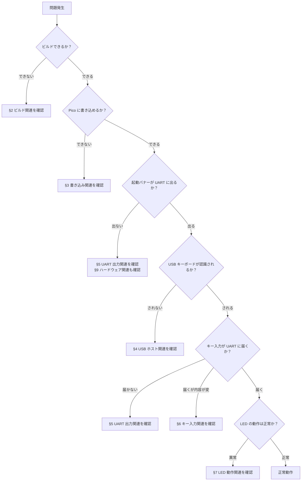

# KKBD-USB ユーザーマニュアル — 07 トラブルシューティング

| 項目 | 内容 |
|------|------|
| 文書番号 | KKBD-USB-MAN-07-001 |
| 作成日 | 2026-05-05 |
| バージョン | 1.0 |
| ステータス | 正式版 |

---

## 目次

1. [はじめに（トラブル発生時の確認順序）](#1-はじめにトラブル発生時の確認順序)
2. [ビルド関連](#2-ビルド関連)
3. [書き込み関連](#3-書き込み関連)
4. [USB ホスト関連](#4-usb-ホスト関連)
5. [UART 出力関連](#5-uart-出力関連)
6. [キー入力関連](#6-キー入力関連)
7. [LED 動作関連](#7-led-動作関連)
8. [ホスト側ユニットテスト関連](#8-ホスト側ユニットテスト関連)
9. [ハードウェア関連](#9-ハードウェア関連)
10. [関連文書](#10-関連文書)

---

## 1. はじめに（トラブル発生時の確認順序）

KKBD-USB で問題が発生した場合は、以下の順序で確認することを推奨します。各ステップで問題が解消しない場合に次のステップに進んでください。



> **共通確認事項**: どのカテゴリの問題でも、まずシリアル端末（9600 bps デフォルト）の UART 出力ログを確認してください。ログに手がかりが含まれていることが多いです。

---

## 2. ビルド関連

### 2.1 ビルドエラー一覧

| 症状（エラーメッセージ） | 原因 | 対処 |
|----------------------|------|------|
| `PICO_SDK_PATH` が設定されていない旨のエラー（CMake 構成フェーズ） | 環境変数 `PICO_SDK_PATH` が未設定 | シェルで `export PICO_SDK_PATH=/path/to/pico-sdk` を実行してから再度ビルドする。永続化するには `~/.zshrc` または `~/.bashrc` に追記する |
| `arm-none-eabi-gcc: No such file or directory` | ARM クロスコンパイラ未インストール | ARM GNU Toolchain をインストールする。macOS の場合は `brew install arm-none-eabi-gcc` 等を参照。詳細は `README.md` の「開発環境」セクションを確認 |
| `Compatibility with CMake < 3.5 has been removed from CMake.`（pioasm または elf2uf2 サブビルド中に発生） | CMake 4.x と Pico SDK 1.5.1 に含まれる TinyUSB の互換性問題 | `scripts/build.sh` を経由してビルドする（CMake 4.x ワークアラウンドが自動適用される）。手動でビルドする場合は `export CMAKE_POLICY_VERSION_MINIMUM=3.5` をシェルで実行してからビルドする |
| `tusb.h: No such file or directory` 等のインクルードエラー | Pico SDK のサブモジュールが未取得 | Pico SDK ディレクトリで `git submodule update --init --recursive` を実行する |
| `tinyusb_board` のリンクエラー（`library not found`） | Pico SDK では `tinyusb_board` ライブラリは不要 | `CMakeLists.txt` から `tinyusb_board` を削除し `tinyusb_host` のみでリンクする |
| ビルドが途中でエラー終了する（依存ライブラリ不足） | Pico SDK バージョン不一致または依存ライブラリ不足 | `pico-sdk --version` 等で SDK バージョンを確認。v1.5.1 以上を推奨。エラーメッセージをもとに不足パッケージを追加 |

### 2.2 ビルドスクリプトの使用

ビルドに関する問題の大部分は `scripts/build.sh` 経由でビルドすることで回避できます。

```sh
export PICO_SDK_PATH=/path/to/pico-sdk
./scripts/build.sh --clean   # クリーンビルド（初回・再ビルド時）
./scripts/build.sh           # 通常ビルド
```

`scripts/build.sh` は CMake 4.x 利用時の `CMAKE_POLICY_VERSION_MINIMUM=3.5` ワークアラウンドを自動で適用します。

---

## 3. 書き込み関連

| 症状 | 原因 | 対処 |
|------|------|------|
| `RPI-RP2` ボリュームがファイルマネージャに現れない | BOOTSEL ボタンを押さずに USB 接続した / データ通信非対応の充電専用ケーブルを使用している | BOOTSEL ボタンを**押し続けたまま** USB ケーブルで PC に接続する。USB ケーブルがデータ通信対応であることを確認する（充電専用ケーブルは不可） |
| 書き込み後に LED が点滅しない（または全く反応しない） | `.uf2` ファイルが正しく書き込まれていない / 書き込みが途中で失敗した | 再度 BOOTSEL モードで接続し、`.uf2` ファイルを上書きコピーする |
| 起動バナーが古い Phase のまま（例: `(Phase 5)` が出る） | 古いファームウェアが書き込まれている | `./scripts/build.sh --clean` でクリーンビルドし、新たに `build/src/kkbd_usb.uf2` を書き込む |
| コピー完了前に `RPI-RP2` が消える | これは正常動作 | `.uf2` のコピーが完了すると Pico は自動的に再起動し BOOTSEL モードを終了する。これは仕様通りの動作 |

### 3.1 書き込み手順（参考）

1. BOOTSEL ボタンを**押し続けたまま** USB ケーブルで PC に接続
2. `RPI-RP2` ボリュームが表示されることを確認
3. BOOTSEL ボタンを離す
4. `build/src/kkbd_usb.uf2` を `RPI-RP2` にコピー

   | OS | コマンド |
   |----|---------|
   | macOS | `cp build/src/kkbd_usb.uf2 /Volumes/RPI-RP2/` |
   | Linux | `cp build/src/kkbd_usb.uf2 /media/$USER/RPI-RP2/` |
   | Windows | エクスプローラで `RPI-RP2` ドライブへドラッグ＆ドロップ |

---

## 4. USB ホスト関連

| 症状 | 原因 | 対処 |
|------|------|------|
| キーボードを接続しても接続ログ（`[USB] Keyboard connected ...`）が出ない | OTG/VBUS 給電が不足している | OTG アダプタが VBUS 給電パススルー機能付きのものを使用する。または Pico ピン 39（VSYS）にショットキーダイオード経由で外部 5V を供給する（ピン 40 VBUS への直接給電は逆流の危険あり）。詳細は `05_OTGと電源.md` を参照 |
| キーボードを接続しても接続ログが出ない（別原因） | `tuh_init` 失敗 | `tuh_init failed` 等のエラーログを確認。`tusb_config.h` の設定を確認し、Pico SDK v1.5.1 以上を使用していることを確認する |
| 接続ログの直後に切断ログ（`[USB] Keyboard disconnected`）が出る | VBUS 供給電流が不足（過電流により電源が落ちた） | 電流容量 1A 以上の電源アダプタに変更する。別のキーボードでも試す。消費電流の少ないシンプルなキーボードを試用する |
| 接続ログの直後に切断ログが出る（別原因） | USB 通信エラー（ケーブル品質・ノイズ・USB ハブ経由） | 別の USB OTG ケーブルや短いケーブルに交換する。USB ハブを経由している場合は直接接続を試す。ノイズ源（電源アダプタ・モーター等）から離す |
| マウスを接続しても何も起きない（ログも出ない） | 期待通りの動作 | KKBD-USB は HID Keyboard クラス以外のデバイスを無視します（§8.3 非対応デバイス処理）。マウスへの対応は仕様外です |
| 複数 HID インターフェースを持つキーボードで `Non-keyboard HID ignored` ログが出る | 期待通りの動作 | Boot Keyboard 以外のインターフェース（メディアキー等の Generic HID）は意図的に無視されます。Boot Keyboard インターフェースでの動作は正常です |
| キーボードを抜き差ししたら認識されなくなった | 稀なケースで USB スタックが不安定になる場合がある | Pico の電源を一度切り（USB ケーブルを抜く）、再起動してから再接続する |
| 接続中に通信エラーが発生する（将来バージョンで改善予定） | USB 通信の一時的な不安定 | Phase 7（異常系処理）で改善予定。現バージョンでは電源再投入で回復する |

---

## 5. UART 出力関連

| 症状 | 原因 | 対処 |
|------|------|------|
| シリアル端末に何も表示されない | UART TX/GND 配線不良、ボーレート不一致、Pico 未起動 | Pico の GPIO 0（TX）と USB-シリアル変換アダプタの RX が接続されているか確認。GND 同士も接続されているか確認。TX と RX を逆に繋いでいないか確認。シリアル端末のボーレートをジャンパー設定に合わせる |
| 文字化けする（意味不明な文字が出る） | シリアル端末のボーレートとジャンパー設定が不一致 | シリアル端末のボーレートを KKBD-USB のジャンパー設定に合わせる。デフォルト（JP3/JP4 両 OPEN）は 9600 bps |
| 行末コードが期待と異なる | JP1/JP2 ジャンパー設定が違う | 下表の設定を確認し、ジャンパーを正しく設定してから電源を再投入する |
| `KKBD-USB v0.1 (Phase 6) - Waiting for USB keyboard...` などの起動バナーが表示されない | シリアル端末を後から開いた（起動メッセージを取りこぼした）、または UART 配線の問題 | シリアル端末を**先に開いた状態**で Pico の電源を投入する。それでも出ない場合は UART 配線を確認 |

**行末コード設定（JP1/JP2）**:

| JP1 | JP2 | 行末コード | 送出バイト |
|-----|-----|----------|----------|
| OPEN | OPEN | CR（デフォルト） | 0x0D |
| SHORT | OPEN | LF | 0x0A |
| OPEN | SHORT | CRLF | 0x0D 0x0A |
| SHORT | SHORT | CR（予約・フォールバック） | 0x0D |

> **注意**: ジャンパー設定の変更は必ず**電源を切った状態**で行ってください。設定変更後は電源再投入が必要です。

**ボーレート設定（JP3/JP4）**:

| JP3 | JP4 | ボーレート |
|-----|-----|---------|
| OPEN | OPEN | 9600 bps（デフォルト） |
| SHORT | OPEN | 19200 bps |
| OPEN | SHORT | 38400 bps |
| SHORT | SHORT | 115200 bps |

---

## 6. キー入力関連

| 症状 | 原因 | 対処 |
|------|------|------|
| キーを押しても何も送信されない | USB キーボードが未認識の状態 | まず §4 の USB ホスト接続確認を行う。接続ログ（`[USB] Keyboard connected ...`）が出ていない場合は USB ホスト関連の問題 |
| 英字が大文字で送信される（Shift を押していないのに） | キーボード側で Caps Lock が ON になっている | キーボードの Caps Lock を OFF にする。KKBD-USB は HID レポートが送ってくるキーコードに従うため、キーボード側の Caps Lock 状態が影響する |
| 記号キーが想定と違う文字を送信する | JIS 配列キーボードを使用している | KKBD-USB のキーマップは US 配列基準です。JIS 配列キーボードでは記号の位置が異なります。`06_キーボード対応状況.md` の §4 を参照してください |
| キーリピートが効かない（長押ししても 1 文字しか出ない） | `keyrepeat_task()` が呼ばれていない、または初回遅延（500ms）待ちの状態 | 500ms 以上押し続けてリピートが始まるか確認する。それでも効かない場合は、ファームウェアを再度書き込んで試す |
| キーリピートが止まらない | 全キーリリース検出ロジックの不具合 | 電源を再投入する。ソースコードの `usb_host.c` における `keyrepeat_cancel()` の呼び出しタイミングを確認 |
| Enter が連投される（長押しで複数回行末コードが送信される） | Enter のキーリピート除外処理の不具合 | Enter は意図的にリピート対象外としているため、正常時は長押しでも 1 回のみ送信されます。複数回送信される場合は `tuh_hid_report_received_cb` で `is_enter` 判定と `keyrepeat_register` の呼び出し関係を確認してください |
| 同じキーで連投される（差分検出が機能しない） | `s_prev_report` の更新タイミング不具合 | ファームウェアを再書き込みする |
| Shift+英字で小文字が送信される | Caps Lock の干渉、または Shift テーブル不具合 | Caps Lock OFF を確認。それでも小文字の場合はファームウェアを再書き込みする |
| Ctrl+英字で何も送信されない / 大文字が送信される | Ctrl 優先度ロジックの不具合 | 設計では Ctrl > Shift の優先度で処理されます。ファームウェアを再書き込みして再確認 |
| テンキーの数字が送信されない | NumLock が OFF になっている | キーボードの NumLock を ON にしてから再試行する |

---

## 7. LED 動作関連

| 症状 | 原因 | 対処 |
|------|------|------|
| LED が常時点滅し続ける（キーボード接続後も点滅が止まらない） | LED 状態が `WAIT_DEVICE`（キーボード待ち）のまま | USB ホストの mount コールバック（`tuh_hid_mount_cb`）が正常に呼ばれていない。§4 USB ホスト関連を確認し、接続ログが出るか確認する |
| LED がまったく点灯しない | Pico への電源供給がない、または LED が破損 | USB ケーブルが接続されているか確認。Pico の VBUS/3V3 ピンの電圧を確認。別の USB ポートやケーブルで試す |
| LED が点灯したまま点滅しない | 書き込んだファームウェアが古い（Phase 1 の LED 点滅テスト用ファームウェアが残っている） | 最新のファームウェアを再書き込みする |
| LED 点滅周期が著しく遅い・速い | ソースコードの定数が意図しない値になっている可能性 | 複数回計測して確認。異常な場合は `led.h` / `keyrepeat.h` の定数（`LED_BLINK_SLOW_MS`、`LED_BLINK_FAST_MS`）を確認する |
| キーを押したときの LED 点滅が見えない | UART 送信間隔が短く、点灯維持として見える | 単発のキー押しで確認する。連続入力中はほぼ点灯維持状態になるのは正常な動作 |

**LED 状態と意味（Phase 6 以降の正式仕様）**:

| LED の様子 | 状態 | 意味 |
|----------|------|------|
| 起動直後に点灯 | `BOOT` | 初期化処理中 |
| 低速点滅（約 500ms トグル） | `WAIT_DEVICE` | USB キーボード待ち受け中 |
| 常時点灯 | `MOUNTED` | USB キーボード認識済み・通常動作中 |
| 短時間消灯または点灯維持 | `TX` | UART 送信中（連続入力中は常時点灯に見える） |
| 高速点滅（約 100ms トグル） | `ERROR` | USB 通信エラー発生中 |

---

## 8. ホスト側ユニットテスト関連

| 症状 | 原因 | 対処 |
|------|------|------|
| リンクエラー（`KKBD_PHASE4_DONE` 未定義、`undefined reference` 等） | CMake の `-D` フラグが指定されていない | テスト実行時に必要なフラグをすべて指定する（下記参照） |
| Phase 4 のみ有効にしてテストが失敗する | Phase 5 のテスト関数が Phase 4 フラグのみでは有効化されない | `KKBD_PHASE4_DONE=ON` と `KKBD_PHASE5_DONE=ON` の両方を指定することを推奨する |
| `ctest` が全体的に失敗する | テストバイナリのビルドに失敗している | `cmake --build build-tests` のエラー出力を確認し、ビルドエラーを先に解消する |

**各 Phase のテスト実行コマンド**:

```sh
# Phase 4 のみ（keymap 基本テスト）
cmake -S tests -B build-tests -DKKBD_PHASE4_DONE=ON
cmake --build build-tests
ctest --test-dir build-tests --output-on-failure

# Phase 4 + 5（keymap 全テスト）
cmake -S tests -B build-tests -DKKBD_PHASE4_DONE=ON -DKKBD_PHASE5_DONE=ON
cmake --build build-tests
ctest --test-dir build-tests --output-on-failure

# Phase 4 + 5 + 6（keymap + keyrepeat 全テスト）
cmake -S tests -B build-tests -DKKBD_PHASE4_DONE=ON -DKKBD_PHASE5_DONE=ON -DKKBD_PHASE6_DONE=ON
cmake --build build-tests
ctest --test-dir build-tests --output-on-failure
```

---

## 9. ハードウェア関連

| 症状 | 原因 | 対処 |
|------|------|------|
| Pico が PC から認識されない（デバイスマネージャ・システム情報に表示されない） | USB ケーブルが充電専用 / USB ポートの問題 / Pico 破損 | データ通信対応の USB ケーブルに交換する。別の USB ポートで試す。別の Pico で試す |
| 電源を入れても LED が全く反応しない | VBUS 給電の問題 / Pico 破損 | Pico に USB ケーブルを正しく接続しているか確認。VBUS ピン（ピン 40）またはVSYS ピン（ピン 39）の電圧をテスターで確認（外部給電時は VSYS 側が 5V 前後であるべき）。別の USB ポートやケーブルで試す |
| ジャンパーを変えても設定が反映されない | GPIO 読み取りタイミング（ジャンパー設定は起動時のみ読み取られる） | ジャンパー設定変更後は必ず電源を再投入する。設定変更は必ず**電源を切った状態**で行う |
| UART から何も出力されない（配線は正しいのに） | GPIO 0 が UART TX として機能していない / SBC 側の受信ロジックレベルの問題 | テスターで GPIO 0 の電圧変化を確認する。GPIO 0 が 3.3V TTL 出力であることを確認し、SBC 側の入力電圧仕様と照合する |
| RS-232C 接続先 SBC との通信ができない | Pico の UART 出力は 3.3V TTL であり RS-232C レベル（±12V）とは異なる | MAX232 等の RS-232C レベル変換 IC を使用する |

---

## 10. 関連文書

| 文書 | 参照目的 |
|------|---------|
| [`docs/manual/05_OTGと電源.md`](05_OTGと電源.md) | USB OTG ケーブル・給電方式の詳細 |
| [`docs/manual/06_キーボード対応状況.md`](06_キーボード対応状況.md) | 対応キーボード・対応キー一覧 |
| [`docs/tests/phase1_実機検証手順.md`](../tests/phase1_実機検証手順.md) | Phase 1: ビルド環境・書き込み・LED 点滅確認 |
| [`docs/tests/phase2_実機検証手順.md`](../tests/phase2_実機検証手順.md) | Phase 2: ジャンパー設定・UART 送信確認 |
| [`docs/tests/phase3_実機検証手順.md`](../tests/phase3_実機検証手順.md) | Phase 3: USB ホスト接続・切断確認 |
| [`docs/tests/phase4_実機検証手順.md`](../tests/phase4_実機検証手順.md) | Phase 4: 基本キー入力（英数字・Enter）確認 |
| [`docs/tests/phase5_実機検証手順.md`](../tests/phase5_実機検証手順.md) | Phase 5: 修飾キー・記号・特殊キー確認 |
| [`docs/tests/phase6_実機検証手順.md`](../tests/phase6_実機検証手順.md) | Phase 6: 行末コード・キーリピート・LED 確認 |
| [`docs/design/設計書.md`](../design/設計書.md) | §8 エラー処理設計（技術的詳細） |
| [`README.md`](../../README.md) | 開発環境構築・ビルド方法の詳細 |
