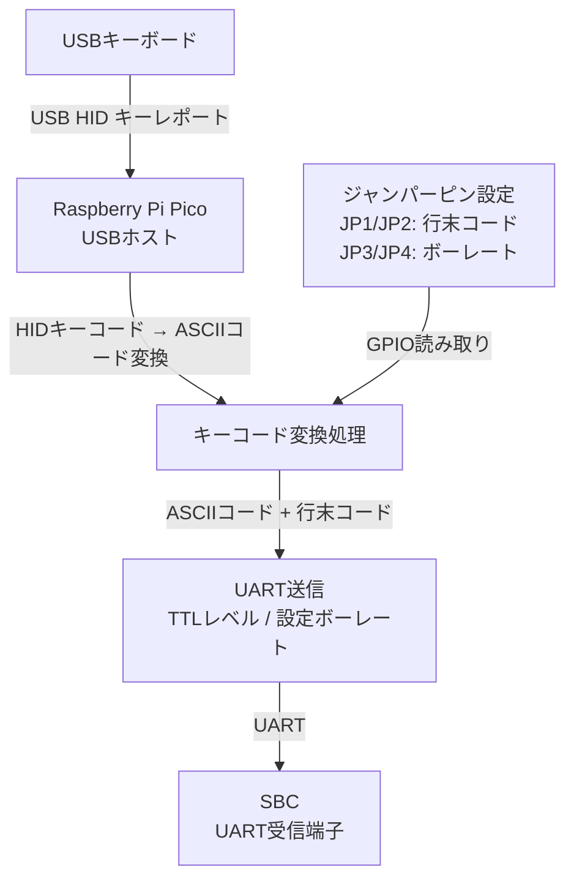

# KKBD-USB 要件定義書

**文書番号**: KKBD-USB-REQ-001
**作成日**: 2026-05-04
**バージョン**: 1.0
**ステータス**: ドラフト

---

## 目次

1. [システム概要](#1-システム概要)
2. [ハードウェア要件](#2-ハードウェア要件)
3. [ソフトウェア要件](#3-ソフトウェア要件)
4. [機能要件](#4-機能要件)
5. [非機能要件](#5-非機能要件)
6. [制約事項・前提条件](#6-制約事項前提条件)
7. [用語集](#7-用語集)

---

## 1. システム概要

### 1.1 目的・背景

SBC6800（Motorola 6800 CPUベースのシングルボードコンピューター）やKZ80（Z80 CPUベースのシングルボードコンピューター）など、UART（RS-232C相当）経由でターミナル入出力を行うレトロマイコン・シングルボードコンピューター（以下、SBC）は、本来PCのターミナルエミュレーターを使って操作することを前提としている。これらのSBCをPCなしでスタンドアロン環境で動作させるためには、USBキーボードからの入力をUART信号に変換するキーボードI/Fボードが必要となる。

KKBD-USBは、Raspberry Pi Pico（RP2040）を使用してUSBキーボード入力をUART出力に変換する専用ボードである。USBホスト機能によりUSBキーボードを直接接続し、キー入力をASCIIコードに変換してUART経由でSBCへ送信する。これにより、PCを介さずにUSBキーボード単体でSBCをスタンドアロン操作することを可能にする。

**主な用途:**
- SBC6800のスタンドアロン操作
- KZ80マイコンのスタンドアロン操作
- その他のUART入力対応SBCのスタンドアロン操作

### 1.2 システム構成図

**信号の流れ:**

---

## 2. ハードウェア要件

### 2.1 MCU仕様

| 項目 | 内容 |
|------|------|
| MCU | Raspberry Pi Pico（無印、RP2040搭載モデル）を基準とする。RP2040搭載互換ボードも使用可能。 |
| チップ | RP2040 |
| クロック | 最大133MHz（デフォルト動作クロック使用） |
| フラッシュメモリ | 2MB（Pico標準） |
| RAM | 264KB SRAM |
| GPIO | 最低4本使用（ジャンパーピン読み取り用） |

### 2.2 USBホスト

| 項目 | 内容 |
|------|------|
| 方式 | Raspberry Pi Pico 内蔵USBホスト機能 |
| ライブラリ | TinyUSB（Pico SDK付属） |
| 対応プロトコル | USB HID (Human Interface Device) Class |
| 対応デバイス | USBキーボード（HID Keyboard） |
| USBコネクタ | Pico標準 Micro-BコネクタをUSBホストとして使用 |
| USBバスパワー供給 | キーボードへの5V / 最大500mA供給 |

> 注意: Raspberry Pi PicoのMicro-BコネクタをUSBホストとして使用する場合、外部回路（USBホスト切り替え回路）が必要となる場合がある。回路設計時に確認すること。

### 2.3 UART出力仕様

| 項目 | 内容 |
|------|------|
| 使用UART | RP2040 UART0またはUART1 |
| 信号レベル | TTLレベル（3.3V） |
| データビット | 8ビット |
| ストップビット | 1ビット |
| パリティ | なし（None） |
| フロー制御 | なし |
| ボーレート | 9600 / 19200 / 38400 / 115200 bps（ジャンパーにて選択） |
| コネクタ | ピンヘッダ（TX / GND 最低限） |

> 注意: SBC側のUARTがRS-232Cレベル（±12V）の場合は、別途レベル変換IC（MAX232等）が必要となる。本ボードはTTLレベル出力を基本とする。

### 2.4 ジャンパーピン設定

ジャンパーピンによりハードウェアレベルで動作設定を行う。合計4本のジャンパーピンを使用する。

#### 2.4.1 行末コード設定（JP1 / JP2）

| JP1 | JP2 | 行末コード | 送出バイト列 |
|-----|-----|-----------|------------|
| OPEN | OPEN | CR | 0x0D |
| SHORT | OPEN | LF | 0x0A |
| OPEN | SHORT | CRLF | 0x0D 0x0A |
| SHORT | SHORT | （予約） | - |

> 注意: JP1/JP2の具体的なOPEN/SHORT割り当ては、回路設計段階で確定する。上記は仕様例であり、最終的なピンアサインは回路図に従うこと。予約パターン（JP1/JP2がともにSHORT）を読み取った場合は、CR（デフォルト）として動作する。

#### 2.4.2 UARTボーレート設定（JP3 / JP4）

| JP3 | JP4 | ボーレート |
|-----|-----|-----------|
| OPEN | OPEN | 9600 bps |
| SHORT | OPEN | 19200 bps |
| OPEN | SHORT | 38400 bps |
| SHORT | SHORT | 115200 bps |

> 注意: JP3/JP4の具体的なOPEN/SHORT割り当ては、回路設計段階で確定する。上記は仕様例であり、最終的なピンアサインは回路図に従うこと。

#### 2.4.3 ジャンパーピンGPIO割り当て

| ジャンパー | GPIO番号（暫定） | 用途 |
|-----------|----------------|------|
| JP1 | GPIO 10 | 行末コード bit0 |
| JP2 | GPIO 11 | 行末コード bit1 |
| JP3 | GPIO 12 | ボーレート bit0 |
| JP4 | GPIO 13 | ボーレート bit1 |

> 注意: GPIO番号は暫定であり、回路設計時に確定する。各GPIOはプルアップ設定（内蔵プルアップ使用）とし、ジャンパーショート時をLow（0）として読み取る。

### 2.5 電源仕様

| 項目 | 内容 |
|------|------|
| 入力電圧 | 5V DC |
| 電源供給方法 | Pico VSYS端子への外部5V供給、またはPicoのUSBコネクタ経由 |
| 消費電流 | Pico本体 約100mA + USBキーボード最大500mA |
| 最大消費電流 | 600mA以下（電源設計時は余裕を持って1A以上を推奨） |

---

## 3. ソフトウェア要件

### 3.1 開発環境

| 項目 | 内容 |
|------|------|
| 開発言語 | C / C++ |
| SDK | Raspberry Pi Pico SDK（公式） |
| USBスタック | TinyUSB（Pico SDK付属） |
| ビルドシステム | CMake |
| 対象ツールチェーン | ARM GNU Toolchain（arm-none-eabi-gcc） |
| 推奨開発環境 | VS Code + Pico SDK（macOS / Linux / Windows） |

### 3.2 USB HIDキーボード入力処理

- TinyUSBのUSBホストHIDクラスドライバを使用する
- USBキーボードのHIDレポートを受信し、キーダウンイベントを検出する
- 同時押し（修飾キー + 通常キー）に対応する
- 対応する修飾キー:
  - Left/Right Shift
  - Left/Right Ctrl
  - Left/Right Alt（将来拡張用、当初はCtrlのみ対応）
- キーリピート機能: OSのキーリピートに相当する機能をソフトウェアで実装する（初回入力後、一定時間経過後にリピート送信）
- NumLock / CapsLockの状態管理は最低限対応する

### 3.3 キーコード変換（USB HIDキーコード→ASCII）

- USB HID Usage ID（キーコード）をASCIIコードに変換するテーブルを実装する
- 変換対象:
  - 英数字（A-Z、a-z、0-9）
  - 記号類（!, @, #, $, %, ^, &, *, (, ), -, =, [, ], \, ;, ', `, ,, ., /）
  - 制御文字（Ctrl+A 〜 Ctrl+Z → 0x01〜0x1A）
  - Enterキー → 行末コード（ジャンパー設定に従う）
  - Backspaceキー → BS (0x08) またはDEL (0x7F)。初期実装ではBS (0x08) 固定とする。将来拡張時にジャンパーまたはソフトウェア設定で切り替え可能とする。
  - Escキー → 0x1B
  - Tabキー → 0x09
  - スペースキー → 0x20
- Shiftキーとの組み合わせによる大文字・記号入力に対応する
- 変換テーブルに存在しないキーコードは無視する

### 3.4 UART送信処理

- Pico SDK の `uart_putc()` / `uart_write_blocking()` を使用してUART送信を行う
- ボーレートは起動時にジャンパーピンの設定値を読み取り、`uart_set_baudrate()` で設定する
- Enterキー入力時は、ジャンパーピン設定に従いCR、LF、またはCRLFを送信する
- UART送信はブロッキング送信とする（送信バッファ枯渇時は送信完了まで待機）

### 3.5 ジャンパーピン読み取り

- 起動時（`main()` 関数の初期化処理内）にジャンパーピン（GPIO）の状態を読み取る
- 各GPIOを内蔵プルアップ有効・入力モードに設定する
- ジャンパーオープン（プルアップにより High）→ bit = 1
- ジャンパーショート（GNDに接続により Low）→ bit = 0
- 読み取った値をグローバル変数（または設定構造体）に保持し、全処理で参照する
- 設定値は起動後に変更されることを想定しない（起動時一回読み取り）

---

## 4. 機能要件

### FR-001: USBキーボード接続検出

| 項目 | 内容 |
|------|------|
| ID | FR-001 |
| 名称 | USBキーボード接続検出 |
| 優先度 | 必須 |
| 説明 | システム起動後、USBホストポートに接続されたUSBキーボード（HID Keyboardクラス）を自動検出し、入力受付を開始する。 |
| 入力 | USBキーボードのUSB接続イベント |
| 処理 | TinyUSBのHIDホストドライバがデバイスを列挙し、HID Keyboardとして認識する |
| 出力 | キーボード入力受付状態への遷移 |
| 補足 | キーボードが未接続の場合はUSBポートを監視し続ける。キーボードが切断された場合は再接続を待ち受ける。 |

### FR-002: キー入力受付

| 項目 | 内容 |
|------|------|
| ID | FR-002 |
| 名称 | キー入力受付 |
| 優先度 | 必須 |
| 説明 | 接続されたUSBキーボードからのHIDレポートを受信し、キーダウンイベントを検出する。 |
| 入力 | USB HID キーボードレポート（Modifier byte + Keycode[6]） |
| 処理 | HIDレポートの変化（前回レポートとの差分）からキーダウンイベントを検出する |
| 出力 | 検出されたキーコードと修飾キー情報をASCII変換処理へ渡す |
| 補足 | 最大6キー同時押しまで対応（HID仕様による）。修飾キー（Shift, Ctrl）の状態を追跡する。 |

### FR-003: ASCIIコード変換

| 項目 | 内容 |
|------|------|
| ID | FR-003 |
| 名称 | ASCIIコード変換 |
| 優先度 | 必須 |
| 説明 | USB HID キーコードと修飾キーの組み合わせをASCIIコードに変換する。 |
| 入力 | HID Usage ID（キーコード）、修飾キー状態（Shift, Ctrl等） |
| 処理 | 変換テーブルを参照しASCIIコードを決定する。Shiftが押されている場合は大文字/記号のASCIIコードを選択する。Ctrlが押されている場合はCtrlコード（0x01〜0x1A）を生成する。 |
| 出力 | ASCIIコード（1バイト）。Enterキーの場合は行末コード設定処理へ委譲。 |
| 補足 | 変換不能なキーコードは処理を行わず無視する。 |

### FR-004: 行末コード選択送信

| 項目 | 内容 |
|------|------|
| ID | FR-004 |
| 名称 | 行末コード選択送信 |
| 優先度 | 必須 |
| 説明 | Enterキー入力時に、ジャンパーピン（JP1/JP2）の設定に従いCR、LF、またはCRLFを送信する。 |
| 入力 | Enterキー入力イベント、JP1/JP2の状態 |
| 処理 | 起動時に読み取ったジャンパー設定値を参照し、対応するバイト列をUART送信処理に渡す |
| 出力 | UART送信バイト列（CR: 0x0D / LF: 0x0A / CRLF: 0x0D 0x0A） |
| 補足 | テンキーのEnterも同様に処理する。JP1/JP2がともにSHORTの予約パターンを読み取った場合は、CR（0x0D）として動作する。 |

### FR-005: UARTボーレート設定

| 項目 | 内容 |
|------|------|
| ID | FR-005 |
| 名称 | UARTボーレート設定 |
| 優先度 | 必須 |
| 説明 | 起動時にジャンパーピン（JP3/JP4）の状態を読み取り、UARTのボーレートを設定する。 |
| 入力 | JP3/JP4のGPIO状態 |
| 処理 | 2ビット値（JP3 bit0, JP4 bit1）に対応するボーレート値を選択し、Pico SDKのuart_set_baudrate()を呼び出す |
| 出力 | UART周辺機能への設定値適用 |
| 設定値 | 00: 9600bps / 01: 19200bps / 10: 38400bps / 11: 115200bps |
| 補足 | デフォルト（ジャンパー全OPEN時、すなわちJP3/JP4ともにOPEN）は9600bpsである。ボーレート設定は起動時一回のみ。設定変更には電源再投入が必要。 |

### FR-006: UART送信

| 項目 | 内容 |
|------|------|
| ID | FR-006 |
| 名称 | UART送信 |
| 優先度 | 必須 |
| 説明 | 変換されたASCIIコード（または行末コード）をUART経由でSBCへ送信する。 |
| 入力 | 送信バイト列（1バイトまたは2バイト） |
| 処理 | Pico SDK の uart_putc() または uart_write_blocking() を用いてUART0/UART1へ送信する |
| 出力 | UART TXピンへの信号出力 |
| 補足 | 送信はブロッキングで行い、送信完了を待ってから次のキー入力処理に戻る。通常のキー入力レートにおいてブロッキングによる問題は発生しない。 |

### FR-007: キーリピート

| 項目 | 内容 |
|------|------|
| ID | FR-007 |
| 名称 | キーリピート |
| 優先度 | 必須 |
| 説明 | キーを押し続けた場合に、一定時間後から繰り返しASCIIコードを送信するキーリピート機能を実装する。 |
| 入力 | キーダウン継続状態、タイマー |
| 処理 | キーダウン検出後、初回遅延（例: 500ms）経過後にリピート間隔（例: 50ms）で同じASCIIコードを繰り返し送信する |
| 出力 | UART送信（繰り返し） |
| 補足 | 初回遅延・リピート間隔はソースコード内の定数として定義し、変更可能とする。 |

### FR-010: LEDインジケータ

| 項目 | 内容 |
|------|------|
| ID | FR-010 |
| 名称 | LEDインジケータ |
| 優先度 | 推奨 |
| 説明 | Raspberry Pi Pico内蔵LED（GPIO 25）を使用して、システムの動作状態を視覚的に表示する。 |
| 状態1 | **起動時**: 点灯（初期化処理中および初期化完了後のキーボード待ち受け状態） |
| 状態2 | **キーボード認識時**: 点灯（USBキーボードを正常に認識した状態） |
| 状態3 | **データ送信時**: 点滅（UART送信のたびに短時間点滅） |
| 状態4 | **エラー時**: 高速点滅（USB通信エラーや異常検出時） |
| 補足 | 各状態の点滅間隔はソースコード内の定数として定義し、変更可能とする。 |

### FR-009: エラー処理・異常系動作

| 項目 | 内容 |
|------|------|
| ID | FR-009 |
| 名称 | エラー処理・異常系動作 |
| 優先度 | 必須 |
| 説明 | 異常状態においてもシステムが安全に動作し、可能な限り自動回復する。 |
| 異常系1 | **USBキーボード未接続時**: USBポートを継続して監視し、接続を待ち受ける。キーボードが接続されるまでUART送信は行わない。 |
| 異常系2 | **USBキーボード切断時**: 切断を検出後、再接続待ち受け状態に遷移する。切断中のキー入力は処理しない。 |
| 異常系3 | **非対応USBデバイス接続時**: HID Keyboardクラス以外のUSBデバイスが接続された場合、そのデバイスを無視し、HID Keyboardの接続を引き続き待ち受ける。 |
| 異常系4 | **USB通信エラー時**: TinyUSBがUSB通信エラーを報告した場合、USBホストを再初期化しリカバリーを試みる。 |
| 異常系5 | **USBキーボードへの過電流保護**: キーボードへの供給電流が規定値（500mA）を超えた場合、ハードウェア保護回路（実装時に検討）により遮断する。ソフトウェアでは異常状態を検出した場合にUSBホストを停止する。 |
| 補足 | 異常状態からの回復後は通常動作に自動的に復帰する。 |

### FR-008: 起動時初期化

| 項目 | 内容 |
|------|------|
| ID | FR-008 |
| 名称 | 起動時初期化 |
| 優先度 | 必須 |
| 説明 | システム起動時に各周辺機能（USBホスト、UART、GPIO）を初期化し、ジャンパーピン設定を読み取る。 |
| 入力 | 電源投入またはリセット |
| 処理 | 1. GPIO初期化（ジャンパーピン用GPIO入力・プルアップ設定）、2. ジャンパーピン読み取り、3. UART初期化（読み取ったボーレートで設定）、4. TinyUSB初期化（USBホストモード）、5. メインループ開始 |
| 出力 | 各周辺機能の動作開始 |
| 補足 | 初期化シーケンスの順序は上記の通りとする。 |

---

## 5. 非機能要件

### NFR-001: 電源要件

| 項目 | 内容 |
|------|------|
| ID | NFR-001 |
| 名称 | 電源要件 |
| 説明 | システムは安定した5V電源で動作しなければならない。 |
| 要件 | 入力電圧: 5.0V ±5%（4.75V〜5.25V）、最大電流供給能力: 1A以上推奨 |
| 根拠 | Pico本体 + USBキーボード（最大500mA）の合計電流を賄うため |

### NFR-002: 対応キーボード

| 項目 | 内容 |
|------|------|
| ID | NFR-002 |
| 名称 | 対応キーボード |
| 説明 | USB HID Keyboardクラスに準拠したUSBキーボードに対応する。 |
| 要件 | USB HID 1.11仕様のKeyboardクラスに準拠したキーボードを対象とする。USB 1.1 / 2.0 Full Speed対応。 |
| 非対応 | Bluetoothキーボード（USBレシーバー経由の場合は対応する可能性がある）、USB複合デバイスとして提供されるキーボード（要確認）、独自プロトコルキーボード |
| 補足 | 一般的な日本語・英語USBキーボードの大多数が対応対象となる。個別の動作確認は別途実施する。 |

### NFR-003: レスポンス性能

| 項目 | 内容 |
|------|------|
| ID | NFR-003 |
| 名称 | レスポンス性能 |
| 説明 | キー入力からUART送信開始までの遅延を実用上問題ないレベルに抑える。 |
| 要件 | キーダウン検出からUART送信開始までの遅延: 10ms以内（目標値） |
| 根拠 | 人間が知覚できる遅延（約20ms〜30ms）以下とすることで、違和感のないキー入力体験を実現する |
| 補足 | USB HIDポーリング周期（通常1〜10ms）の影響により、最悪10ms程度の遅延が発生する場合がある。 |

### NFR-004: 信頼性

| 項目 | 内容 |
|------|------|
| ID | NFR-004 |
| 名称 | 信頼性 |
| 説明 | 通常の使用環境において、長時間安定して動作しなければならない。 |
| 要件 | 連続動作時間: 24時間以上（目標）。ウォッチドッグタイマーの使用を検討する。 |
| 補足 | USBキーボードの抜き差しに対して正常に再認識できること。 |

### NFR-005: 実装サイズ・コスト

| 項目 | 内容 |
|------|------|
| ID | NFR-005 |
| 名称 | 実装サイズ・コスト |
| 説明 | 個人利用・少量製作を前提とした低コスト・コンパクトな設計とする。 |
| 要件 | 主要部品はRaspberry Pi Pico（入手容易・低コスト）を使用する。基板サイズはSBCに搭載可能な程度のコンパクトなサイズを目標とする。 |

---

## 6. 制約事項・前提条件

### 6.1 ハードウェア制約

1. **USBホスト動作**: Raspberry Pi PicoはデフォルトではUSBデバイス（スレーブ）として動作する。USBホスト（マスター）として動作させるには、VBUS電源供給のための外部回路と、ソフトウェアによるUSBホストモード設定が必要である。
2. **UARTレベル**: Pico（RP2040）のGPIO電圧は3.3Vである。接続先SBCのUART入力が3.3Vロジックレベルに対応している場合は本ボードと直結が可能であるが、RS-232Cレベル（±12V）を要求するSBCに接続する場合は別途レベル変換回路が必要である。また、SBCが5VロジックのUARTを使用している場合、KKBD-USBの3.3V出力を5V入力閾値が許容するか確認が必要である。
3. **キーボード給電**: Pico経由でUSBキーボードに最大500mAを供給するため、外部電源は十分な電流容量を持つものを使用すること。
4. **ジャンパー設定の反映**: ジャンパーピンの設定変更は、電源再投入またはリセット後に有効となる。ホットスワップによる設定変更には対応しない。

### 6.2 ソフトウェア制約

1. **TinyUSBバージョン**: Pico SDKに含まれるTinyUSBのバージョンに依存する。Pico SDK v1.5.0以降の使用を推奨する。なお、TinyUSBはPico SDKに標準で含まれ、RP2040のUSBホスト機能を容易に利用できることから採用した（参考: https://q61.org/blog/2021/06/09/easyusbhost/ ）。
2. **キーマップ**: 本実装はUSキーボードレイアウトを基準とする。日本語キーボードを接続した場合、英数字・記号・制御キーなどASCII範囲内のキーは動作するが、日本語キーボード固有キー（¥、全角/半角、無変換、変換、カタカナ/ひらがな等）のASCIIコードへのマッピングは対応可能な範囲に限定され、完全な日本語入力機能は提供しない。
3. **マルチバイト文字**: 送信データはASCII（1バイト）コードのみとする。UTF-8等のマルチバイト文字送信には対応しない。
4. **UARTは送信のみ**: 本ボードのUARTは送信専用とする（SBCからKKBD-USBへの受信は行わない）。将来拡張として受信対応を検討する余地はある。

### 6.3 前提条件

1. 接続するSBCはUARTを入力インターフェースとして使用し、受信したASCIIコードをキーボード入力として処理できること。
2. SBC側のUARTボーレートとKKBD-USBのジャンパー設定が一致していること。
3. 使用するUSBキーボードはUSB HID Keyboardクラスに準拠していること。
4. 開発者はRaspberry Pi Pico SDKの開発環境を構築済みであること。

---

## 7. 用語集

| 用語 | 説明 |
|------|------|
| SBC | Single Board Computer（シングルボードコンピューター）。本書ではSBC6800やKZ80など、UART経由で操作するレトロ系コンピューターボードを指す。 |
| SBC6800 | Motorola 6800 CPUを搭載したシングルボードコンピューター。 |
| KZ80 | Z80 CPUを搭載したシングルボードコンピューター。 |
| UART | Universal Asynchronous Receiver/Transmitter。非同期シリアル通信インターフェース。 |
| USB HID | USB Human Interface Device。キーボード・マウス等の入力デバイスに使用されるUSBクラス仕様。 |
| TinyUSB | 組み込み向けのオープンソースUSBスタックライブラリ。Raspberry Pi Pico SDKに含まれる。 |
| HID Usage ID | USB HID仕様で定義されたキーコード。各キーに固有の識別番号が割り当てられている。 |
| RP2040 | Raspberry Pi社が開発したマイクロコントローラーチップ。Raspberry Pi Picoに搭載されている。 |
| Raspberry Pi Pico | RP2040を搭載した低コストのマイクロコントローラーボード。 |
| Pico SDK | Raspberry Pi Pico向けの公式C/C++ Software Development Kit。 |
| ASCII | American Standard Code for Information Interchange。英数字・記号・制御文字を7ビットで表すキャラクターコード体系。 |
| CR | Carriage Return（復帰）。ASCIIコード 0x0D。行末コードの一種。 |
| LF | Line Feed（改行）。ASCIIコード 0x0A。行末コードの一種。 |
| CRLF | CR+LFの組み合わせ（0x0D 0x0A）。Windows系で標準的な行末コード。 |
| ボーレート | Baud Rate。シリアル通信の通信速度。1秒間に送受信できるシンボル数（ビット数）を表す。 |
| TTLレベル | Transistor-Transistor Logic レベル。本書ではRP2040の3.3VロジックレベルのUART信号を指す。 |
| RS-232C | シリアル通信の標準規格。±12V等の電圧レベルを使用する。TTLレベルとは異なる。 |
| ジャンパーピン | 基板上の2本のピン間をショートプラグ（ジャンパー）で接続することで動作設定を変更する機構。 |
| GPIO | General Purpose Input/Output。汎用入出力ピン。 |
| HIDレポート | USBキーボードがホストに送信するデータパケット。修飾キーの状態と最大6キーのキーコードを含む。 |
| キーリピート | キーを押し続けた際に、一定間隔で同じ入力が繰り返される機能。 |
| プルアップ | GPIOピンを抵抗経由で電源電圧（High）に接続することで、未接続時にHighレベルを保持する回路。 |
| FR | Functional Requirement（機能要件）の略。 |
| NFR | Non-Functional Requirement（非機能要件）の略。 |

---

*本文書はKKBD-USBプロジェクトの要件定義書（バージョン1.0）です。設計・実装が進むにつれて内容を更新・精緻化します。*
